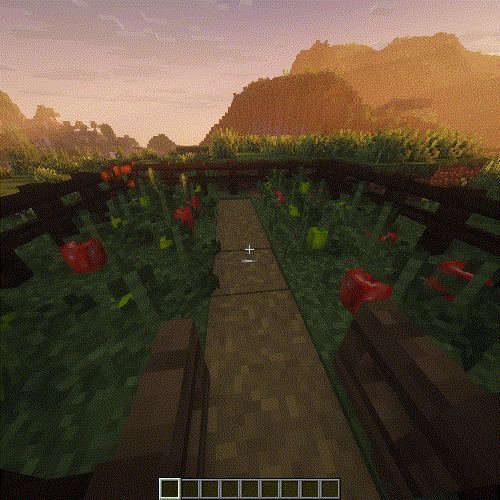

# Coffee And Tea Flow

Cafe adds several chains:

- Coffee cherry -> light beans -> medium beans -> dark beans.
- Medium/dark beans -> espresso.
- Espresso + water -> americano.
- Espresso + milk/oat milk -> latte, cappuccino, flat white, mocha.
- Leaves -> leaf litter or dried green tea.
- Dried green tea -> chance at matcha powder.
- Tea leaves -> green tea, black tea, sweet tea, matcha latte.
- Tea + milk + sugar + boba ingredient -> boba tea.

<figure class="hl-media-card">
  
  <figcaption>Grow coffee plants and harvest ripe coffee cherries.</figcaption>
</figure>

## Core Stations Vs Cafe Station

The Oven and prep stations create the ingredients. The Barista Machine assembles the drinks. If a player tries to make a latte before pulling espresso, the recipe is missing an intermediate, not a permission.

## Ingredient Variants

Milk bucket and oat milk variants can change names, returns, and dietary behavior. Sweet or glow berry variants can change drink identity when the recipe has a matching rule.

See [Default Recipe Index](../../recipes/default-recipes.md) for exact recipes and links.
