# Heirloom Asian Food Pack

<figure class="hl-figure">
  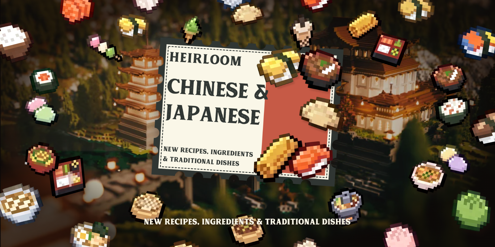
  <figcaption>Ảnh giới thiệu Heirloom Asian Food Pack.</figcaption>
</figure>

<figure class="hl-figure">
  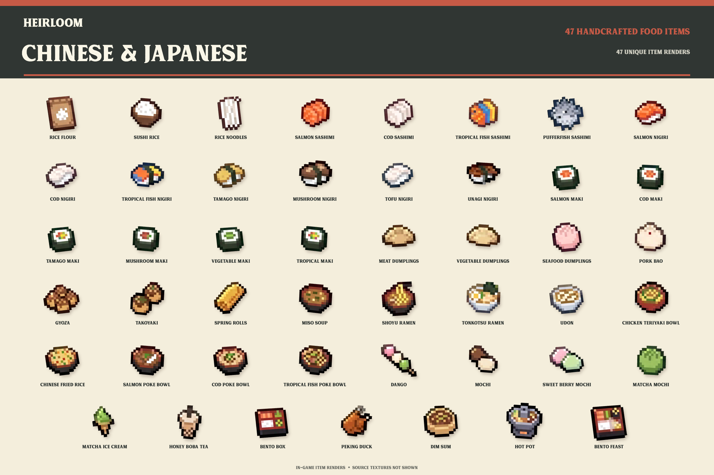
  <figcaption>Bản xem trước.</figcaption>
</figure>

Heirloom Asian Food Pack 1.0.0 bổ sung **47 vật phẩm tùy chỉnh** và **29 công thức**. Các hình ảnh PNG có thể được sử dụng làm gói tài nguyên riêng mà không cần Heirloom. Từ Heirloom 2.9 trở lên, gói này có thêm hệ thống nấu ăn, hệ thống nhận diện công thức, thuộc tính mới của thực phẩm, các biến thể và những món ăn có thể đặt để tổ chức yến tiệc.

| Trường | Giá trị |
| --- | --- |
| ID gói | `heirloom_asian_food` |
| Phiên bản | `1.0.0` |
| Mức độ ưu tiên ghi đè công thức | 100 |
| Vật phẩm | 47 |
| Công thức | 29 |
| Hình ảnh PNG | 47 |
| Cấu hình tích hợp hình ảnh | Nexo, ItemsAdder, CraftEngine |

## Cài đặt và tích hợp hình ảnh

Sao chép các tệp trong `content/` vào thư mục dành cho gói nội dung của Heirloom, chọn thư mục tương ứng với hệ thống hình ảnh mà máy chủ đang sử dụng, sau đó chạy `/hl reload`. Gói vẫn luôn giữ hình ảnh dự phòng bằng đầu người chơi.

Bản phát hành bao gồm **47 hình ảnh PNG gốc** cùng cấu hình cài đặt sẵn cho **Nexo, ItemsAdder và CraftEngine**. Chỉ cài đặt phần tương ứng với hệ thống hình ảnh mà máy chủ của bạn đang sử dụng.

## Vật phẩm

| Biểu tượng | ID vật phẩm | Tên | Cách sử dụng |
| --- | --- | --- | --- |
|  | [`ASIAN_BOBA_TEA`](../reference/items.md#item-asian-boba-tea) | Trà sữa trân châu mật ong | 6 điểm đói / 4 độ no; uống; trả lại chai thủy tinh |
| 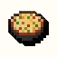 | [`ASIAN_CHINESE_FRIED_RICE`](../reference/items.md#item-asian-chinese-fried-rice) | Cơm chiên Trung Hoa | 8 điểm đói / 6 độ no; ăn; trả lại bát |
|  | [`ASIAN_DANGO`](../reference/items.md#item-asian-dango) | Dango | 4 điểm đói / 2 độ no; ăn |
| 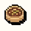 | [`ASIAN_DIM_SUM`](../reference/items.md#item-asian-dim-sum) | Dim sum | 16 điểm đói / 12 độ no; ăn; 4 phần có thể đặt; yến tiệc |
| 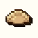 | [`ASIAN_DUMPLING_MEAT`](../reference/items.md#item-asian-dumpling-meat) | Há cảo thịt | 6 điểm đói / 4 độ no; ăn |
|  | [`ASIAN_DUMPLING_SEAFOOD`](../reference/items.md#item-asian-dumpling-seafood) | Há cảo hải sản | 6 điểm đói / 4 độ no; ăn |
| 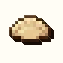 | [`ASIAN_DUMPLING_VEGETABLE`](../reference/items.md#item-asian-dumpling-vegetable) | Há cảo rau củ | 6 điểm đói / 4 độ no; ăn |
|  | [`ASIAN_FEAST_BENTO`](../reference/items.md#item-asian-feast-bento) | Yến tiệc Bento | 16 điểm đói / 12 độ no; ăn; 4 phần có thể đặt; yến tiệc |
| 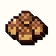 | [`ASIAN_GYOZA`](../reference/items.md#item-asian-gyoza) | Gyoza | 6 điểm đói / 4 độ no; ăn |
|  | [`ASIAN_HOT_POT`](../reference/items.md#item-asian-hot-pot) | Lẩu | 20 điểm đói / 16 độ no; ăn; 5 phần có thể đặt; yến tiệc |
| 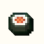 | [`ASIAN_MAKI_COD`](../reference/items.md#item-asian-maki-cod) | Maki cá tuyết | 4 điểm đói / 2 độ no; ăn |
| 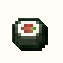 | [`ASIAN_MAKI_MUSHROOM`](../reference/items.md#item-asian-maki-mushroom) | Maki nấm | 4 điểm đói / 2 độ no; ăn |
|  | [`ASIAN_MAKI_RAINBOW`](../reference/items.md#item-asian-maki-rainbow) | Maki nhiệt đới | 4 điểm đói / 2 độ no; ăn |
|  | [`ASIAN_MAKI_SALMON`](../reference/items.md#item-asian-maki-salmon) | Maki cá hồi | 4 điểm đói / 2 độ no; ăn |
| 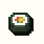 | [`ASIAN_MAKI_TAMAGO`](../reference/items.md#item-asian-maki-tamago) | Maki trứng | 4 điểm đói / 2 độ no; ăn |
|  | [`ASIAN_MAKI_VEGETABLE`](../reference/items.md#item-asian-maki-vegetable) | Maki rau củ | 4 điểm đói / 2 độ no; ăn |
|  | [`ASIAN_MATCHA_ICE_CREAM`](../reference/items.md#item-asian-matcha-ice-cream) | Kem matcha | 6 điểm đói / 4 độ no; ăn |
|  | [`ASIAN_MISO_SOUP`](../reference/items.md#item-asian-miso-soup) | Súp miso | 8 điểm đói / 6 độ no; uống; trả lại bát |
|  | [`ASIAN_MOCHI`](../reference/items.md#item-asian-mochi) | Mochi | 4 điểm đói / 2 độ no; ăn |
|  | [`ASIAN_MOCHI_BERRY`](../reference/items.md#item-asian-mochi-berry) | Mochi quả mọng ngọt | 4 điểm đói / 2 độ no; ăn |
|  | [`ASIAN_MOCHI_MATCHA`](../reference/items.md#item-asian-mochi-matcha) | Mochi matcha | 4 điểm đói / 2 độ no; ăn |
|  | [`ASIAN_NIGIRI_COD`](../reference/items.md#item-asian-nigiri-cod) | Nigiri cá tuyết | 6 điểm đói / 4 độ no; ăn |
|  | [`ASIAN_NIGIRI_MUSHROOM`](../reference/items.md#item-asian-nigiri-mushroom) | Nigiri nấm | 6 điểm đói / 4 độ no; ăn |
|  | [`ASIAN_NIGIRI_SALMON`](../reference/items.md#item-asian-nigiri-salmon) | Nigiri cá hồi | 6 điểm đói / 4 độ no; ăn |
|  | [`ASIAN_NIGIRI_TAMAGO`](../reference/items.md#item-asian-nigiri-tamago) | Nigiri trứng | 6 điểm đói / 4 độ no; ăn |
|  | [`ASIAN_NIGIRI_TOFU`](../reference/items.md#item-asian-nigiri-tofu) | Nigiri đậu phụ | 6 điểm đói / 4 độ no; ăn |
|  | [`ASIAN_NIGIRI_TROPICAL`](../reference/items.md#item-asian-nigiri-tropical) | Nigiri cá nhiệt đới | 6 điểm đói / 4 độ no; ăn |
|  | [`ASIAN_NIGIRI_UNAGI`](../reference/items.md#item-asian-nigiri-unagi) | Nigiri lươn | 6 điểm đói / 4 độ no; ăn |
| 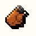 | [`ASIAN_PEKING_DUCK`](../reference/items.md#item-asian-peking-duck) | Vịt quay Bắc Kinh | 16 điểm đói / 12 độ no; ăn; 4 phần có thể đặt; yến tiệc |
|  | [`ASIAN_POKE_BOWL_COD`](../reference/items.md#item-asian-poke-bowl-cod) | Poke cá tuyết | 10 điểm đói / 8 độ no; ăn; trả lại bát |
|  | [`ASIAN_POKE_BOWL_SALMON`](../reference/items.md#item-asian-poke-bowl-salmon) | Poke cá hồi | 10 điểm đói / 8 độ no; ăn; trả lại bát |
| 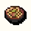 | [`ASIAN_POKE_BOWL_TROPICAL`](../reference/items.md#item-asian-poke-bowl-tropical) | Poke cá nhiệt đới | 10 điểm đói / 8 độ no; ăn; trả lại bát |
| 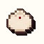 | [`ASIAN_PORK_BAO`](../reference/items.md#item-asian-pork-bao) | Bánh bao thịt heo | 6 điểm đói / 4 độ no; ăn |
|  | [`ASIAN_PORTABLE_BENTO`](../reference/items.md#item-asian-portable-bento) | Hộp Bento | 12 điểm đói / 10 độ no; ăn; hiệu ứng: Tốc độ, Hấp thụ |
|  | [`ASIAN_RICE_FLOUR`](../reference/items.md#item-asian-rice-flour) | Bột gạo | nguyên liệu |
|  | [`ASIAN_RICE_NOODLES`](../reference/items.md#item-asian-rice-noodles) | Bún gạo | nguyên liệu |
|  | [`ASIAN_SASHIMI_COD`](../reference/items.md#item-asian-sashimi-cod) | Sashimi cá tuyết | 4 điểm đói / 2 độ no; ăn |
|  | [`ASIAN_SASHIMI_PUFFERFISH`](../reference/items.md#item-asian-sashimi-pufferfish) | Sashimi cá nóc | 4 điểm đói / 2 độ no; ăn; hiệu ứng: May mắn, Độc, Buồn nôn |
|  | [`ASIAN_SASHIMI_SALMON`](../reference/items.md#item-asian-sashimi-salmon) | Sashimi cá hồi | 4 điểm đói / 2 độ no; ăn |
|  | [`ASIAN_SASHIMI_TROPICAL`](../reference/items.md#item-asian-sashimi-tropical) | Sashimi cá nhiệt đới | 4 điểm đói / 2 độ no; ăn |
|  | [`ASIAN_SHOYU_RAMEN`](../reference/items.md#item-asian-shoyu-ramen) | Ramen shoyu | 10 điểm đói / 8 độ no; ăn; trả lại bát |
|  | [`ASIAN_SPRING_ROLL`](../reference/items.md#item-asian-spring-roll) | Chả giò | 6 điểm đói / 4 độ no; ăn |
|  | [`ASIAN_SUSHI_RICE`](../reference/items.md#item-asian-sushi-rice) | Cơm sushi | nguyên liệu |
| 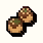 | [`ASIAN_TAKOYAKI`](../reference/items.md#item-asian-takoyaki) | Takoyaki | 6 điểm đói / 4 độ no; ăn |
|  | [`ASIAN_TERIYAKI_BOWL`](../reference/items.md#item-asian-teriyaki-bowl) | Cơm gà teriyaki | 10 điểm đói / 8 độ no; ăn; trả lại bát |
| 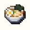 | [`ASIAN_TONKOTSU_RAMEN`](../reference/items.md#item-asian-tonkotsu-ramen) | Ramen tonkotsu | 10 điểm đói / 8 độ no; ăn; trả lại bát |
| 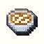 | [`ASIAN_UDON`](../reference/items.md#item-asian-udon) | Udon | 10 điểm đói / 8 độ no; ăn; trả lại bát |

## Công thức

### Nồi đun

| Công thức | Thành phẩm | Nguyên liệu | Yêu cầu nguyên liệu | Thời gian |
| --- | --- | --- | --- | --- |
| [`ASIAN_DANGO`](../recipes/default-recipes.md#recipe-asian-dango) | ... | ... | ... | 80 tick |
| [`ASIAN_DIM_SUM`](../recipes/default-recipes.md#recipe-asian-dim-sum) | ... | ... | ... | 180 tick |
| [`ASIAN_DUMPLINGS`](../recipes/default-recipes.md#recipe-asian-dumplings) | ... | ... | ... | 120 tick |
| [`ASIAN_HOT_POT`](../recipes/default-recipes.md#recipe-asian-hot-pot) | ... | ... | ... | 220 tick |
| [`ASIAN_MISO_SOUP`](../recipes/default-recipes.md#recipe-asian-miso-soup) | ... | ... | ... | 100 tick |
| [`ASIAN_PORK_BAO`](../recipes/default-recipes.md#recipe-asian-pork-bao) | ... | ... | ... | 120 tick |
| [`ASIAN_SHOYU_RAMEN`](../recipes/default-recipes.md#recipe-asian-shoyu-ramen) | ... | ... | ... | 140 tick |
| [`ASIAN_SUSHI_RICE`](../recipes/default-recipes.md#recipe-asian-sushi-rice) | ... | ... | ... | 100 tick |
| [`ASIAN_TONKOTSU_RAMEN`](../recipes/default-recipes.md#recipe-asian-tonkotsu-ramen) | ... | ... | ... | 160 tick |
| [`ASIAN_UDON`](../recipes/default-recipes.md#recipe-asian-udon) | ... | ... | ... | 140 tick |

### Thớt

| Công thức | Thành phẩm | Nguyên liệu | Yêu cầu nguyên liệu | Thời gian |
| --- | --- | --- | --- | --- |
| [`ASIAN_FEAST_BENTO`](../recipes/default-recipes.md#recipe-asian-feast-bento) | ... | ... | ... | 0 tick |
| [`ASIAN_MAKI`](../recipes/default-recipes.md#recipe-asian-maki) | ... | ... | ... | 0 tick |
| [`ASIAN_PUFFERFISH_SASHIMI`](../recipes/default-recipes.md#recipe-asian-pufferfish-sashimi) | ... | ... | ... | 0 tick |
| [`ASIAN_SASHIMI`](../recipes/default-recipes.md#recipe-asian-sashimi) | ... | ... | ... | 0 tick |
| [`DRY_PASTA`](../recipes/default-recipes.md#recipe-dry-pasta-2) | ... | ... | ... | 0 tick |
| [`SUSHI`](../recipes/default-recipes.md#recipe-sushi-2) | ... | ... | ... | 0 tick |

### Chảo chiên

| Công thức | Thành phẩm | Nguyên liệu | Yêu cầu nguyên liệu | Thời gian |
| --- | --- | --- | --- | --- |
| [`ASIAN_GYOZA`](../recipes/default-recipes.md#recipe-asian-gyoza) | ... | ... | ... | 100 tick |
| [`ASIAN_SPRING_ROLL`](../recipes/default-recipes.md#recipe-asian-spring-roll) | ... | ... | ... | 90 tick |
| [`ASIAN_TAKOYAKI`](../recipes/default-recipes.md#recipe-asian-takoyaki) | ... | ... | ... | 100 tick |
| [`ASIAN_TERIYAKI_BOWL`](../recipes/default-recipes.md#recipe-asian-teriyaki-bowl) | ... | ... | ... | 120 tick |
| [`FRIED_RICE`](../recipes/default-recipes.md#recipe-fried-rice-2) | ... | ... | ... | 100 tick |

### Bát trộn

| Công thức | Thành phẩm | Nguyên liệu | Yêu cầu nguyên liệu | Thời gian |
| --- | --- | --- | --- | --- |
| [`ASIAN_BOBA_TEA`](../recipes/default-recipes.md#recipe-asian-boba-tea) | ... | ... | ... | 0 tick |
| [`ASIAN_MATCHA_ICE_CREAM`](../recipes/default-recipes.md#recipe-asian-matcha-ice-cream) | ... | ... | ... | 0 tick |
| [`ASIAN_MOCHI`](../recipes/default-recipes.md#recipe-asian-mochi) | ... | ... | ... | 0 tick |
| [`ASIAN_POKE_BOWL`](../recipes/default-recipes.md#recipe-asian-poke-bowl) | ... | ... | ... | 0 tick |
| [`ASIAN_PORTABLE_BENTO`](../recipes/default-recipes.md#recipe-asian-portable-bento) | ... | ... | ... | 0 tick |

## Ghi đè công thức cơ bản

Gói này chủ động cung cấp định nghĩa ưu tiên cao hơn cho các công thức: `DOUGH`, `DRY_PASTA`, `SUSHI`, `FRIED_RICE`.

## Biến thể tự động

Các công thức này sẽ chọn hình ảnh thành phẩm dựa trên nguyên liệu được sử dụng hoặc đặc tính thực phẩm đi kèm.

| Công thức | Các biến thể được tạo |
| --- | --- |
| [`DRY_PASTA`](../recipes/default-recipes.md#recipe-dry-pasta-2) | Mì ống khô mặc định, Bún gạo |
| [`ASIAN_SASHIMI`](../recipes/default-recipes.md#recipe-asian-sashimi) | Sashimi cá hồi mặc định, Sashimi cá tuyết, Sashimi cá nhiệt đới |
| [`SUSHI`](../recipes/default-recipes.md#recipe-sushi-2) | Nigiri cá hồi mặc định, Nigiri cá tuyết, Nigiri cá nhiệt đới, Nigiri trứng, Nigiri nấm, Nigiri lươn |
| [`ASIAN_MAKI`](../recipes/default-recipes.md#recipe-asian-maki) | Maki cá hồi mặc định, Maki rau củ, Maki nhiệt đới |
| [`ASIAN_DUMPLINGS`](../recipes/default-recipes.md#recipe-asian-dumplings) | Há cảo thịt mặc định, Há cảo rau củ, Há cảo hải sản |
| [`ASIAN_POKE_BOWL`](../recipes/default-recipes.md#recipe-asian-poke-bowl) | Poke cá hồi mặc định, Poke cá tuyết |

## Gỡ gói

Xóa cả hai tệp JSON cùng lúc, sau đó chạy `/hl reload`. Heirloom sẽ khôi phục những định nghĩa công thức có sẵn với mức ưu tiên thấp hơn mà gói này đã ghi đè.
