# Thư viện ảnh

Thư viện tập hợp những hình ảnh và GIF hiện có trong dự án Wiki. Những hình ảnh còn thiếu được liệt kê tại [Hình ảnh cần bổ sung](media-needed.md).

## Hình ảnh trong trò chơi và giao diện

  <figure class="hl-media-card">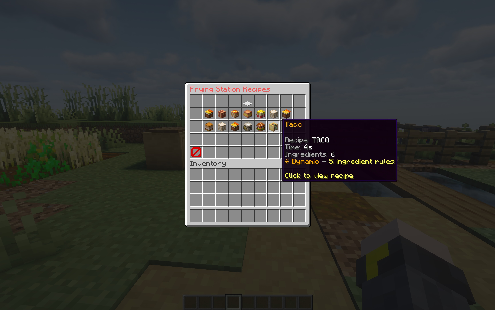<figcaption>Tra cứu công thức và nguyên liệu.</figcaption></figure>
  <figure class="hl-media-card"><figcaption>Giao diện tìm kiếm công thức.</figcaption></figure>
  <figure class="hl-media-card"><figcaption>Tìm kiếm công thức trong khung chat.</figcaption></figure>
  <figure class="hl-media-card"><a class="hl-media-link" href="../getting-started/installation/">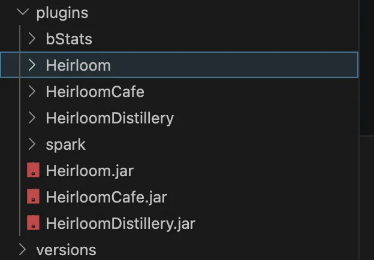</a><figcaption>Cấu trúc thư mục sau khi cài đặt.</figcaption></figure>
  <figure class="hl-media-card"><a class="hl-media-link" href="../getting-started/first-meal/">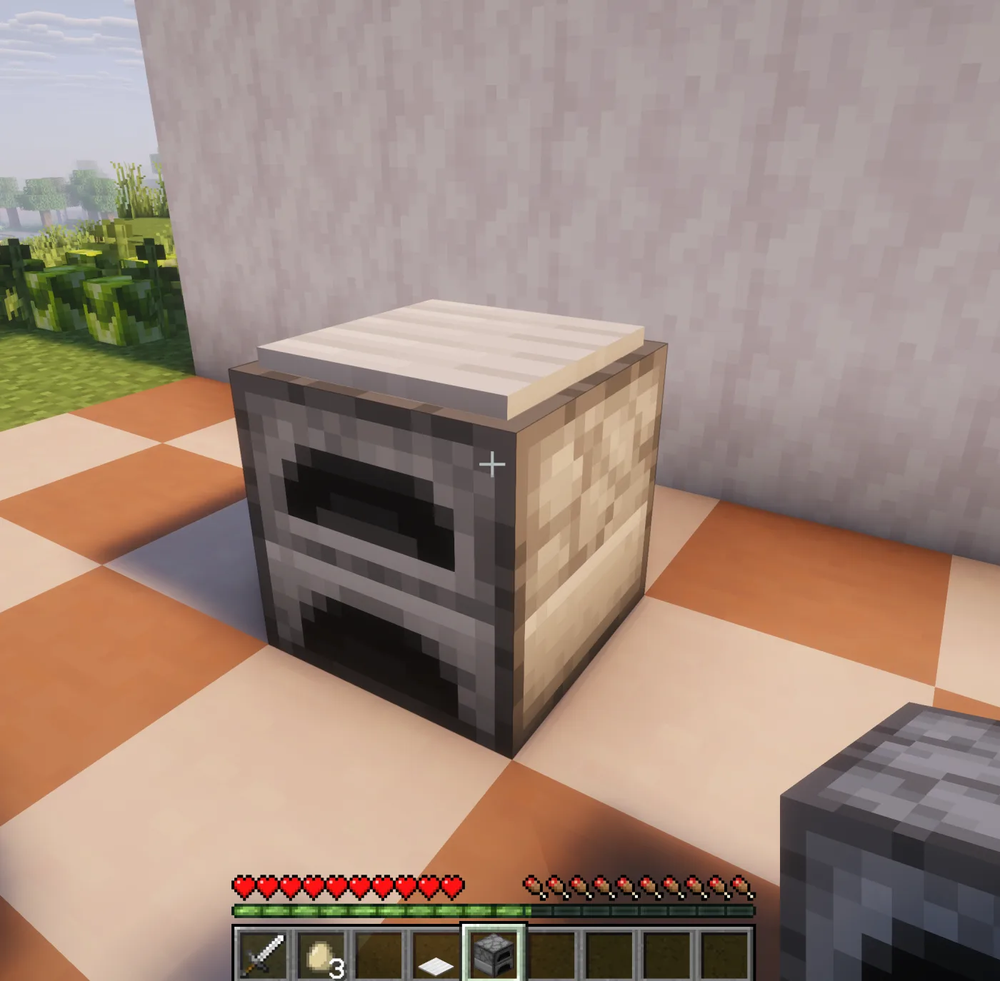</a><figcaption>Thiết lập trạm cho bữa ăn đầu tiên.</figcaption></figure>
  <figure class="hl-media-card"><a class="hl-media-link" href="../getting-started/first-meal/">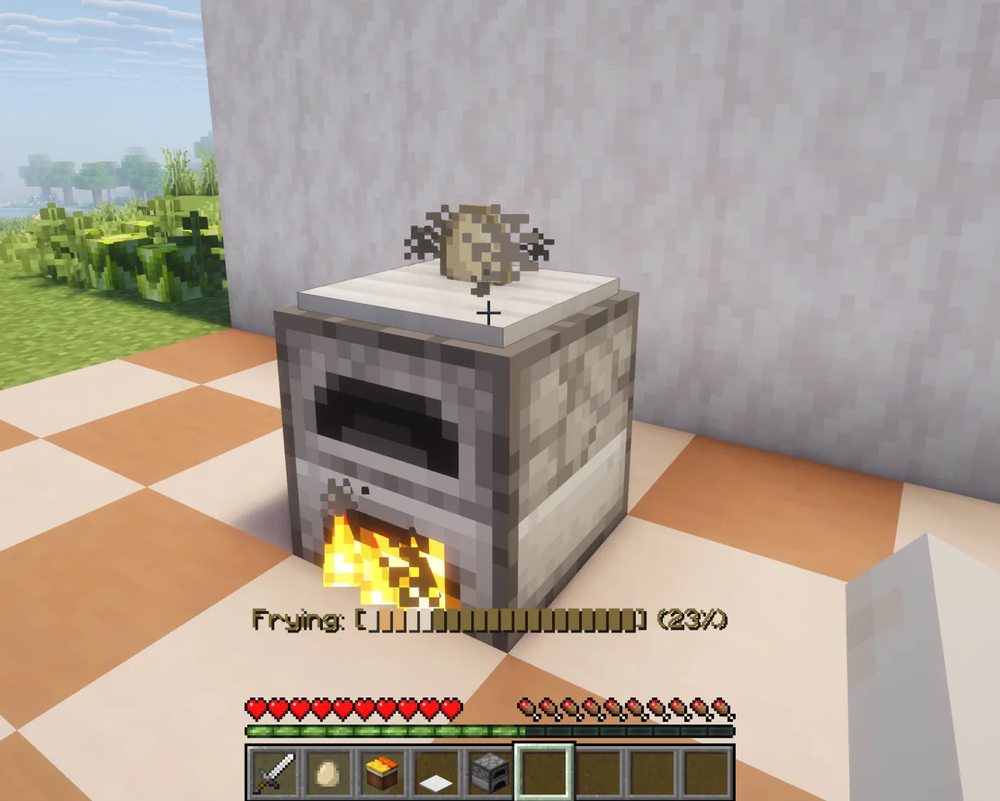</a><figcaption>Tiến trình nấu bữa ăn đầu tiên.</figcaption></figure>
  <figure class="hl-media-card"><a class="hl-media-link" href="../player-guide/cooking/">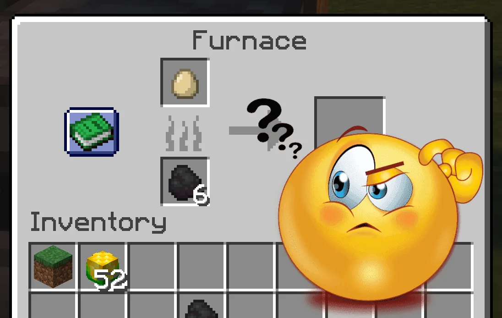</a><figcaption>Ví dụ khi tương tác nhầm với lò nung.</figcaption></figure>
  <figure class="hl-media-card"><figcaption>Thông tin chất lượng thực phẩm.</figcaption></figure>
  <figure class="hl-media-card">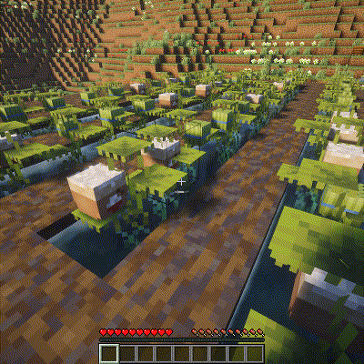<figcaption>Quá trình sinh trưởng và hình ảnh của cây lúa.</figcaption></figure>
  <figure class="hl-media-card">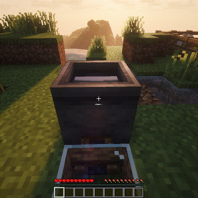<figcaption>Quy trình nấu và các biến thể công thức.</figcaption></figure>
  <figure class="hl-media-card">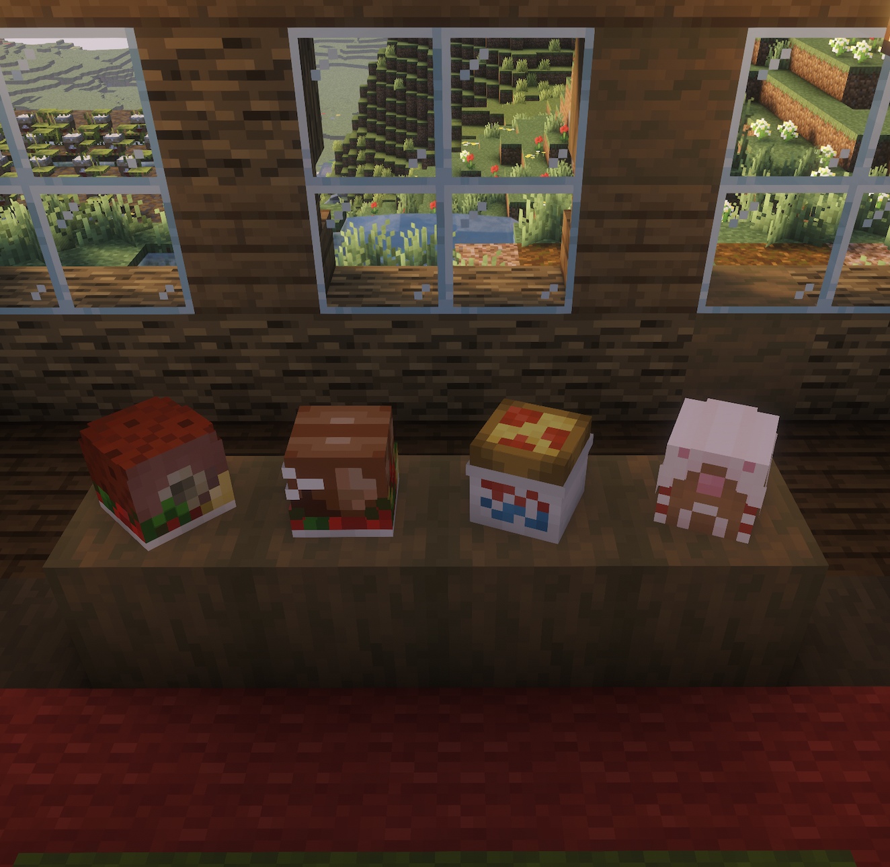<figcaption>Thức ăn theo mùa có thể đặt trong thế giới.</figcaption></figure>
  <figure class="hl-media-card"><figcaption>Giao diện thành tựu.</figcaption></figure>
  <figure class="hl-media-card">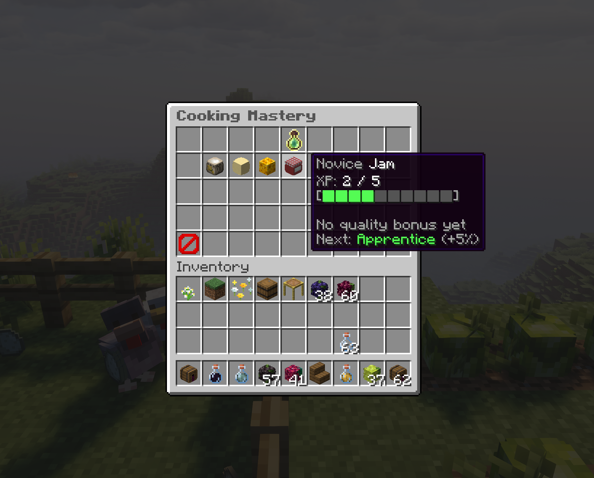<figcaption>Giao diện tinh thông nấu ăn.</figcaption></figure>

## Hệ thống nấu ăn

  <figure class="hl-media-card"><a class="hl-media-link" href="../stations/oven/">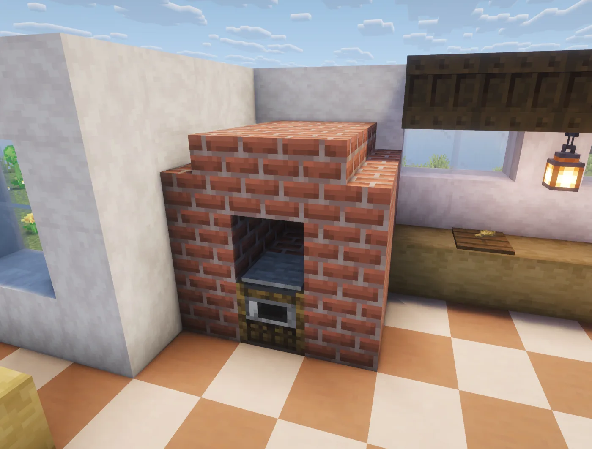</a><figcaption>Trạm Lò nướng.</figcaption></figure>
  <figure class="hl-media-card"><a class="hl-media-link" href="../stations/boiling-pot/">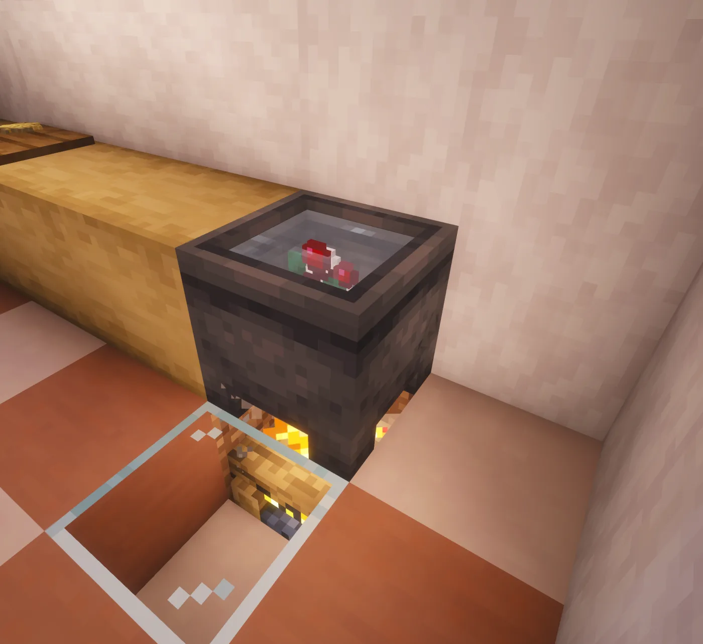</a><figcaption>Trạm Nồi đun.</figcaption></figure>
  <figure class="hl-media-card"><a class="hl-media-link" href="../stations/mixing-bowl/">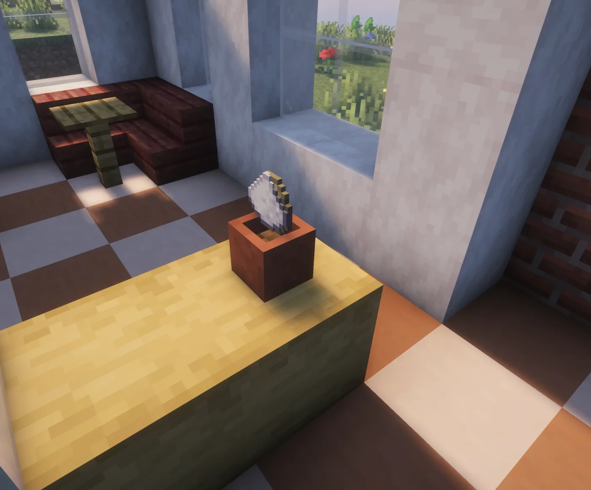</a><figcaption>Trạm Bát trộn.</figcaption></figure>
  <figure class="hl-media-card"><a class="hl-media-link" href="../stations/cutting-board/">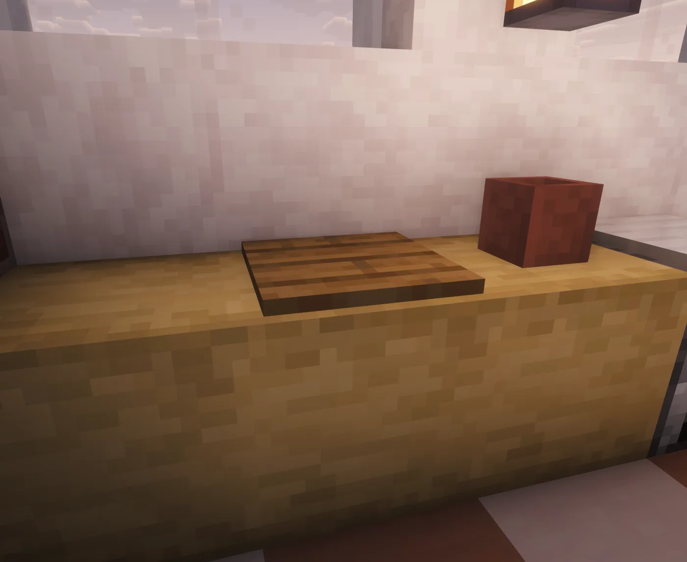</a><figcaption>Trạm Thớt.</figcaption></figure>
  <figure class="hl-media-card"><a class="hl-media-link" href="../stations/frying-pan/">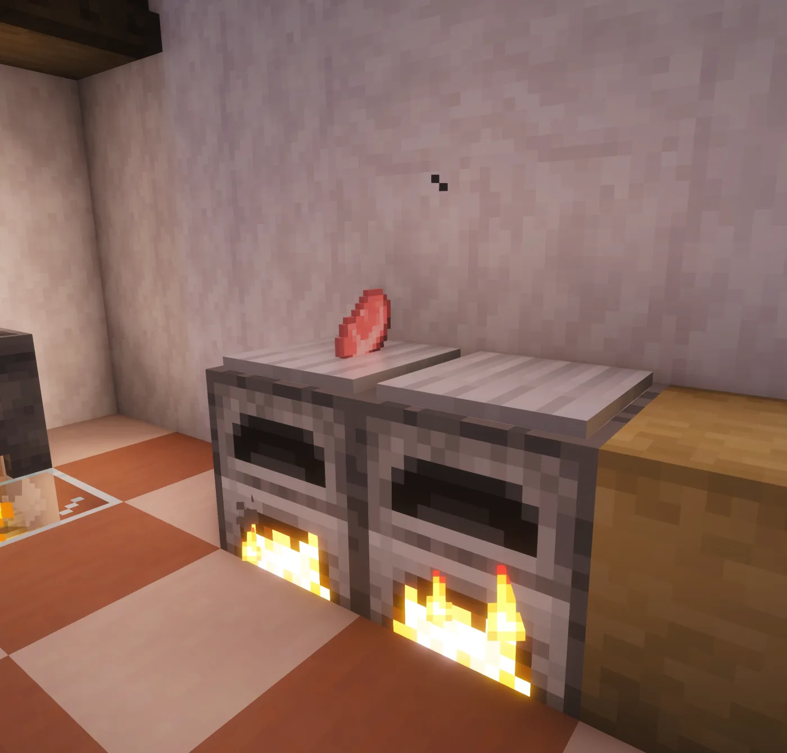</a><figcaption>Trạm Chảo chiên.</figcaption></figure>
  <figure class="hl-media-card"><a class="hl-media-link" href="../stations/barista-machine/">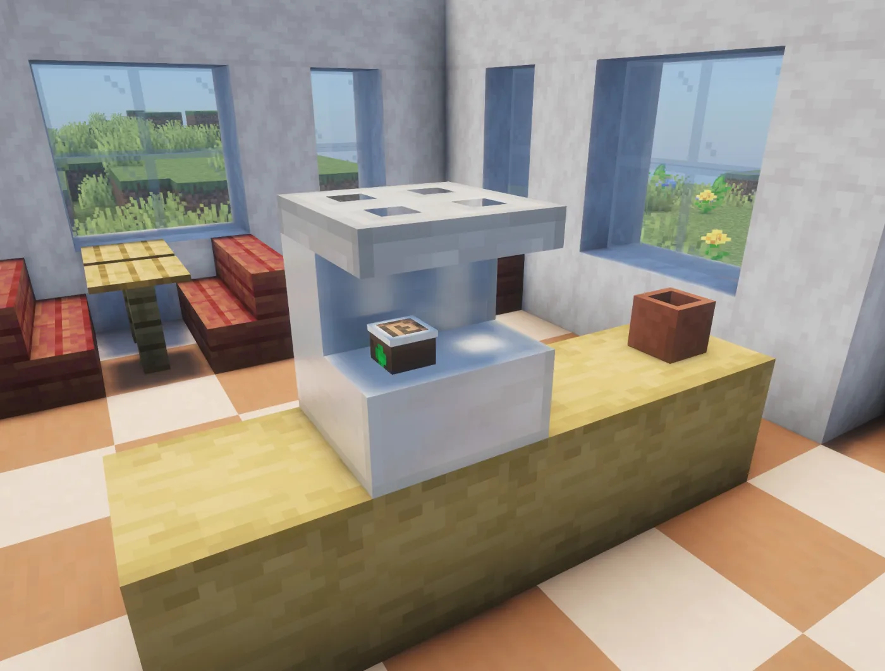</a><figcaption>Trạm Máy pha chế.</figcaption></figure>

## Cây trồng

  <figure class="hl-media-card"><figcaption>Xà lách: Cây trồng thấp, mọc sát mặt đất.</figcaption></figure>
  <figure class="hl-media-card"><figcaption>Hành tây: Cây họ hành mọc sát mặt đất.</figcaption></figure>
  <figure class="hl-media-card"><figcaption>Ngô: Cây trồng cao, cần không gian theo chiều dọc.</figcaption></figure>
  <figure class="hl-media-card"><figcaption>Cà chua: Cây leo có thể mọc trên tường.</figcaption></figure>
  <figure class="hl-media-card"><figcaption>Lúa: Cây trồng dưới nước.</figcaption></figure>

## Hoạt ảnh hệ thống ủ rượu

  <figure class="hl-media-card"><figcaption>Giã ngũ cốc trong thùng.</figcaption></figure>
  <figure class="hl-media-card"><figcaption>Đun dịch ngũ cốc.</figcaption></figure>
  <figure class="hl-media-card"><figcaption>Quá trình lên men rượu vang.</figcaption></figure>
  <figure class="hl-media-card"><figcaption>Thành phẩm sau khi chưng cất.</figcaption></figure>

