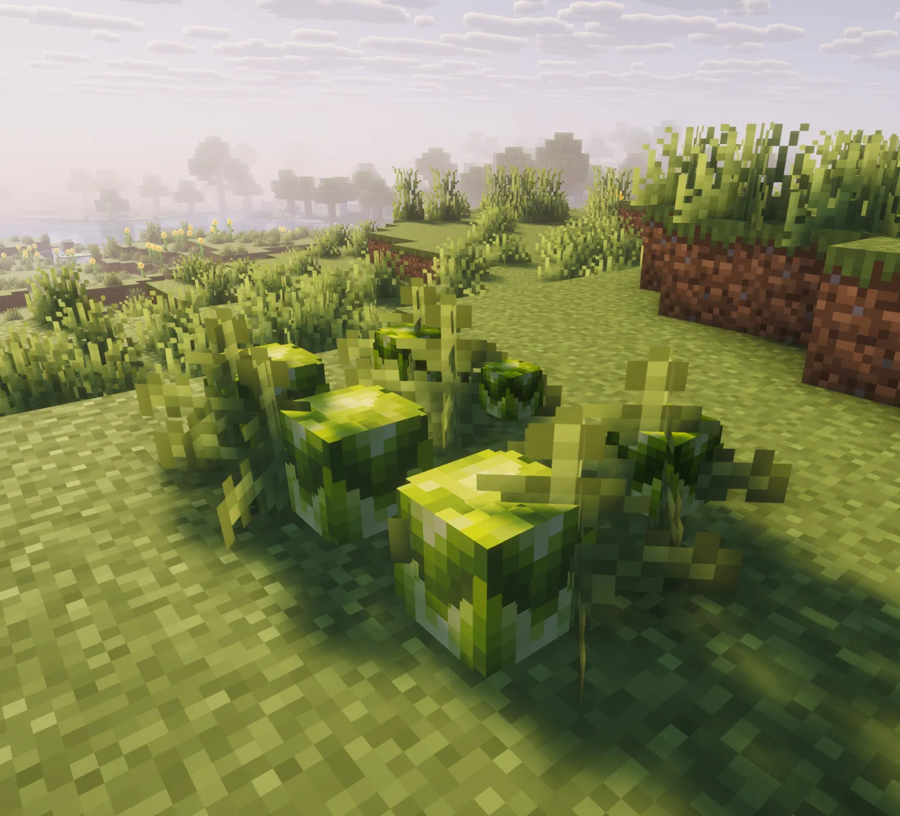
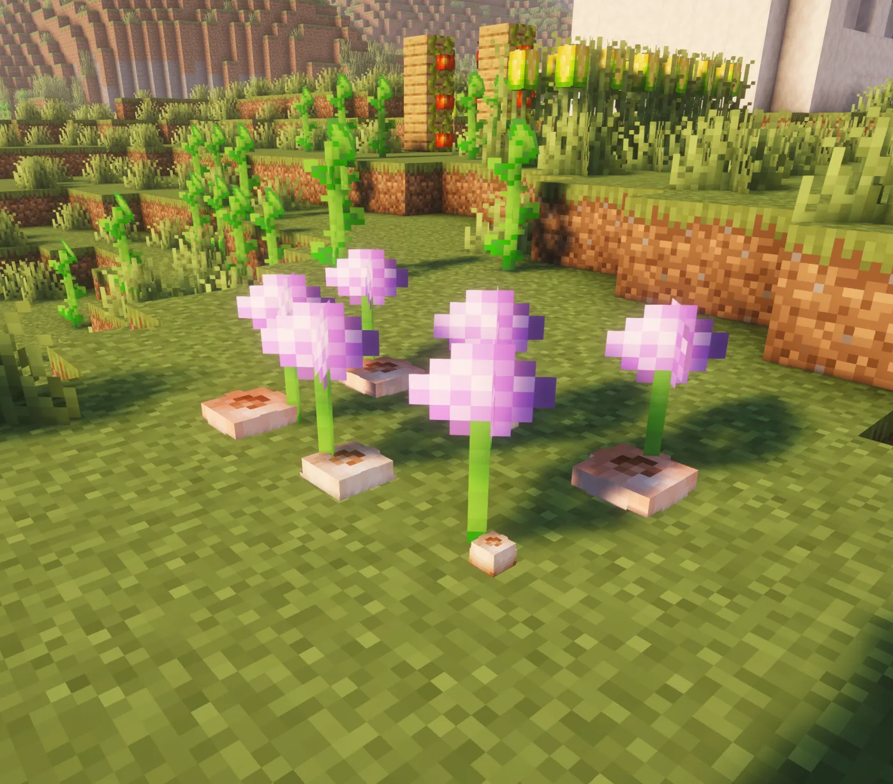

# Hệ thống nông sản đầu tiên

Tham khảo bắt đầu với xà lách vì đây là loại cây có cách trồng và phát triển đơn giản nhất.

## Các loại cây trồng mẫu

<div class="hl-media-grid">
  <figure class="hl-media-card"><a class="hl-media-link" href="../../gardening/lettuce/"></a><figcaption>Xà lách: Cây trồng thấp, mọc sát mặt đất.</figcaption></figure>
  <figure class="hl-media-card"><a class="hl-media-link" href="../../gardening/onion/"></a><figcaption>Hành tây: Cây trồng thấp, mọc sát mặt đất.</figcaption></figure>
  <figure class="hl-media-card"><a class="hl-media-link" href="../../gardening/corn/"></a><figcaption>Ngô: Cây trồng cao, cần có đủ không gian phía trên.</figcaption></figure>
  <figure class="hl-media-card"><a class="hl-media-link" href="../../gardening/tomato/"></a><figcaption>Cà chua: Cây dây leo, cần có tường để bám.</figcaption></figure>
  <figure class="hl-media-card"><a class="hl-media-link" href="../../gardening/rice/"></a><figcaption>Lúa: Cây trồng dưới nước.</figcaption></figure>
</div>

## Cách lấy cây trồng

Quản trị viên có thể dùng lệnh sau để lấy thử cây trồng:

```text
/hl give LETTUCE
```

Thông thường, người chơi sẽ tìm thấy hạt giống từ cỏ, túi hạt giống, rương chứa vật phẩm hoặc các khu vực cây trồng xuất hiện tự nhiên, tùy theo cấu hình của máy chủ.

## Trồng xà lách

1. Cầm `LETTUCE` trên tay.
2. Nhấp chuột phải vào cỏ, đất, đất thô, podzol hoặc đất rễ.
3. Chờ cây phát triển qua các giai đoạn cho đến khi trưởng thành.
4. Nhấp chuột phải vào cây đã trưởng thành để thu hoạch.

## Thử các loại cây trồng khác

- Xà lách: cây thấp, mọc sát mặt đất.
- Hành tây: cây thấp, mọc sát mặt đất.
- Ngô: cây cao, cần khoảng trống phía trên.
- Cà chua: cây dây leo, cần tường để bám.
- Lúa: cây trồng dưới nước, cần được trồng trên đất có nước bên trên.

Tham khảo [Làm vườn](../gardening/index.md) để xem điều kiện trồng, quyền cần thiết và các vật phẩm nhận được khi thu hoạch.
