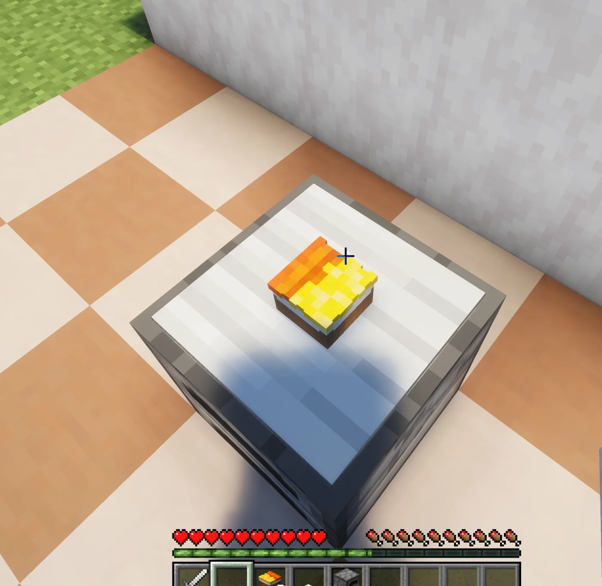

# Bữa ăn đầu tiên

Hướng dẫn này sẽ giúp quản trị viên chế biến một món ăn đơn giản và làm quen với cách sử dụng các trạm nấu trong Heirloom.

## Hình ảnh minh họa quy trình

  <figure class="hl-media-card"><figcaption>Dựng chảo chiên bằng một lò nung và một tấm áp lực có trọng lượng nặng.</figcaption></figure>
  <figure class="hl-media-card"><figcaption>Nhấp chuột phải khi đang cầm trứng để đặt nguyên liệu lên chảo.</figcaption></figure>
  <figure class="hl-media-card"><figcaption>Để tay trống rồi nhấp chuột phải vào chảo để bắt đầu nấu và theo dõi tiến trình.</figcaption></figure>
  <figure class="hl-media-card"><figcaption>Lấy món ăn đã hoàn thành khỏi chảo chiên.</figcaption></figure>

## Lỗi thường gặp

  <figure class="hl-media-card"><figcaption>Giao diện lò nung thông thường không dùng để nấu công thức của Heirloom. Hãy tương tác trực tiếp với trạm nấu bên ngoài thay vì mở giao diện của lò nung.</figcaption></figure>

## Mục tiêu

Nấu món Trứng chiên bằng chảo chiên.

## Chế tạo chảo chiên

Đặt một khối `FURNACE` (lò nung), sau đó đặt một `HEAVY_WEIGHTED_PRESSURE_PLATE` (tấm áp lực có trọng lượng nặng) lên trên. Người chơi sẽ tương tác trực tiếp với tấm áp lực để sử dụng trạm nấu.

## Cách nấu

1. Cầm một quả trứng trên tay.
2. Nhấp chuột phải vào chảo chiên để đặt trứng lên.
3. Bỏ vật phẩm đang cầm trên tay để tay trống.
4. Nhấp chuột phải vào trạm để bắt đầu nấu.
5. Chờ đến khi hiệu ứng báo hiệu món ăn đã hoàn thành xuất hiện.
6. Nhấp chuột trái để lấy món ăn, hoặc tiếp tục thêm nguyên liệu nếu món ăn này được dùng cho công thức tiếp theo.

## Những điểm cần lưu ý

- Hệ thống nấu lưu các nguyên liệu dưới dạng những thực thể hiển thị ngay trên trạm.
- Một số hệ thống yêu cầu sử dụng đúng công cụ để đạt kết quả tốt nhất, chẳng hạn như dùng dao trên thớt.
- Chất lượng món ăn có thể được cải thiện bằng cách thao tác đúng với trạm nấu và nâng cao kỹ năng nấu ăn.

Tiếp theo: [Trang trại đầu tiên](first-farm.md) hoặc [Trình duyệt công thức](recipe-browser.md).
