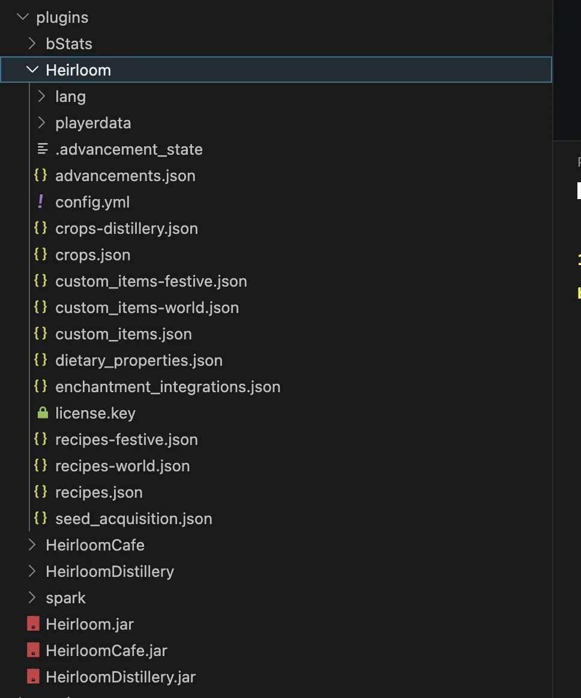

# Cài đặt

Heirloom là plugin dành cho các máy chủ Minecraft 1.21+. Trước tiên,cài đặt plugin, sau đó mới cài thêm các tiện ích tùy chọn như Hệ thống Ủ rượu và Hệ thống Cà phê.

## Bố cục cài đặt

  <figure class="hl-media-card"><figcaption>Các tệp jar của Heirloom lõi và các tiện ích cùng những thư mục plugin đã được tạo.</figcaption></figure>
  <figure class="hl-media-card"><figcaption>Các tệp tài nguyên của Heirloom được tạo tự động sau lần khởi động đầu tiên.</figcaption></figure>

## Yêu cầu hệ thống

- Máy chủ tương thích với Paper và Minecraft 1.21.
- Phiên bản Java phù hợp với phiên bản máy chủ đang sử dụng.
- Tệp `.jar` của Heirloom lõi.
- Tùy chọn: tệp `.jar` của tiện ích mở rộng HeirloomDistillery và HeirloomCafe.
- Tùy chọn plugin hiển thị gói tài nguyên: Nexo, CraftEngine hoặc ItemsAdder.
- Tùy chọn plugin bảo vệ: WorldGuard, Towny, GriefPrevention, Lands hoặc các Plugin phụ trách bảo vệ công trình tương tự.

## Cài đặt Heirloom

1. Dừng máy chủ.
2. Đặt tệp `.jar` của Heirloom vào thư mục `plugins/`.
3. Khởi động máy chủ.
4. Kiểm tra xem thư mục `plugins/Heirloom/` đã được tạo hay chưa.
5. Vào máy chủ và chạy lệnh `/hl help`.

## Cài đặt tiện ích mở rộng

Hệ thống Ủ rượu và Hệ thống Cà phê cần có Heirloom để hoạt động. Sau khi cài Heirloom , đặt tệp `.jar` của tiện ích vào thư mục `plugins/`, sau đó khởi động lại máy chủ. Sau khi cài đặt xong, hãy chạy các lệnh kiểm tra: `/hld help`

!!! Lưu ý
Nếu quản trị viên sử dụng plugin bảo vệ công trình, thì nhớ kiểm tra khả năng trồng cây, thu hoạch và sử dụng hệ thống nấu ăn ở cả khu vực cho phép và bị cấm trước - khi mở máy chủ cho người chơi tham gia.
