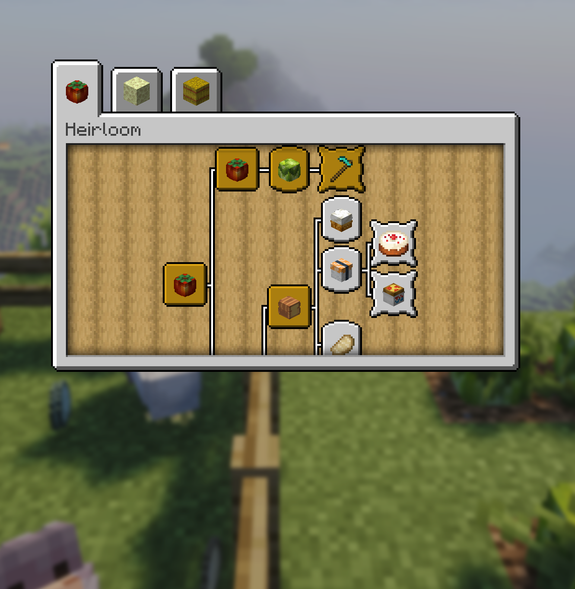

# Thành tựu

<figure class="hl-figure">
  
  <figcaption>Heirloom có sẵn hệ thống theo dõi tiến trình thành tựu.</figcaption>
</figure>

Heirloom theo dõi quá trình khám phá món ăn, thu hoạch cây trồng, hoàn thành công thức, sưu tầm vật phẩm và đạt các mốc chất lượng.

Các lệnh liên quan:

```text
/hl advancements
/hl adv
/hl progress
```

## Cách tính tiến độ

Khi người chơi ăn một món ăn tùy chỉnh, Heirloom sẽ ghi lại ID của món ăn và chất lượng của món đó. Tiến độ thu hoạch cây trồng cũng được ghi nhận tương tự. Với các thành tựu yêu cầu sưu tầm, Heirloom sẽ kiểm tra xem người chơi đã ăn hoặc thu hoạch đủ tất cả vật phẩm được yêu cầu hay chưa. Các thành tựu yêu cầu đạt đủ số lượng sẽ theo dõi tổng số lần thực hiện.

Quản trị viên có thể chỉnh sửa các thành tựu được cung cấp sẵn trong tệp `advancements.json`.
