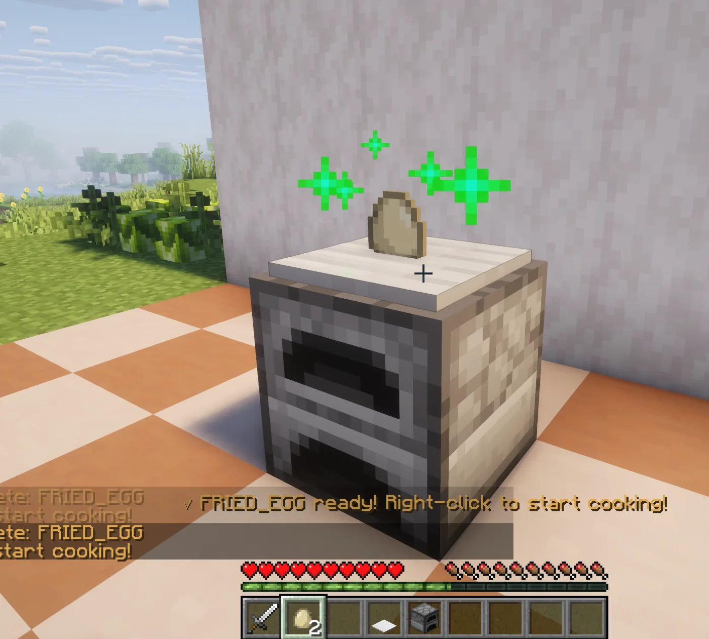

# Kiến thức cơ bản về nấu ăn

Người chơi sẽ chuẩn bị một hệ thống nấu ăn, đặt nguyên liệu lên đó, bắt đầu nấu rồi lấy thành phẩm. Thành phẩm sau đó có thể được dùng làm nguyên liệu cho bước tiếp theo trong một chuỗi chế biến.

## Ví dụ về quy trình nấu

  <figure class="hl-media-card"><figcaption>Nguyên liệu được đặt trực tiếp lên hệ thống và hiển thị như một vật thể trong thế giới.</figcaption></figure>
  <figure class="hl-media-card"><figcaption>Quá trình nấu bắt đầu sau khi tương tác với hệ thống và tiến trình được hiển thị trong trò chơi.</figcaption></figure>
  <figure class="hl-media-card"><figcaption>Nếu giao diện lò nung thông thường mở ra, nghĩa là đang tương tác không đúng cách với hệ thống nấu.</figcaption></figure>

## Quy trình nấu

1. Dựng hệ thống nấu theo đúng hình dạng được yêu cầu.
2. Cầm nguyên liệu trên tay và nhấp chuột phải vào hệ thống để đặt nguyên liệu lên đó.
3. Bỏ vật phẩm trên tay để tay trống, sau đó nhấp chuột phải vào hệ thống để bắt đầu nấu.
4. Chờ quá trình nấu hoàn tất.
5. Nhấp chuột trái để lấy thành phẩm, hoặc giữ nguyên liệu trên hệ thống nếu thành phẩm đó sẽ được dùng cho công thức tiếp theo.

## Chuỗi công thức là phần quan trọng

Nhiều món ăn được tạo ra qua nhiều bước thay vì chỉ cần một công thức. Ví dụ, bột mì có thể được làm thành bột nhào, sau đó bột nhào được dùng để làm bánh mì hoặc bánh kếp. Gạo có thể được nấu thành cơm rồi tiếp tục dùng cho những món khác. Mứt cũng có thể được dùng làm lớp phủ cho món ăn khác và giữ lại các đặc tính của nó.

Khi một công thức yêu cầu `Jam`(mứt), Heirloom sẽ sử dụng đúng loại mứt đã được tạo ra trước đó, bao gồm chất lượng, thông tin về người chế biến, vật phẩm được trả lại khi ăn và các thuộc tính thực phẩm đi kèm.

## Những yếu tố có thể làm thay đổi kết quả

Món ăn thành phẩm có thể bị ảnh hưởng bởi cấu hình công thức, nguyên liệu tùy chọn, các thuộc tính được kế thừa, chất lượng và thông tin hiển thị. Vì vậy, hai món ăn có cùng ID đầu ra vẫn có thể có tên, phần mô tả, hình ảnh hoặc hiệu ứng khác nhau.

## Trả lại vật phẩm chứa

Một số công thức hoặc món ăn có thể trả lại xô, chai hoặc vật chứa khác. Có hai trường hợp thường gặp:

- Trả lại khi chế biến: Hệ thống nấu sẽ trả lại vật phẩm sau khi công thức hoàn thành.
- Trả lại khi ăn: Người chơi nhận lại vật phẩm sau khi ăn món đó, chẳng hạn như một chiếc chai sau khi ăn mứt.

## Những lỗi thường gặp

- Dựng hệ thống sai hình dạng, khiến Heirloom không đọc được.
- Sử dụng sai loại nguyên liệu, chẳng hạn như dùng `WHEAT` thay vì `BAG_OF_FLOUR`.
- Công thức thuộc về một hệ thống nấu hoặc tiện ích mở rộng khác.
- Nguyên liệu tùy chọn đã khớp với công thức cơ bản, nhưng không đáp ứng đúng điều kiện mà quản trị viên mong muốn.
- Plugin bảo vệ công trình đang chặn tương tác tại vị trí đó.

Nếu không biết nên tiếp tục với nguyên liệu nào, hãy thử `/hl search <nguyên liệu>`. Cách này thường giúp tìm công thức phù hợp nhanh hơn thay vì phải tự đoán nên sử dụng hệ thống nào.
