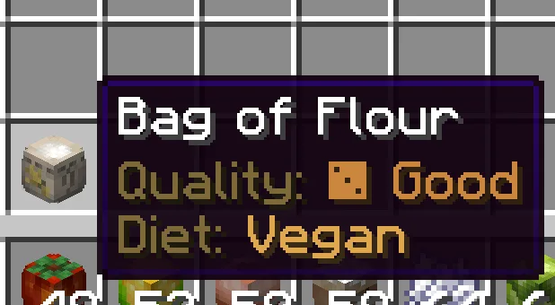

# Chất lượng món ăn

Chất lượng được lưu trên các món ăn và nguyên liệu tùy chỉnh. Chất lượng không chỉ để mô tả món ăn mà còn ảnh hưởng đến quá trình tiến triển, thành tựu và kết quả của công thức.

## Những yếu tố ảnh hưởng đến chất lượng

- Công thức có thể đặt chất lượng ban đầu hoặc cộng thêm chất lượng.
- Chất lượng của nguyên liệu có thể được truyền sang món ăn tiếp theo. Nếu công thức không quy định chất lượng cụ thể, Heirloom sẽ lấy mức chất lượng cao nhất trong các nguyên liệu được sử dụng.
- Cây trồng có thể lưu lại chất lượng và giữ nguyên chất lượng đó khi được trồng lại sau khi thu hoạch.
- Hệ thống Tinh thông nấu ăn sẽ cộng thêm một mức thưởng chất lượng riêng cho từng công thức khi người chơi chế biến công thức đó nhiều lần.

## Xem chất lượng trong hệ thống cây trồng

Chất lượng món ăn được hiển thị trong tên và phần mô tả của vật phẩm. Hai người chơi cùng nấu một công thức vẫn có thể nhận được món ăn có chất lượng khác nhau, tùy vào nguyên liệu sử dụng và mức Tinh thông nấu ăn của từng người.

## Ví dụ về hiển thị chất lượng

<figure class="hl-figure">
  
  <figcaption>Thông tin về chất lượng và thuộc tính dinh dưỡng được hiển thị ngay trong phần mô tả của vật phẩm.</figcaption>
</figure>

## Vì sao chất lượng quan trọng

Chất lượng tạo thêm mục tiêu lâu dài cho người chơi, từ việc trồng cây có chất lượng cao hơn, chế biến món ăn ngày càng tốt hơn cho đến việc hoàn thành các thành tựu dựa trên chất lượng. Nếu một công thức không mang lại cảm giác xứng đáng, hãy kiểm tra xem công thức có đặt chất lượng quá thấp hoặc không kế thừa chất lượng từ nguyên liệu hay không.

Quản trị viên có thể xem phần cấu hình tương ứng tại [Công thức tùy chỉnh](../customization/custom-recipes.md).
