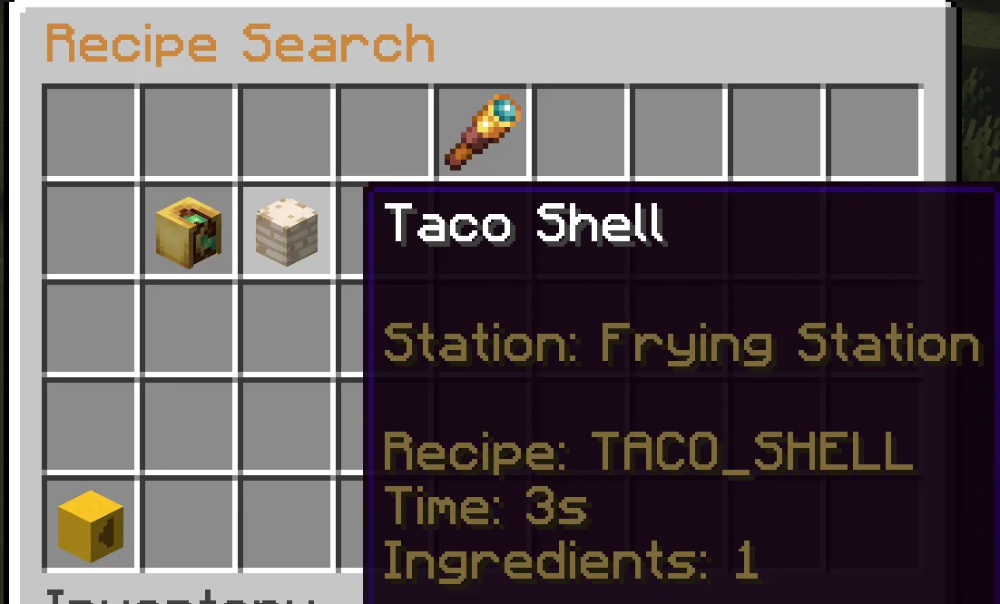
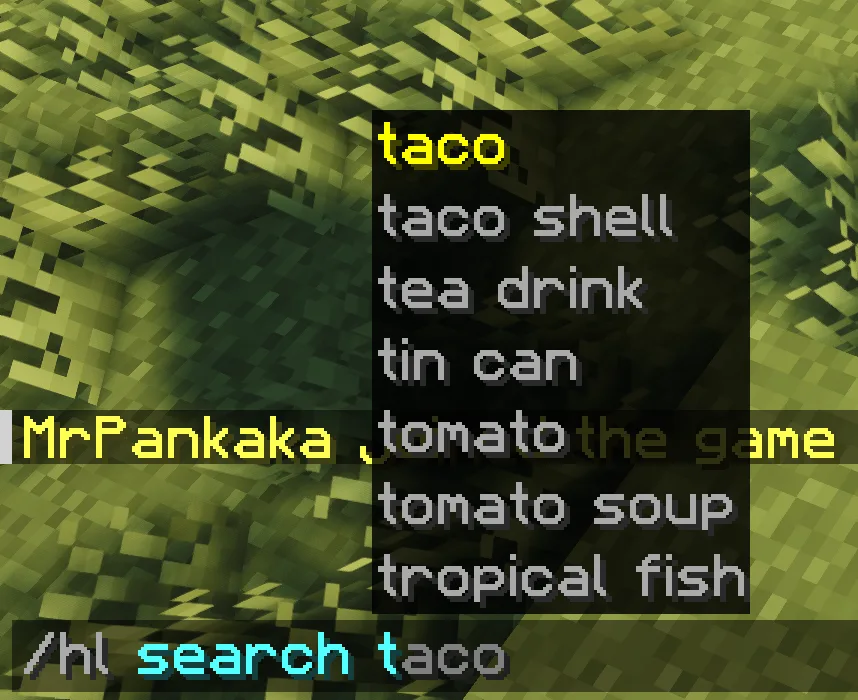

# Tìm kiếm công thức

`/hl search <từ khóa>` cho phép tìm công thức dựa trên tên món ăn, trạm nấu, tiện ích, nguyên liệu hoặc vật phẩm tạo ra. Đây là cách nhanh nhất để tìm lại các bước trong một chuỗi chế biến.

## Ví dụ tìm kiếm

<div class="hl-media-grid">
  <figure class="hl-media-card"><figcaption>Giao diện tìm kiếm công thức với các kết quả phù hợp.</figcaption></figure>
  <figure class="hl-media-card"><figcaption>Kết quả tìm kiếm được hiển thị trong khung trò chuyện để tra cứu nhanh.</figcaption></figure>
</div>

Ví dụ:

```text
/hl search pizza
/hl search rice
/hl search oven
/hl search cafe
/hl search jam
```

## Cách tìm kiếm hiệu quả

Nên tìm nguyên liệu đang có thay vì chỉ tìm món ăn muốn làm. Ví dụ, nếu đang có `RICE`, hãy tìm "rice" để xem cách nấu cơm và những món có thể làm tiếp từ cơm. Nếu đang có `JAM`, hãy tìm "jam" để xem các công thức làm bánh kếp, bánh rán hoặc những món khác của máy chủ có sử dụng mứt.

## Xem trước công thức

Giao diện công thức sẽ cho biết món ăn có thể tạo ra từ những nguyên liệu đã chọn. Nếu nguyên liệu có thuộc tính thực phẩm hoặc thông tin dinh dưỡng, các thông tin này cũng sẽ được hiển thị trước khi chế biến.
