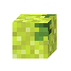
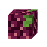
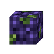
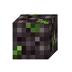
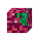

# Danh mục công thức mặc định

Trang này được tạo từ các tệp JSON công thức được đóng gói sẵn. Trang này dùng để tra cứu; các trang trạm nấu sẽ giải thích cách hệ thống vận hành trong thực tế.

## Máy pha chế

### Cà phê Americano - BREW_AMERICANO { #recipe-brew-americano }
| Trường | Giá trị |
| --- | --- |
| Đầu ra | <a class="hl-output-item" href="#recipe-brew-americano">AMERICANO</a> |
| Mô tả | Pha loãng espresso với nước nóng |
| Nguồn |  |
| Thời gian chế biến | 100 ticks |
| Nguyên liệu hiển thị |  |
| Nguyên liệu | bắt buộc: 1 x [`ESPRESSO`](../reference/items.md#item-espresso) bắt buộc: 1 x [`WATER_BOTTLE`](../reference/vanilla-items.md#vanilla-item-water-bottle) |
| Quy tắc và hành động | `SET_VISUAL_ITEM` = `AMERICANO` `SET_RETURN_ITEM` = `GLASS_BOTTLE` |

### Trà đen - BREW_BLACK_TEA { #recipe-brew-black-tea }
| Trường | Giá trị |
| --- | --- |
| Đầu ra | <a class="hl-output-item" href="#recipe-brew-black-tea">TEA_DRINK</a> |
| Mô tả | Ủ lá trà đen |
| Nguồn |  |
| Thời gian chế biến | 140 ticks |
| Nguyên liệu hiển thị | 0-1 |
| Nguyên liệu | bắt buộc: 1 x [`BLACK_TEA_LEAVES`](../reference/items.md#item-black-tea-leaves) tuỳ chọn: 0-1 x [`SUGAR`](../reference/vanilla-items.md#vanilla-item-sugar) |
| Quy tắc và hành động | `SET_PROPERTY` `NAME` = `Black Tea` `SET_VISUAL_ITEM` = `BLACK_TEA` `SET_PROPERTY` `NAME` = `Sweet Tea` `SET_VISUAL_ITEM` = `SWEET_TEA` |

### Trà sữa trân châu - BREW_BOBA_TEA { #recipe-brew-boba-tea }
| Trường | Giá trị |
| --- | --- |
| Đầu ra | <a class="hl-output-item" href="#recipe-brew-boba-tea">BOBA_TEA</a>Trà sữa trân châu mặc địnhTrà sữa trân châu dâu |
| Mô tả | Lắc trà với sữa, đường và trân châu |
| Nguồn |  |
| Thời gian chế biến | 180 ticks |
| Nguyên liệu hiển thị | hoặchoặchoặc0-1 |
| Nguyên liệu | bắt buộc: 1 x [`DRIED_GREEN_TEA`](../reference/items.md#item-dried-green-tea) hoặc [`BLACK_TEA_LEAVES`](../reference/items.md#item-black-tea-leaves) bắt buộc: 1 x [`MILK_BUCKET`](../reference/vanilla-items.md#vanilla-item-milk-bucket) hoặc [`OAT_MILK`](../reference/items.md#item-oat-milk) bắt buộc: 1 x [`SLIME_BALL`](../reference/vanilla-items.md#vanilla-item-slime-ball) bắt buộc: 1 x [`SUGAR`](../reference/vanilla-items.md#vanilla-item-sugar) tuỳ chọn: 0-1 x [`SWEET_BERRIES`](../reference/vanilla-items.md#vanilla-item-sweet-berries) hoặc [`GLOW_BERRIES`](../reference/vanilla-items.md#vanilla-item-glow-berries) |
| Quy tắc và hành động | `SET_VISUAL_ITEM` = `BOBA_TEA` `SET_PROPERTY` `NAME` = `Boba Tea` `SET_TEXTURE` = `http://textures.minecraft.net/texture/d6d91d3dbfbc01d7bd4a8691f93d7f96d4a5d2bbd3e16faa8ec7c2e58c4907bd` `SET_QUALITY` = `0.45` `SET_RETURN_ITEM` = `BUCKET` `PREPEND_NAME` = `Berry ` `SET_TEXTURE` = `http://textures.minecraft.net/texture/57a4976386ea44e7168451068efaa9289dafb78bbaec9642050aa3ae99558bde` `ADD_QUALITY` = `0.08` `PREPEND_NAME` = `Glow Berry ` `SET_TEXTURE` = `http://textures.minecraft.net/texture/57a4976386ea44e7168451068efaa9289dafb78bbaec9642050aa3ae99558bde` `ADD_METADATA` `food_property` = `GLOWING` `ADD_QUALITY` = `0.12` `PREPEND_NAME` = `Oat ` |

### Cappuccino - BREW_CAPPUCCINO { #recipe-brew-cappuccino }
| Trường | Giá trị |
| --- | --- |
| Đầu ra | <a class="hl-output-item" href="#recipe-brew-cappuccino">CAPPUCCINO</a> |
| Mô tả | Đánh bông sữa thêm lên trên espresso |
| Nguồn |  |
| Thời gian chế biến | 160 ticks |
| Nguyên liệu hiển thị | hoặc2 |
| Nguyên liệu | bắt buộc: 1 x [`ESPRESSO`](../reference/items.md#item-espresso) bắt buộc: 2 x [`MILK_BUCKET`](../reference/vanilla-items.md#vanilla-item-milk-bucket) hoặc [`OAT_MILK`](../reference/items.md#item-oat-milk) |
| Quy tắc và hành động | `SET_VISUAL_ITEM` = `CAPPUCCINO` `SET_RETURN_ITEM` = `BUCKET` `SET_PROPERTY` `NAME` = `Oat Cappuccino` |

### Espresso - BREW_ESPRESSO { #recipe-brew-espresso }
| Trường | Giá trị |
| --- | --- |
| Đầu ra | <a class="hl-output-item" href="#recipe-brew-espresso">ESPRESSO</a> |
| Mô tả | Pha espresso từ hạt cà phê rang vừa hoặc rang đậm |
| Nguồn |  |
| Thời gian chế biến | 120 ticks |
| Nguyên liệu hiển thị | hoặc |
| Nguyên liệu | bắt buộc: 1 x [`COFFEE_BEANS_MEDIUM`](../reference/items.md#item-coffee-beans-medium) hoặc [`COFFEE_BEANS_DARK`](../reference/items.md#item-coffee-beans-dark) |
| Quy tắc và hành động | `SET_VISUAL_ITEM` = `ESPRESSO` |

### Flat White - BREW_FLAT_WHITE { #recipe-brew-flat-white }
| Trường | Giá trị |
| --- | --- |
| Đầu ra | <a class="hl-output-item" href="#recipe-brew-flat-white">FLAT_WHITE</a> |
| Mô tả | Hấp sữa vào hai phần espresso |
| Nguồn |  |
| Thời gian chế biến | 160 ticks |
| Nguyên liệu hiển thị | 2hoặc |
| Nguyên liệu | bắt buộc: 2 x [`ESPRESSO`](../reference/items.md#item-espresso) bắt buộc: 1 x [`MILK_BUCKET`](../reference/vanilla-items.md#vanilla-item-milk-bucket) hoặc [`OAT_MILK`](../reference/items.md#item-oat-milk) |
| Quy tắc và hành động | `SET_VISUAL_ITEM` = `FLAT_WHITE` `SET_RETURN_ITEM` = `BUCKET` `SET_PROPERTY` `NAME` = `Oat Flat White` |

### Trà xanh - BREW_GREEN_TEA { #recipe-brew-green-tea }
| Trường | Giá trị |
| --- | --- |
| Đầu ra | <a class="hl-output-item" href="#recipe-brew-green-tea">TEA_DRINK</a> |
| Mô tả | Ủ lá trà xanh khô |
| Nguồn |  |
| Thời gian chế biến | 140 ticks |
| Nguyên liệu hiển thị | 0-1 |
| Nguyên liệu | bắt buộc: 1 x [`DRIED_GREEN_TEA`](../reference/items.md#item-dried-green-tea) tuỳ chọn: 0-1 x [`SUGAR`](../reference/vanilla-items.md#vanilla-item-sugar) |
| Quy tắc và hành động | `SET_PROPERTY` `NAME` = `Green Tea` `SET_VISUAL_ITEM` = `GREEN_TEA` `SET_PROPERTY` `NAME` = `Sweet Tea` `SET_VISUAL_ITEM` = `SWEET_TEA` |

### Ca cao nóng - BREW_HOT_COCOA { #recipe-brew-hot-cocoa }
| Trường | Giá trị |
| --- | --- |
| Đầu ra | <a class="hl-output-item" href="#recipe-brew-hot-cocoa">HOT_COCOA</a> |
| Mô tả | Hấp cacao hoặc sô-cô-la với nước, sữa hoặc sữa yến mạch |
| Nguồn |  |
| Thời gian chế biến | 160 ticks |
| Nguyên liệu hiển thị | hoặc1-2hoặchoặc0-1 |
| Nguyên liệu | bắt buộc: 1-2 x [`COCOA_BEANS`](../reference/vanilla-items.md#vanilla-item-cocoa-beans) hoặc [`CHOCOLATE`](../reference/items.md#item-chocolate) bắt buộc: 1 x [`WATER_BOTTLE`](../reference/vanilla-items.md#vanilla-item-water-bottle) hoặc [`MILK_BUCKET`](../reference/vanilla-items.md#vanilla-item-milk-bucket) hoặc [`OAT_MILK`](../reference/items.md#item-oat-milk) tuỳ chọn: 0-1 x [`SUGAR`](../reference/vanilla-items.md#vanilla-item-sugar) |
| Quy tắc và hành động | `SET_VISUAL_ITEM` = `HOT_COCOA` `SET_QUALITY` = `0.35` `SET_RETURN_ITEM` = `GLASS_BOTTLE` `SET_PROPERTY` `NAME` = `Hot Cocoa` `SET_RETURN_ITEM` = `BUCKET` `SET_PROPERTY` `NAME` = `Hot Chocolate` `ADD_QUALITY` = `0.1` `SET_PROPERTY` `NAME` = `Oat Hot Chocolate` `ADD_QUALITY` = `0.08` `SET_PROPERTY` `NAME` = `Rich Hot Chocolate` `ADD_QUALITY` = `0.15` `PREPEND_NAME` = `Sweet ` `ADD_QUALITY` = `0.05` |

### Cà phê đá - BREW_ICED_COFFEE { #recipe-brew-iced-coffee }
| Trường | Giá trị |
| --- | --- |
| Đầu ra | <a class="hl-output-item" href="#recipe-brew-iced-coffee">ICED_COFFEE</a> |
| Mô tả | Làm lạnh espresso với đá |
| Nguồn |  |
| Thời gian chế biến | 100 ticks |
| Nguyên liệu hiển thị |  |
| Nguyên liệu | bắt buộc: 1 x [`ESPRESSO`](../reference/items.md#item-espresso) bắt buộc: 1 x [`ICE`](../reference/vanilla-items.md#vanilla-item-ice) |
| Quy tắc và hành động | `SET_VISUAL_ITEM` = `ICED_COFFEE` |

### Latte - BREW_LATTE { #recipe-brew-latte }
| Trường | Giá trị |
| --- | --- |
| Đầu ra | <a class="hl-output-item" href="#recipe-brew-latte">LATTE</a> |
| Mô tả | Hấp sữa vào espresso |
| Nguồn |  |
| Thời gian chế biến | 140 ticks |
| Nguyên liệu hiển thị | hoặc |
| Nguyên liệu | bắt buộc: 1 x [`ESPRESSO`](../reference/items.md#item-espresso) bắt buộc: 1 x [`MILK_BUCKET`](../reference/vanilla-items.md#vanilla-item-milk-bucket) hoặc [`OAT_MILK`](../reference/items.md#item-oat-milk) |
| Quy tắc và hành động | `SET_VISUAL_ITEM` = `LATTE` `SET_RETURN_ITEM` = `BUCKET` `SET_PROPERTY` `NAME` = `Oat Latte` |

### Matcha Latte - BREW_MATCHA_LATTE { #recipe-brew-matcha-latte }
| Trường | Giá trị |
| --- | --- |
| Đầu ra | <a class="hl-output-item" href="#recipe-brew-matcha-latte">MATCHA_LATTE</a> |
| Mô tả | Đánh bột matcha với sữa |
| Nguồn |  |
| Thời gian chế biến | 160 ticks |
| Nguyên liệu hiển thị | hoặc |
| Nguyên liệu | bắt buộc: 1 x [`MATCHA_POWDER`](../reference/items.md#item-matcha-powder) bắt buộc: 1 x [`MILK_BUCKET`](../reference/vanilla-items.md#vanilla-item-milk-bucket) hoặc [`OAT_MILK`](../reference/items.md#item-oat-milk) |
| Quy tắc và hành động | `SET_PROPERTY` `NAME` = `Matcha Latte` `SET_VISUAL_ITEM` = `MATCHA_LATTE` `SET_RETURN_ITEM` = `BUCKET` `SET_PROPERTY` `NAME` = `Oat Matcha Latte` |

### Mocha - BREW_MOCHA { #recipe-brew-mocha }
| Trường | Giá trị |
| --- | --- |
| Đầu ra | <a class="hl-output-item" href="#recipe-brew-mocha">MOCHA</a> |
| Mô tả | Pha trộn espresso, sữa và cacao |
| Nguồn |  |
| Thời gian chế biến | 160 ticks |
| Nguyên liệu hiển thị | hoặc |
| Nguyên liệu | bắt buộc: 1 x [`ESPRESSO`](../reference/items.md#item-espresso) bắt buộc: 1 x [`MILK_BUCKET`](../reference/vanilla-items.md#vanilla-item-milk-bucket) hoặc [`OAT_MILK`](../reference/items.md#item-oat-milk) bắt buộc: 1 x [`COCOA_BEANS`](../reference/vanilla-items.md#vanilla-item-cocoa-beans) |
| Quy tắc và hành động | `SET_VISUAL_ITEM` = `MOCHA` `SET_RETURN_ITEM` = `BUCKET` `SET_PROPERTY` `NAME` = `Oat Mocha` |

## Nồi đun

### Bánh trôi Nhật Bản Dango - ASIAN_DANGO { #recipe-asian-dango }
| Trường | Giá trị |
| --- | --- |
| Đầu ra | <a class="hl-output-item" href="#recipe-asian-dango">ASIAN_DANGO</a> |
| Nguồn |  |
| Thời gian chế biến | 80 ticks |
| Nguyên liệu hiển thị |  |
| Nguyên liệu | bắt buộc: 1 x [`ASIAN_RICE_FLOUR`](../reference/items.md#item-asian-rice-flour) bắt buộc: 1 x [`SUGAR`](../reference/vanilla-items.md#vanilla-item-sugar) |
| Quy tắc và hành động | - |

### Điểm tâm Dim Sum - ASIAN_DIM_SUM { #recipe-asian-dim-sum }
| Trường | Giá trị |
| --- | --- |
| Đầu ra | <a class="hl-output-item" href="#recipe-asian-dim-sum">ASIAN_DIM_SUM</a> |
| Nguồn |  |
| Thời gian chế biến | 180 ticks |
| Nguyên liệu hiển thị | 1-2 |
| Nguyên liệu | bắt buộc: 1-2 x [`DOUGH`](../reference/items.md#item-dough) bắt buộc: 1 x [`MINCED_MEAT`](../reference/items.md#item-minced-meat) bắt buộc: 1 x [`PLANT_PROTEIN`](../reference/items.md#item-plant-protein) |
| Quy tắc và hành động | - |

### Sủi cảo - ASIAN_DUMPLINGS { #recipe-asian-dumplings }
| Trường | Giá trị |
| --- | --- |
| Đầu ra | <a class="hl-output-item" href="#recipe-asian-dumplings">ASIAN_DUMPLING_MEAT</a>Sủi cảo nhân thịtSủi cảo nhân rauSủi cảo nhân hải sản |
| Nguồn |  |
| Thời gian chế biến | 120 ticks |
| Nguyên liệu hiển thị | hoặchoặc |
| Nguyên liệu | bắt buộc: 1 x [`DOUGH`](../reference/items.md#item-dough) bắt buộc: 1 x [`MINCED_MEAT`](../reference/items.md#item-minced-meat) hoặc [`PLANT_PROTEIN`](../reference/items.md#item-plant-protein) hoặc [`COD`](../reference/vanilla-items.md#vanilla-item-cod) |
| Quy tắc và hành động | `SET_PROPERTY` `NAME` = `Meat Dumplings` `SET_VISUAL_ITEM` = `ASIAN_DUMPLING_MEAT` `SET_TEXTURE` = `http://textures.minecraft.net/texture/1af15ce3085aff7fcac262c42261b3a58413fb881daf4f50a0b2ea15f0c4b36b` `SET_PROPERTY` `NAME` = `Vegetable Dumplings` `SET_VISUAL_ITEM` = `ASIAN_DUMPLING_VEGETABLE` `SET_TEXTURE` = `http://textures.minecraft.net/texture/819b1f24e86d5372de0a565432a6b3390be60975c2750851628279aabeaf0d9` `SET_PROPERTY` `NAME` = `Seafood Dumplings` `SET_VISUAL_ITEM` = `ASIAN_DUMPLING_SEAFOOD` `SET_TEXTURE` = `http://textures.minecraft.net/texture/b8f7f5db69cbce60bf7dbf44c14f9d32b67fb9e4764e15f23e1d92bd7960b665` |

### Lẩu Châu Á - ASIAN_HOT_POT { #recipe-asian-hot-pot }
| Trường | Giá trị |
| --- | --- |
| Đầu ra | <a class="hl-output-item" href="#recipe-asian-hot-pot">ASIAN_HOT_POT</a> |
| Nguồn |  |
| Thời gian chế biến | 220 ticks |
| Nguyên liệu hiển thị | hoặchoặchoặc |
| Nguyên liệu | bắt buộc: 1 x [`BOWL`](../reference/vanilla-items.md#vanilla-item-bowl) bắt buộc: 1 x [`BEEF`](../reference/vanilla-items.md#vanilla-item-beef) hoặc [`PORKCHOP`](../reference/vanilla-items.md#vanilla-item-porkchop) bắt buộc: 1 x [`COD`](../reference/vanilla-items.md#vanilla-item-cod) hoặc [`SALMON`](../reference/vanilla-items.md#vanilla-item-salmon) bắt buộc: 1 x [`CARROT`](../reference/vanilla-items.md#vanilla-item-carrot) hoặc [`BROWN_MUSHROOM`](../reference/vanilla-items.md#vanilla-item-brown-mushroom) |
| Quy tắc và hành động | - |

### Súp Miso - ASIAN_MISO_SOUP { #recipe-asian-miso-soup }
| Trường | Giá trị |
| --- | --- |
| Đầu ra | <a class="hl-output-item" href="#recipe-asian-miso-soup">ASIAN_MISO_SOUP</a> |
| Nguồn |  |
| Thời gian chế biến | 100 ticks |
| Nguyên liệu hiển thị |  |
| Nguyên liệu | bắt buộc: 1 x [`BOWL`](../reference/vanilla-items.md#vanilla-item-bowl) bắt buộc: 1 x [`PLANT_PROTEIN`](../reference/items.md#item-plant-protein) bắt buộc: 1 x [`DRIED_KELP`](../reference/vanilla-items.md#vanilla-item-dried-kelp) |
| Quy tắc và hành động | - |

### Bánh bao thịt lợn - ASIAN_PORK_BAO { #recipe-asian-pork-bao }
| Trường | Giá trị |
| --- | --- |
| Đầu ra | <a class="hl-output-item" href="#recipe-asian-pork-bao">ASIAN_PORK_BAO</a> |
| Nguồn |  |
| Thời gian chế biến | 120 ticks |
| Nguyên liệu hiển thị |  |
| Nguyên liệu | bắt buộc: 1 x [`DOUGH`](../reference/items.md#item-dough) bắt buộc: 1 x [`PORKCHOP`](../reference/vanilla-items.md#vanilla-item-porkchop) |
| Quy tắc và hành động | - |

### Ramen xì dầu - ASIAN_SHOYU_RAMEN { #recipe-asian-shoyu-ramen }
| Trường | Giá trị |
| --- | --- |
| Đầu ra | <a class="hl-output-item" href="#recipe-asian-shoyu-ramen">ASIAN_SHOYU_RAMEN</a> |
| Nguồn |  |
| Thời gian chế biến | 140 ticks |
| Nguyên liệu hiển thị | hoặc0-1 |
| Nguyên liệu | bắt buộc: 1 x [`BOWL`](../reference/vanilla-items.md#vanilla-item-bowl) bắt buộc: 1 x [`ASIAN_RICE_NOODLES`](../reference/items.md#item-asian-rice-noodles) hoặc [`DRY_PASTA`](../reference/items.md#item-dry-pasta) bắt buộc: 1 x [`COOKED_CHICKEN`](../reference/vanilla-items.md#vanilla-item-cooked-chicken) tuỳ chọn: 0-1 x [`FRIED_EGG`](../reference/items.md#item-fried-egg) |
| Quy tắc và hành động | `ADD_QUALITY` = `0.1` |

### Cơm sushi - ASIAN_SUSHI_RICE { #recipe-asian-sushi-rice }
| Trường | Giá trị |
| --- | --- |
| Đầu ra | <a class="hl-output-item" href="#recipe-asian-sushi-rice">ASIAN_SUSHI_RICE</a> |
| Nguồn |  |
| Thời gian chế biến | 100 ticks |
| Nguyên liệu hiển thị | 1-20-1 |
| Nguyên liệu | bắt buộc: 1-2 x [`RICE`](../reference/items.md#item-rice) bắt buộc: 1 x [`WATER_BOTTLE`](../reference/vanilla-items.md#vanilla-item-water-bottle) tuỳ chọn: 0-1 x [`VINEGAR`](../reference/items.md#item-vinegar) |
| Quy tắc và hành động | `SET_RETURN_ITEM` = `GLASS_BOTTLE` `SET_VISUAL_ITEM` = `ASIAN_SUSHI_RICE` `SET_TEXTURE` = `http://textures.minecraft.net/texture/69c2ddf2bd74a4655e8f0153a7453e67db2a21dbfac6756789481adbec483a` `SET_RETURN_ITEM` = `GLASS_BOTTLE` `ADD_CONTAINS` = `VINEGAR` `ADD_QUALITY` = `0.15` |

### Mì Ramen Tonkotsu - ASIAN_TONKOTSU_RAMEN { #recipe-asian-tonkotsu-ramen }
| Trường | Giá trị |
| --- | --- |
| Đầu ra | <a class="hl-output-item" href="#recipe-asian-tonkotsu-ramen">ASIAN_TONKOTSU_RAMEN</a> |
| Nguồn |  |
| Thời gian chế biến | 160 ticks |
| Nguyên liệu hiển thị | hoặc0-1 |
| Nguyên liệu | bắt buộc: 1 x [`BOWL`](../reference/vanilla-items.md#vanilla-item-bowl) bắt buộc: 1 x [`ASIAN_RICE_NOODLES`](../reference/items.md#item-asian-rice-noodles) hoặc [`DRY_PASTA`](../reference/items.md#item-dry-pasta) bắt buộc: 1 x [`COOKED_PORKCHOP`](../reference/vanilla-items.md#vanilla-item-cooked-porkchop) tuỳ chọn: 0-1 x [`FRIED_EGG`](../reference/items.md#item-fried-egg) |
| Quy tắc và hành động | `ADD_QUALITY` = `0.1` |

### Mỳ Udon - ASIAN_UDON { #recipe-asian-udon }
| Trường | Giá trị |
| --- | --- |
| Đầu ra | <a class="hl-output-item" href="#recipe-asian-udon">ASIAN_UDON</a> |
| Nguồn |  |
| Thời gian chế biến | 140 ticks |
| Nguyên liệu hiển thị | hoặc0-1 |
| Nguyên liệu | bắt buộc: 1 x [`BOWL`](../reference/vanilla-items.md#vanilla-item-bowl) bắt buộc: 1 x [`ASIAN_RICE_NOODLES`](../reference/items.md#item-asian-rice-noodles) hoặc [`DRY_PASTA`](../reference/items.md#item-dry-pasta) tuỳ chọn: 0-1 x [`BROWN_MUSHROOM`](../reference/vanilla-items.md#vanilla-item-brown-mushroom) |
| Quy tắc và hành động | `ADD_QUALITY` = `0.1` |

### Kẹo táo - CANDY_APPLE { #recipe-candy-apple }
| Trường | Giá trị |
| --- | --- |
| Đầu ra | <a class="hl-output-item" href="#recipe-candy-apple">CANDY_APPLE</a>Táo kẹoTáo kẹo vàng |
| Nguồn |  |
| Thời gian chế biến | 150 ticks |
| Nguyên liệu hiển thị | hoặc1-2 |
| Nguyên liệu | bắt buộc: 1 x [`APPLE`](../reference/vanilla-items.md#vanilla-item-apple) hoặc [`GOLDEN_APPLE`](../reference/vanilla-items.md#vanilla-item-golden-apple) bắt buộc: 1-2 x [`SUGAR`](../reference/vanilla-items.md#vanilla-item-sugar) bắt buộc: 1 x [`STICK`](../reference/vanilla-items.md#vanilla-item-stick) |
| Quy tắc và hành động | `SET_PROPERTY` `NAME` = `Candy Apple` `SET_TEXTURE` = `http://textures.minecraft.net/texture/921127d22675c5c769a0c08b572018d299c83046f8e1f943ed9d51be03b07` `SET_QUALITY` = `0.55` `ADD_LORE` = `Món ngọt mùa thu` `ADD_LORE` = `✦ Đặc biệt Halloween` `SET_RETURN_ITEM` = `STICK` `SET_TEXTURE` = `http://textures.minecraft.net/texture/421cab4095e71bd925cf464990e18e43adb725db7cc175fd9d1dec820914b3de` `SET_PROPERTY` `NAME` = `Golden Candy Apple` `ADD_METADATA` `food_property` = `GOLDEN` |

### Kẹo ngô - CANDY_CORN { #recipe-candy-corn }
| Trường | Giá trị |
| --- | --- |
| Đầu ra | <a class="hl-output-item" href="#recipe-candy-corn">CANDY_CORN</a> |
| Nguồn |  |
| Thời gian chế biến | 60 ticks |
| Nguyên liệu hiển thị | 1-2 |
| Nguyên liệu | bắt buộc: 1-2 x [`SUGAR`](../reference/vanilla-items.md#vanilla-item-sugar) bắt buộc: 1 x [`HONEY_BOTTLE`](../reference/vanilla-items.md#vanilla-item-honey-bottle) bắt buộc: 1 x [`CORN`](../reference/items.md#item-corn) |
| Quy tắc và hành động | `SET_CONSUME_RETURN` = `GLASS_BOTTLE` |

### Cà chua đóng hộp - CANNED_TOMATOES { #recipe-canned-tomatoes }
| Trường | Giá trị |
| --- | --- |
| Đầu ra | <a class="hl-output-item" href="#recipe-canned-tomatoes">CANNED_TOMATOES</a> |
| Nguồn |  |
| Thời gian chế biến | 100 ticks |
| Nguyên liệu hiển thị |  |
| Nguyên liệu | bắt buộc: 1 x [`TOMATO`](../reference/items.md#item-tomato) bắt buộc: 1 x [`TIN_CAN`](../reference/items.md#item-tin-can) |
| Quy tắc và hành động | - |

### Phô mai - CHEESE { #recipe-cheese }
| Trường | Giá trị |
| --- | --- |
| Đầu ra | <a class="hl-output-item" href="#recipe-cheese">CHEESE</a> |
| Nguồn |  |
| Thời gian chế biến | 200 ticks |
| Nguyên liệu hiển thị |  |
| Nguyên liệu | bắt buộc: 1 x [`MILK_BUCKET`](../reference/vanilla-items.md#vanilla-item-milk-bucket) |
| Quy tắc và hành động | `SET_PROPERTY` `NAME` = `Cheese` `SET_TEXTURE` = `http://textures.minecraft.net/texture/d089bda72e1985324f3014932cde0241f9f38ddb98f07358b93413d80e5ac0ed` `SET_RETURN_ITEM` = `BUCKET` |

### Phô mai (giấm) - CHEESE { #recipe-cheese-2 }
| Trường | Giá trị |
| --- | --- |
| Đầu ra | <a class="hl-output-item" href="#recipe-cheese-2">CHEESE</a> |
| Nguồn |  |
| Thời gian chế biến | 150 ticks |
| Nguyên liệu hiển thị |  |
| Nguyên liệu | bắt buộc: 1 x [`MILK_BUCKET`](../reference/vanilla-items.md#vanilla-item-milk-bucket) bắt buộc: 1 x [`VINEGAR`](../reference/items.md#item-vinegar) |
| Quy tắc và hành động | `SET_QUALITY` = `0.5` `SET_RETURN_ITEM` = `BUCKET` |

### Cà ri gà - CHICKEN_CURRY { #recipe-chicken-curry }
| Trường | Giá trị |
| --- | --- |
| Đầu ra | <a class="hl-output-item" href="#recipe-chicken-curry">CHICKEN_CURRY</a> |
| Nguồn |  |
| Thời gian chế biến | 300 ticks |
| Nguyên liệu hiển thị | hoặchoặchoặchoặc1-3 |
| Nguyên liệu | bắt buộc: 1 x [`COOKED_CHICKEN`](../reference/vanilla-items.md#vanilla-item-cooked-chicken) bắt buộc: 1 x [`RICE`](../reference/items.md#item-rice) bắt buộc: 1 x [`HEAVY_CREAM`](../reference/items.md#item-heavy-cream) hoặc [`MILK_BUCKET`](../reference/vanilla-items.md#vanilla-item-milk-bucket) hoặc [`COCONUT_MILK`](../reference/items.md#item-coconut-milk) bắt buộc: 1-3 x [`TOMATO`](../reference/items.md#item-tomato) hoặc [`ONION`](../reference/items.md#item-onion) hoặc [`GARLIC`](../reference/items.md#item-garlic) |
| Quy tắc và hành động | `SET_PROPERTY` `NAME` = `Chicken Curry` `SET_QUALITY` = `0.4` `SET_CONSUME_RETURN` = `BOWL` `PREPEND_NAME` = `Coconut ` `ADD_QUALITY` = `0.1` |

### Trứng sô-cô-la - CHOCOLATE_EGG { #recipe-chocolate-egg }
| Trường | Giá trị |
| --- | --- |
| Đầu ra | <a class="hl-output-item" href="#recipe-chocolate-egg">CHOCOLATE_EGG</a> |
| Nguồn |  |
| Thời gian chế biến | 100 ticks |
| Nguyên liệu hiển thị |  |
| Nguyên liệu | bắt buộc: 1 x [`CHOCOLATE`](../reference/items.md#item-chocolate) bắt buộc: 1 x [`EGG`](../reference/vanilla-items.md#vanilla-item-egg) |
| Quy tắc và hành động | `ADD_METADATA` `food_property` = `EASTERBUNNY` |

### Cơm chín - COOKED_RICE { #recipe-cooked-rice }
| Trường | Giá trị |
| --- | --- |
| Đầu ra | <a class="hl-output-item" href="#recipe-cooked-rice">COOKED_RICE</a> |
| Nguồn |  |
| Thời gian chế biến | 120 ticks |
| Nguyên liệu hiển thị | 0-1 |
| Nguyên liệu | bắt buộc: 1 x [`RICE`](../reference/items.md#item-rice) tuỳ chọn: 0-1 x [`VINEGAR`](../reference/items.md#item-vinegar) |
| Quy tắc và hành động | `SET_PROPERTY` `NAME` = `Cooked Rice` `SET_QUALITY` = `0.3` `SET_PROPERTY` `NAME` = `Sushi Rice` `ADD_QUALITY` = `0.2` `ADD_CONTAINS` = `VINEGAR` |

### Bánh rán - DOUGHNUT { #recipe-doughnut }
| Trường | Giá trị |
| --- | --- |
| Đầu ra | <a class="hl-output-item" href="#recipe-doughnut">DOUGHNUT</a>Bánh rán mặc địnhBánh rán nhân mứtBánh rán sô-cô-la |
| Nguồn |  |
| Thời gian chế biến | 100 ticks |
| Nguyên liệu hiển thị | 0-1hoặchoặc0-1 |
| Nguyên liệu | bắt buộc: 1 x [`DOUGH`](../reference/items.md#item-dough) tuỳ chọn: 0-1 x [`JAM`](../reference/items.md#item-jam) tuỳ chọn: 0-1 x [`SUGAR`](../reference/vanilla-items.md#vanilla-item-sugar) hoặc [`COCOA_BEANS`](../reference/vanilla-items.md#vanilla-item-cocoa-beans) hoặc [`HONEY_BOTTLE`](../reference/vanilla-items.md#vanilla-item-honey-bottle) |
| Quy tắc và hành động | `SET_PROPERTY` `NAME` = `Doughnut` `SET_TEXTURE` = `http://textures.minecraft.net/texture/53572a1ba0663245d57bc146b979e91c07a02a1c89ad3f8751bafe2ab188644` `SET_QUALITY` = `0.3` `ADD_QUALITY` = `0.1` `ADD_QUALITY` = `0.2` `ADD_QUALITY` = `0.1` `SET_PROPERTY` `NAME` = `Jelly Doughnut` `SET_TEXTURE` = `http://textures.minecraft.net/texture/488a079ff61f114ad01382d19e2174b19435ba28418091007c9e67e8d5dc662` `ADD_QUALITY` = `0.05` `SET_PROPERTY` `NAME` = `Sugar Doughnut` `ADD_QUALITY` = `0.05` `SET_PROPERTY` `NAME` = `Chocolate Doughnut` `SET_TEXTURE` = `http://textures.minecraft.net/texture/59da54ff366e738e31de92919986abb4d50ca944fa9926af63758b7448f18` `ADD_QUALITY` = `0.1` `SET_PROPERTY` `NAME` = `Honey Glazed Doughnut` `ADD_METADATA` `food_property` = `SWEET` `SET_CONSUME_RETURN` = `GLASS_BOTTLE` `ADD_QUALITY` = `0.1` `SET_PROPERTY` `NAME` = `Powdered Jelly Doughnut` `ADD_QUALITY` = `0.05` `APPEND_NAME` = `s` |

### Cá và khoai tây chiên - FISH_AND_CHIPS { #recipe-fish-and-chips }
| Trường | Giá trị |
| --- | --- |
| Đầu ra | <a class="hl-output-item" href="#recipe-fish-and-chips">FISH_AND_CHIPS</a> |
| Nguồn |  |
| Thời gian chế biến | 150 ticks |
| Nguyên liệu hiển thị | hoặchoặc |
| Nguyên liệu | bắt buộc: 1 x [`COD`](../reference/vanilla-items.md#vanilla-item-cod) hoặc [`SALMON`](../reference/vanilla-items.md#vanilla-item-salmon) bắt buộc: 1 x [`POTATO`](../reference/vanilla-items.md#vanilla-item-potato) bắt buộc: 1 x [`BAG_OF_FLOUR`](../reference/items.md#item-bag-of-flour) hoặc [`CORNMEAL`](../reference/items.md#item-cornmeal) bắt buộc: 1 x [`VINEGAR`](../reference/items.md#item-vinegar) bắt buộc: 1 x [`COOKING_OIL`](../reference/items.md#item-cooking-oil) |
| Quy tắc và hành động | `SET_QUALITY` = `0.6` `SET_PROPERTY` `NAME` = `Salmon & Chips` `ADD_QUALITY` = `0.1` |

### Gà rán - FRIED_CHICKEN { #recipe-fried-chicken }
| Trường | Giá trị |
| --- | --- |
| Đầu ra | <a class="hl-output-item" href="#recipe-fried-chicken">FRIED_CHICKEN</a> |
| Nguồn |  |
| Thời gian chế biến | 150 ticks |
| Nguyên liệu hiển thị | hoặc |
| Nguyên liệu | bắt buộc: 1 x [`CHICKEN`](../reference/vanilla-items.md#vanilla-item-chicken) bắt buộc: 1 x [`BAG_OF_FLOUR`](../reference/items.md#item-bag-of-flour) hoặc [`CORNMEAL`](../reference/items.md#item-cornmeal) bắt buộc: 1 x [`COOKING_OIL`](../reference/items.md#item-cooking-oil) |
| Quy tắc và hành động | `SET_QUALITY` = `0.6` |

### Khoai tây chiên - FRIES { #recipe-fries }
| Trường | Giá trị |
| --- | --- |
| Đầu ra | <a class="hl-output-item" href="#recipe-fries">FRIES</a> |
| Nguồn |  |
| Thời gian chế biến | 100 ticks |
| Nguyên liệu hiển thị | 1-20-1 |
| Nguyên liệu | bắt buộc: 1-2 x [`POTATO`](../reference/vanilla-items.md#vanilla-item-potato) bắt buộc: 1 x [`COOKING_OIL`](../reference/items.md#item-cooking-oil) tuỳ chọn: 0-1 x [`SALT`](../reference/items.md#item-salt) |
| Quy tắc và hành động | `SET_QUALITY` = `0.4` `ADD_QUALITY` = `0.1` |

### Mứt - JAM { #recipe-jam }
| Trường | Giá trị |
| --- | --- |
| Đầu ra | <a class="hl-output-item" href="#recipe-jam">JAM</a>Mứt mặc địnhMứt phát sángMứt vàngMứt Chorus |
| Nguồn |  |
| Thời gian chế biến | 150 ticks |
| Nguyên liệu hiển thị | hoặchoặchoặchoặchoặc1-3 |
| Nguyên liệu | bắt buộc: 1-3 x [`SWEET_BERRIES`](../reference/vanilla-items.md#vanilla-item-sweet-berries) hoặc [`GLOW_BERRIES`](../reference/vanilla-items.md#vanilla-item-glow-berries) hoặc [`APPLE`](../reference/vanilla-items.md#vanilla-item-apple) hoặc [`GOLDEN_APPLE`](../reference/vanilla-items.md#vanilla-item-golden-apple) hoặc [`MELON_SLICE`](../reference/vanilla-items.md#vanilla-item-melon-slice) hoặc [`CHORUS_FRUIT`](../reference/vanilla-items.md#vanilla-item-chorus-fruit) bắt buộc: 1 x [`SUGAR`](../reference/vanilla-items.md#vanilla-item-sugar) bắt buộc: 1 x [`GLASS_BOTTLE`](../reference/vanilla-items.md#vanilla-item-glass-bottle) |
| Quy tắc và hành động | `SET_PROPERTY` `NAME` = `Jam` `SET_TEXTURE` = `http://textures.minecraft.net/texture/c0b8b5889ee1c6388dc6c2c5dbd70b6984aefe54319a095e64db7638097b821` `SET_CONSUME_RETURN` = `GLASS_BOTTLE` `SET_QUALITY` = `0.25` `PREPEND_NAME` = `Apple ` `SET_TEXTURE` = `http://textures.minecraft.net/texture/c0b8b5889ee1c6388dc6c2c5dbd70b6984aefe54319a095e64db7638097b821` `ADD_QUALITY` = `0.15` `PREPEND_NAME` = `Berry ` `SET_TEXTURE` = `http://textures.minecraft.net/texture/c0b8b5889ee1c6388dc6c2c5dbd70b6984aefe54319a095e64db7638097b821` `ADD_QUALITY` = `0.1` `PREPEND_NAME` = `Glow ` `ADD_METADATA` `food_property` = `GLOWING` `SET_TEXTURE` = `http://textures.minecraft.net/texture/10192f33373b914a6e2d5a23c0daa5db5f77204471a36b6161ae556d3e663` `ADD_QUALITY` = `0.2` `PREPEND_NAME` = `Golden ` `ADD_METADATA` `food_property` = `GOLDEN` `SET_TEXTURE` = `http://textures.minecraft.net/texture/6f363628123af11aa6f4a899cebd094f074555a41e6d335212ee7263ad39f6` `ADD_QUALITY` = `0.5` `PREPEND_NAME` = `Melon ` `SET_TEXTURE` = `http://textures.minecraft.net/texture/c0b8b5889ee1c6388dc6c2c5dbd70b6984aefe54319a095e64db7638097b821` `ADD_QUALITY` = `0.1` `PREPEND_NAME` = `Chorus ` `ADD_METADATA` `food_property` = `CHORUS` `SET_TEXTURE` = `http://textures.minecraft.net/texture/91708ed352e17ca89c1c9485cd1db017c4c886895ab5c7c27a9ff564af2172d` `ADD_QUALITY` = `0.3` `APPEND_NAME` = ` (Mixed)` `ADD_QUALITY` = `0.05` |

### Mì ống phô mai - MAC_AND_CHEESE { #recipe-mac-and-cheese }
| Trường | Giá trị |
| --- | --- |
| Đầu ra | <a class="hl-output-item" href="#recipe-mac-and-cheese">MAC_AND_CHEESE</a> |
| Nguồn |  |
| Thời gian chế biến | 100 ticks |
| Nguyên liệu hiển thị | 0-10-1 |
| Nguyên liệu | bắt buộc: 1 x [`DRY_PASTA`](../reference/items.md#item-dry-pasta) bắt buộc: 1 x [`CHEESE`](../reference/items.md#item-cheese) bắt buộc: 1 x [`MILK_BUCKET`](../reference/vanilla-items.md#vanilla-item-milk-bucket) tuỳ chọn: 0-1 x [`BUTTER`](../reference/items.md#item-butter) tuỳ chọn: 0-1 x [`BACON`](../reference/items.md#item-bacon) |
| Quy tắc và hành động | `SET_PROPERTY` `NAME` = `Mac & Cheese` `SET_QUALITY` = `0.5` `SET_RETURN_ITEM` = `BUCKET` `SET_PROPERTY` `NAME` = `Buttery Mac & Cheese` `ADD_QUALITY` = `0.1` `SET_PROPERTY` `NAME` = `Bacon Mac & Cheese` `ADD_QUALITY` = `0.15` |

### Khoai tây nghiền - MASHED_POTATOES { #recipe-mashed-potatoes }
| Trường | Giá trị |
| --- | --- |
| Đầu ra | <a class="hl-output-item" href="#recipe-mashed-potatoes">MASHED_POTATOES</a> |
| Nguồn |  |
| Thời gian chế biến | 120 ticks |
| Nguyên liệu hiển thị | 20-1 |
| Nguyên liệu | bắt buộc: 2 x [`POTATO`](../reference/vanilla-items.md#vanilla-item-potato) bắt buộc: 1 x [`BUTTER`](../reference/items.md#item-butter) bắt buộc: 1 x [`HEAVY_CREAM`](../reference/items.md#item-heavy-cream) tuỳ chọn: 0-1 x [`SALT`](../reference/items.md#item-salt) |
| Quy tắc và hành động | `SET_QUALITY` = `0.5` `ADD_QUALITY` = `0.1` |

### Mì Ý sốt bò bằm - Pasta Bolognese - PASTA_BOLOGNESE { #recipe-pasta-bolognese }
| Trường | Giá trị |
| --- | --- |
| Đầu ra | <a class="hl-output-item" href="#recipe-pasta-bolognese">PASTA_BOLOGNESE</a> |
| Nguồn |  |
| Thời gian chế biến | 200 ticks |
| Nguyên liệu hiển thị | hoặc |
| Nguyên liệu | bắt buộc: 1 x [`DRY_PASTA`](../reference/items.md#item-dry-pasta) bắt buộc: 1 x [`MINCED_MEAT`](../reference/items.md#item-minced-meat) hoặc [`PLANT_PROTEIN`](../reference/items.md#item-plant-protein) bắt buộc: 1 x [`CANNED_TOMATOES`](../reference/items.md#item-canned-tomatoes) |
| Quy tắc và hành động | `SET_PROPERTY` `NAME` = `Pasta Bolognese` `SET_QUALITY` = `0.5` `SET_PROPERTY` `NAME` = `Veggie Bolognese` `ADD_QUALITY` = `0.2` |

### Súp cà chua - TOMATO_SOUP { #recipe-tomato-soup }
| Trường | Giá trị |
| --- | --- |
| Đầu ra | <a class="hl-output-item" href="#recipe-tomato-soup">TOMATO_SOUP</a> |
| Nguồn |  |
| Thời gian chế biến | 150 ticks |
| Nguyên liệu hiển thị | 0-1 |
| Nguyên liệu | bắt buộc: 1 x [`CANNED_TOMATOES`](../reference/items.md#item-canned-tomatoes) bắt buộc: 1 x [`HEAVY_CREAM`](../reference/items.md#item-heavy-cream) bắt buộc: 1 x [`BUTTER`](../reference/items.md#item-butter) tuỳ chọn: 0-1 x [`ONION`](../reference/items.md#item-onion) |
| Quy tắc và hành động | `SET_QUALITY` = `0.6` `SET_CONSUME_RETURN` = `BOWL` `ADD_QUALITY` = `0.1` |

## Bàn chế tạo

### Bánh cuộn Falafel - FALAFEL_WRAP { #recipe-falafel-wrap }
| Trường | Giá trị |
| --- | --- |
| Đầu ra | <a class="hl-output-item" href="#recipe-falafel-wrap">FALAFEL_WRAP</a> |
| Nguồn |  |
| Thời gian chế biến | 0 ticks |
| Nguyên liệu hiển thị | hoặchoặc1-2 |
| Nguyên liệu | bắt buộc: 1 x [`FLATBREAD`](../reference/items.md#item-flatbread) bắt buộc: 1 x [`FALAFEL`](../reference/items.md#item-falafel) bắt buộc: 1-2 x [`LETTUCE`](../reference/items.md#item-lettuce) hoặc [`TOMATO`](../reference/items.md#item-tomato) hoặc [`ONION`](../reference/items.md#item-onion) |
| Quy tắc và hành động | `SET_PROPERTY` `NAME` = `Falafel Wrap` `SET_QUALITY` = `0.4` |

## Thớt

### Hộp cơm bento tiệc Châu Á - ASIAN_FEAST_BENTO { #recipe-asian-feast-bento }
| Trường | Giá trị |
| --- | --- |
| Đầu ra | <a class="hl-output-item" href="#recipe-asian-feast-bento">ASIAN_FEAST_BENTO</a> |
| Nguồn |  |
| Thời gian chế biến | 0 ticks |
| Nguyên liệu hiển thị | 20-1 |
| Nguyên liệu | bắt buộc: 2 x [`ASIAN_SUSHI_RICE`](../reference/items.md#item-asian-sushi-rice) bắt buộc: 1 x [`SUSHI`](../reference/items.md#item-sushi) bắt buộc: 1 x [`COOKED_CHICKEN`](../reference/vanilla-items.md#vanilla-item-cooked-chicken) tuỳ chọn: 0-1 x [`CARROT`](../reference/vanilla-items.md#vanilla-item-carrot) |
| Quy tắc và hành động | `ADD_QUALITY` = `0.1` |

### Cơm cuộn Nhật Bản - ASIAN_MAKI { #recipe-asian-maki }
| Trường | Giá trị |
| --- | --- |
| Đầu ra | <a class="hl-output-item" href="#recipe-asian-maki">ASIAN_MAKI_SALMON</a>Maki cá hồiMaki rau củMaki nhiệt đới |
| Nguồn |  |
| Thời gian chế biến | 0 ticks |
| Nguyên liệu hiển thị | hoặchoặchoặchoặchoặchoặc |
| Nguyên liệu | bắt buộc: 1 x [`SALMON`](../reference/vanilla-items.md#vanilla-item-salmon) hoặc [`COD`](../reference/vanilla-items.md#vanilla-item-cod) hoặc [`TROPICAL_FISH`](../reference/vanilla-items.md#vanilla-item-tropical-fish) hoặc [`FRIED_EGG`](../reference/items.md#item-fried-egg) hoặc [`BROWN_MUSHROOM`](../reference/vanilla-items.md#vanilla-item-brown-mushroom) hoặc [`CARROT`](../reference/vanilla-items.md#vanilla-item-carrot) bắt buộc: 1 x [`ASIAN_SUSHI_RICE`](../reference/items.md#item-asian-sushi-rice) hoặc [`COOKED_RICE`](../reference/items.md#item-cooked-rice) bắt buộc: 1 x [`DRIED_KELP`](../reference/vanilla-items.md#vanilla-item-dried-kelp) |
| Quy tắc và hành động | `SET_PROPERTY` `NAME` = `Salmon Maki` `SET_VISUAL_ITEM` = `ASIAN_MAKI_SALMON` `SET_TEXTURE` = `http://textures.minecraft.net/texture/e5347dadf68199fa7a1b66f0481ad8e9daee1510865add6f33d15fb378d13e91` `SET_PROPERTY` `NAME` = `Cod Maki` `SET_VISUAL_ITEM` = `ASIAN_MAKI_COD` `SET_TEXTURE` = `http://textures.minecraft.net/texture/e5347dadf68199fa7a1b66f0481ad8e9daee1510865add6f33d15fb378d13e91` `SET_PROPERTY` `NAME` = `Vegetable Maki` `SET_VISUAL_ITEM` = `ASIAN_MAKI_VEGETABLE` `SET_TEXTURE` = `http://textures.minecraft.net/texture/2eec7640e43240c8167b1677eabffaad9f62806ccbe267324c97ceb729d303a` `SET_PROPERTY` `NAME` = `Tropical Maki` `SET_VISUAL_ITEM` = `ASIAN_MAKI_RAINBOW` `SET_TEXTURE` = `http://textures.minecraft.net/texture/80f4aa94beef0d5ab19979fd4913f4d2825acb3b642b9fa1afc9ebb3f79` `SET_PROPERTY` `NAME` = `Tamago Maki` `SET_VISUAL_ITEM` = `ASIAN_MAKI_TAMAGO` `SET_TEXTURE` = `http://textures.minecraft.net/texture/e5347dadf68199fa7a1b66f0481ad8e9daee1510865add6f33d15fb378d13e91` `SET_PROPERTY` `NAME` = `Mushroom Maki` `SET_VISUAL_ITEM` = `ASIAN_MAKI_MUSHROOM` `SET_TEXTURE` = `http://textures.minecraft.net/texture/e5347dadf68199fa7a1b66f0481ad8e9daee1510865add6f33d15fb378d13e91` |

### Sashimi cá nóc - ASIAN_PUFFERFISH_SASHIMI { #recipe-asian-pufferfish-sashimi }
| Trường | Giá trị |
| --- | --- |
| Đầu ra | <a class="hl-output-item" href="#recipe-asian-pufferfish-sashimi">ASIAN_SASHIMI_PUFFERFISH</a> |
| Nguồn |  |
| Thời gian chế biến | 0 ticks |
| Nguyên liệu hiển thị |  |
| Nguyên liệu | bắt buộc: 1 x [`PUFFERFISH`](../reference/vanilla-items.md#vanilla-item-pufferfish) |
| Quy tắc và hành động | - |

### Sashimi - ASIAN_SASHIMI { #recipe-asian-sashimi }
| Trường | Giá trị |
| --- | --- |
| Đầu ra | <a class="hl-output-item" href="#recipe-asian-sashimi">ASIAN_SASHIMI_SALMON</a>Sashimi cá hồiSashimi cá tuyếtSashimi cá nhiệt đới |
| Nguồn |  |
| Thời gian chế biến | 0 ticks |
| Nguyên liệu hiển thị | hoặchoặc |
| Nguyên liệu | bắt buộc: 1 x [`SALMON`](../reference/vanilla-items.md#vanilla-item-salmon) hoặc [`COD`](../reference/vanilla-items.md#vanilla-item-cod) hoặc [`TROPICAL_FISH`](../reference/vanilla-items.md#vanilla-item-tropical-fish) |
| Quy tắc và hành động | `SET_PROPERTY` `NAME` = `Salmon Sashimi` `SET_VISUAL_ITEM` = `ASIAN_SASHIMI_SALMON` `SET_TEXTURE` = `http://textures.minecraft.net/texture/b17eda1f65bdc8ed41aaa4ccaa4e2bed694714e32867ee16af31f4c42ef1f28` `SET_PROPERTY` `NAME` = `Cod Sashimi` `SET_VISUAL_ITEM` = `ASIAN_SASHIMI_COD` `SET_TEXTURE` = `http://textures.minecraft.net/texture/23bf8fca2af3592c5574b13e3bcf61e2fae829788535f0ddeaa7a2e45b6ba4` `SET_PROPERTY` `NAME` = `Tropical Fish Sashimi` `SET_VISUAL_ITEM` = `ASIAN_SASHIMI_TROPICAL` `SET_TEXTURE` = `http://textures.minecraft.net/texture/21e56100a7a62941428a67f545fdeeace6ab48183bdc1998344e219fe16209f1` |

### Bánh Sandwich thịt xông khói, là lách, cà chua - BLT (Bacon, Lettuce, Tomato) { #recipe-blt }
| Trường | Giá trị |
| --- | --- |
| Đầu ra | <a class="hl-output-item" href="#recipe-blt">BLT</a> |
| Nguồn |  |
| Thời gian chế biến | 0 ticks |
| Nguyên liệu hiển thị | hoặchoặc |
| Nguyên liệu | bắt buộc: 1 x [`BREAD`](../reference/items.md#item-bread) hoặc [`BREAD`](../reference/items.md#item-bread) bắt buộc: 1 x [`BACON`](../reference/items.md#item-bacon) hoặc [`PLANT_PROTEIN`](../reference/items.md#item-plant-protein) bắt buộc: 1 x [`LETTUCE`](../reference/items.md#item-lettuce) bắt buộc: 1 x [`TOMATO`](../reference/items.md#item-tomato) |
| Quy tắc và hành động | `SET_PROPERTY` `NAME` = `BLT Sandwich` `SET_QUALITY` = `0.5` `SET_PROPERTY` `NAME` = `Veggie BLT` |

### Bột ngô - CORNMEAL { #recipe-cornmeal }
| Trường | Giá trị |
| --- | --- |
| Đầu ra | <a class="hl-output-item" href="#recipe-cornmeal">CORNMEAL</a> |
| Nguồn |  |
| Thời gian chế biến | 0 ticks |
| Nguyên liệu hiển thị |  |
| Nguyên liệu | bắt buộc: 1 x [`CORN`](../reference/items.md#item-corn) |
| Quy tắc và hành động | - |

### Mì khô - DRY_PASTA { #recipe-dry-pasta }
| Trường | Giá trị |
| --- | --- |
| Đầu ra | <a class="hl-output-item" href="#recipe-dry-pasta">DRY_PASTA</a> |
| Nguồn |  |
| Thời gian chế biến | 0 ticks |
| Nguyên liệu hiển thị |  |
| Nguyên liệu | bắt buộc: 1 x [`DOUGH`](../reference/items.md#item-dough) |
| Quy tắc và hành động | `SET_QUALITY` = `0.25` `ADD_QUALITY` = `0.35` `ADD_CONTAINS` = `EGG` `SET_PROPERTY` `NAME` = `Fresh Egg Pasta` |

### Mì khô 2 - DRY_PASTA 2 { #recipe-dry-pasta-2 }
| Trường | Giá trị |
| --- | --- |
| Đầu ra | <a class="hl-output-item" href="#recipe-dry-pasta-2">DRY_PASTA</a>Pasta khôBún gạo |
| Nguồn |  |
| Thời gian chế biến | 0 ticks |
| Nguyên liệu hiển thị |  |
| Nguyên liệu | bắt buộc: 1 x [`DOUGH`](../reference/items.md#item-dough) |
| Quy tắc và hành động | `SET_QUALITY` = `0.25` `ADD_QUALITY` = `0.35` `ADD_CONTAINS` = `EGG` `SET_PROPERTY` `NAME` = `Fresh Egg Pasta` `SET_PROPERTY` `NAME` = `Rice Noodles` `ADD_CONTAINS` = `RICE_FLOUR` `SET_VISUAL_ITEM` = `ASIAN_RICE_NOODLES` `SET_TEXTURE` = `http://textures.minecraft.net/texture/cff6eb5587e8ca43a9d48272f160c2a27e5f64b3e0aa7747ca3a712f8723a964` |

### Bột mì - FLOUR { #recipe-flour }
| Trường | Giá trị |
| --- | --- |
| Đầu ra | <a class="hl-output-item" href="#recipe-flour">BAG_OF_FLOUR</a> |
| Nguồn |  |
| Thời gian chế biến | 0 ticks |
| Nguyên liệu hiển thị |  |
| Nguyên liệu | bắt buộc: 1 x [`WHEAT`](../reference/vanilla-items.md#vanilla-item-wheat) |
| Quy tắc và hành động | - |

### Nhà bánh gừng - GINGERBREAD_HOUSE { #recipe-gingerbread-house }
| Trường | Giá trị |
| --- | --- |
| Đầu ra | <a class="hl-output-item" href="#recipe-gingerbread-house">GINGERBREAD_HOUSE</a> |
| Nguồn |  |
| Thời gian chế biến | 300 ticks |
| Nguyên liệu hiển thị | 1-3hoặc0-2 |
| Nguyên liệu | bắt buộc: 1-3 x [`GINGERBREAD`](../reference/items.md#item-gingerbread) bắt buộc: 1 x [`SUGAR`](../reference/vanilla-items.md#vanilla-item-sugar) tuỳ chọn: 0-2 x [`SWEET_BERRIES`](../reference/vanilla-items.md#vanilla-item-sweet-berries) hoặc [`GLOW_BERRIES`](../reference/vanilla-items.md#vanilla-item-glow-berries) |
| Quy tắc và hành động | `SET_PROPERTY` `NAME` = `Gingerbread House` `SET_TEXTURE` = `http://textures.minecraft.net/texture/975fea83236ed8c49e60bd70a7e9f255dc8b7c388032dd978b161b54c33fc140` `SET_QUALITY` = `0.8` `ADD_LORE` = `Một tác phẩm ngày lễ công phu!` `ADD_LORE` = `✦ Đặc biệt Giáng sinh` `PREPEND_NAME` = `Glowing ` `ADD_METADATA` `food_property` = `GLOWING` `ADD_QUALITY` = `0.1` |

### Thịt băm bò - MINCED_MEAT_BEEF { #recipe-minced-meat-beef }
| Trường | Giá trị |
| --- | --- |
| Đầu ra | <a class="hl-output-item" href="#recipe-minced-meat-beef">MINCED_MEAT</a> |
| Nguồn |  |
| Thời gian chế biến | 0 ticks |
| Nguyên liệu hiển thị | hoặchoặc |
| Nguyên liệu | bắt buộc: 1 x [`BEEF`](../reference/vanilla-items.md#vanilla-item-beef) hoặc [`PORKCHOP`](../reference/vanilla-items.md#vanilla-item-porkchop) hoặc [`MUTTON`](../reference/vanilla-items.md#vanilla-item-mutton) |
| Quy tắc và hành động | - |

### Sushi - SUSHI { #recipe-sushi }
| Trường | Giá trị |
| --- | --- |
| Đầu ra | <a class="hl-output-item" href="#recipe-sushi">SUSHI</a> |
| Nguồn |  |
| Thời gian chế biến | 0 ticks |
| Nguyên liệu hiển thị | hoặchoặchoặchoặc |
| Nguyên liệu | bắt buộc: 1 x [`SALMON`](../reference/vanilla-items.md#vanilla-item-salmon) hoặc [`COD`](../reference/vanilla-items.md#vanilla-item-cod) hoặc [`TROPICAL_FISH`](../reference/vanilla-items.md#vanilla-item-tropical-fish) hoặc [`PLANT_PROTEIN`](../reference/items.md#item-plant-protein) hoặc [`BROWN_MUSHROOM`](../reference/vanilla-items.md#vanilla-item-brown-mushroom) bắt buộc: 1 x [`COOKED_RICE`](../reference/items.md#item-cooked-rice) bắt buộc: 1 x [`DRIED_KELP`](../reference/vanilla-items.md#vanilla-item-dried-kelp) |
| Quy tắc và hành động | `SET_PROPERTY` `NAME` = `Sushi` `SET_QUALITY` = `0.5` `SET_PROPERTY` `NAME` = `Salmon Sushi` `ADD_QUALITY` = `0.1` `SET_PROPERTY` `NAME` = `Premium Sushi` `ADD_QUALITY` = `0.3` `SET_PROPERTY` `NAME` = `Traditional Sushi` `ADD_QUALITY` = `0.15` |

### Nigiri Sushi - SUSHI { #recipe-sushi-2 }
| Trường | Giá trị |
| --- | --- |
| Đầu ra | <a class="hl-output-item" href="#recipe-sushi-2">SUSHI</a>Nigiri cá hồiNigiri cá tuyếtNigiri cá nhiệt đớiNigiri tamagoNigiri nấmNigiri unagi |
| Nguồn |  |
| Thời gian chế biến | 0 ticks |
| Nguyên liệu hiển thị | hoặchoặchoặchoặchoặchoặchoặc |
| Nguyên liệu | bắt buộc: 1 x [`SALMON`](../reference/vanilla-items.md#vanilla-item-salmon) hoặc [`COD`](../reference/vanilla-items.md#vanilla-item-cod) hoặc [`TROPICAL_FISH`](../reference/vanilla-items.md#vanilla-item-tropical-fish) hoặc [`FRIED_EGG`](../reference/items.md#item-fried-egg) hoặc [`BROWN_MUSHROOM`](../reference/vanilla-items.md#vanilla-item-brown-mushroom) hoặc [`PLANT_PROTEIN`](../reference/items.md#item-plant-protein) hoặc [`COOKED_COD`](../reference/vanilla-items.md#vanilla-item-cooked-cod) bắt buộc: 1 x [`ASIAN_SUSHI_RICE`](../reference/items.md#item-asian-sushi-rice) hoặc [`COOKED_RICE`](../reference/items.md#item-cooked-rice) |
| Quy tắc và hành động | `SET_PROPERTY` `NAME` = `Salmon Nigiri` `SET_QUALITY` = `0.5` `SET_VISUAL_ITEM` = `ASIAN_NIGIRI_SALMON` `SET_TEXTURE` = `http://textures.minecraft.net/texture/b17eda1f65bdc8ed41aaa4ccaa4e2bed694714e32867ee16af31f4c42ef1f28` `SET_PROPERTY` `NAME` = `Cod Nigiri` `SET_VISUAL_ITEM` = `ASIAN_NIGIRI_COD` `SET_TEXTURE` = `http://textures.minecraft.net/texture/23bf8fca2af3592c5574b13e3bcf61e2fae829788535f0ddeaa7a2e45b6ba4` `SET_PROPERTY` `NAME` = `Tropical Fish Nigiri` `SET_VISUAL_ITEM` = `ASIAN_NIGIRI_TROPICAL` `SET_TEXTURE` = `http://textures.minecraft.net/texture/2e12f267953e76ae66a8dd025a3286aecbc64b4ad98eeb10b3c67a69aae15` `SET_PROPERTY` `NAME` = `Tamago Nigiri` `SET_VISUAL_ITEM` = `ASIAN_NIGIRI_TAMAGO` `SET_TEXTURE` = `http://textures.minecraft.net/texture/cb82d3c9eedc718c07519254f7921a59ff3a6f245939665c9cb017112ce670` `SET_PROPERTY` `NAME` = `Mushroom Nigiri` `SET_VISUAL_ITEM` = `ASIAN_NIGIRI_MUSHROOM` `SET_TEXTURE` = `http://textures.minecraft.net/texture/e2084befc8a7bf73f762195fb930dc108abf20d67ba80c49a3406e0dc8a37b9d` `SET_PROPERTY` `NAME` = `Tofu Nigiri` `SET_VISUAL_ITEM` = `ASIAN_NIGIRI_TOFU` `SET_TEXTURE` = `http://textures.minecraft.net/texture/2e12f267953e76ae66a8dd025a3286aecbc64b4ad98eeb10b3c67a69aae15` `SET_PROPERTY` `NAME` = `Unagi Nigiri` `SET_VISUAL_ITEM` = `ASIAN_NIGIRI_UNAGI` `SET_TEXTURE` = `http://textures.minecraft.net/texture/169bb90e1788fee95af3f69ca1f884874646bc9f01a237cd79968ca949bddec4` `ADD_QUALITY` = `0.15` |

### Sushi cuộn - SUSHI_ROLL { #recipe-sushi-roll }
| Trường | Giá trị |
| --- | --- |
| Đầu ra | <a class="hl-output-item" href="#recipe-sushi-roll">SUSHI_ROLL</a> |
| Nguồn |  |
| Thời gian chế biến | 60 ticks |
| Nguyên liệu hiển thị | hoặchoặchoặc |
| Nguyên liệu | bắt buộc: 1 x [`RICE`](../reference/items.md#item-rice) bắt buộc: 1 x [`DRIED_KELP`](../reference/vanilla-items.md#vanilla-item-dried-kelp) bắt buộc: 1 x [`SALMON`](../reference/vanilla-items.md#vanilla-item-salmon) hoặc [`COD`](../reference/vanilla-items.md#vanilla-item-cod) hoặc [`TROPICAL_FISH`](../reference/vanilla-items.md#vanilla-item-tropical-fish) hoặc [`PUFFERFISH`](../reference/vanilla-items.md#vanilla-item-pufferfish) |
| Quy tắc và hành động | `SET_PROPERTY` `NAME` = `Sushi Roll` `SET_QUALITY` = `0.35` `PREPEND_NAME` = `Salmon ` `PREPEND_NAME` = `Cod ` `PREPEND_NAME` = `Tropical ` `PREPEND_NAME` = `Fugu ` `ADD_QUALITY` = `0.2` |

### Sô-cô-la Valentine - VALENTINES_CHOCOLATE { #recipe-valentines-chocolate }
| Trường | Giá trị |
| --- | --- |
| Đầu ra | <a class="hl-output-item" href="#recipe-valentines-chocolate">VALENTINES_CHOCOLATE</a> |
| Nguồn |  |
| Thời gian chế biến | 0 ticks |
| Nguyên liệu hiển thị | hoặc... (các loại hoa khác) |
| Nguyên liệu | bắt buộc: 1 x [`COCOA_BEANS`](../reference/vanilla-items.md#vanilla-item-cocoa-beans) bắt buộc: 1 x [`SUGAR`](../reference/vanilla-items.md#vanilla-item-sugar) bắt buộc: 1 x [`MILK_BUCKET`](../reference/vanilla-items.md#vanilla-item-milk-bucket) bắt buộc: 1 x bất kỳ loại hoa nào |
| Quy tắc và hành động | `SET_CONSUME_RETURN` = `BUCKET` `ADD_METADATA` `food_property` = `AFFINITY` |

## Chảo chiên

### Há cảo Nhật Bản - ASIAN_GYOZA { #recipe-asian-gyoza }
| Trường | Giá trị |
| --- | --- |
| Đầu ra | <a class="hl-output-item" href="#recipe-asian-gyoza">ASIAN_GYOZA</a> |
| Nguồn |  |
| Thời gian chế biến | 100 ticks |
| Nguyên liệu hiển thị | hoặchoặc |
| Nguyên liệu | bắt buộc: 1 x [`ASIAN_DUMPLING_MEAT`](../reference/items.md#item-asian-dumpling-meat) hoặc [`ASIAN_DUMPLING_VEGETABLE`](../reference/items.md#item-asian-dumpling-vegetable) hoặc [`ASIAN_DUMPLING_SEAFOOD`](../reference/items.md#item-asian-dumpling-seafood) |
| Quy tắc và hành động | - |

### Chả giò Châu Á - ASIAN_SPRING_ROLL { #recipe-asian-spring-roll }
| Trường | Giá trị |
| --- | --- |
| Đầu ra | <a class="hl-output-item" href="#recipe-asian-spring-roll">Chả giò Á</a> |
| Nguồn |  |
| Thời gian chế biến | 90 ticks |
| Nguyên liệu hiển thị | hoặc |
| Nguyên liệu | bắt buộc: 1 x [`DOUGH`](../reference/items.md#item-dough) bắt buộc: 1 x [`CARROT`](../reference/vanilla-items.md#vanilla-item-carrot) hoặc [`PLANT_PROTEIN`](../reference/items.md#item-plant-protein) |
| Quy tắc và hành động | - |

### Bánh bạch tuộc Takoyaki - ASIAN_TAKOYAKI { #recipe-asian-takoyaki }
| Trường | Giá trị |
| --- | --- |
| Đầu ra | <a class="hl-output-item" href="#recipe-asian-takoyaki">Takoyaki Á</a> |
| Nguồn |  |
| Thời gian chế biến | 100 ticks |
| Nguyên liệu hiển thị |  |
| Nguyên liệu | bắt buộc: 1 x [`COD`](../reference/vanilla-items.md#vanilla-item-cod) bắt buộc: 1 x [`DOUGH`](../reference/items.md#item-dough) |
| Quy tắc và hành động | - |

### Cơm tô Teriyaki - ASIAN_TERIYAKI_BOWL { #recipe-asian-teriyaki-bowl}
| Trường | Giá trị |
| --- | --- |
| Đầu ra | <a class="hl-output-item" href="#recipe-asian-teriyaki-bowl">Cơm teriyaki Á</a> |
| Nguồn |  |
| Thời gian chế biến | 120 ticks |
| Nguyên liệu hiển thị |  |
| Nguyên liệu | bắt buộc: 1 x [`BOWL`](../reference/vanilla-items.md#vanilla-item-bowl) bắt buộc: 1 x [`COOKED_RICE`](../reference/items.md#item-cooked-rice) bắt buộc: 1 x [`COOKED_CHICKEN`](../reference/vanilla-items.md#vanilla-item-cooked-chicken) bắt buộc: 1 x [`HONEY_BOTTLE`](../reference/vanilla-items.md#vanilla-item-honey-bottle) |
| Quy tắc và hành động | `SET_RETURN_ITEM` = `GLASS_BOTTLE` `SET_QUALITY` = `0.6` |

### Thịt xông khói - BACON { #recipe-bacon }
| Trường | Giá trị |
| --- | --- |
| Đầu ra | <a class="hl-output-item" href="#recipe-bacon">Thịt xông khói</a> |
| Nguồn |  |
| Thời gian chế biến | 80 ticks |
| Nguyên liệu hiển thị |  |
| Nguyên liệu | bắt buộc: 1 x [`PORKCHOP`](../reference/vanilla-items.md#vanilla-item-porkchop) |
| Quy tắc và hành động | `SET_QUALITY` = `0.4` |

### Trứng và thịt xông khói - EGGS_AND_BACON { #recipe-eggs-and-bacon }
| Trường | Giá trị |
| --- | --- |
| Đầu ra | <a class="hl-output-item" href="#recipe-eggs-and-bacon">Trứng và thịt xông khói</a> |
| Nguồn |  |
| Thời gian chế biến | 80 ticks |
| Nguyên liệu hiển thị | hoặchoặc1-2 |
| Nguyên liệu | bắt buộc: 1-2 x [`EGG`](../reference/vanilla-items.md#vanilla-item-egg) hoặc [`BLUE_EGG`](../reference/vanilla-items.md#vanilla-item-blue-egg) hoặc [`BROWN_EGG`](../reference/vanilla-items.md#vanilla-item-brown-egg) bắt buộc: 1 x [`BACON`](../reference/items.md#item-bacon) |
| Quy tắc và hành động | `SET_QUALITY` = `0.5` |

### Chả đậu gà - FALAFEL { #recipe-falafel } ([dienmayxanh.com][1])
| Trường | Giá trị |
| --- | --- |
| Đầu ra | <a class="hl-output-item" href="#recipe-falafel">Falafel</a> |
| Nguồn |  |
| Thời gian chế biến | 150 ticks |
| Nguyên liệu hiển thị | hoặchoặc1-2 |
| Nguyên liệu | bắt buộc: 1 x [`PLANT_PROTEIN`](../reference/items.md#item-plant-protein) bắt buộc: 1-2 x [`ONION`](../reference/items.md#item-onion) hoặc [`GARLIC`](../reference/items.md#item-garlic) hoặc [`BAG_OF_FLOUR`](../reference/items.md#item-bag-of-flour) bắt buộc: 1 x [`COOKING_OIL`](../reference/items.md#item-cooking-oil) |
| Quy tắc và hành động | `SET_PROPERTY` `NAME` = `Falafel` `SET_QUALITY` = `0.3` |

### Cá và khoai tây chiên - FISH_AND_CHIPS { #recipe-fish-and-chips-2 }
| Trường | Giá trị |
| --- | --- |
| Đầu ra | <a class="hl-output-item" href="#recipe-fish-and-chips-2">Cá và khoai tây chiên</a> |
| Nguồn |  |
| Thời gian chế biến | 180 ticks |
| Nguyên liệu hiển thị |  |
| Nguyên liệu | bắt buộc: 1 x [`COOKED_COD`](../reference/vanilla-items.md#vanilla-item-cooked-cod) bắt buộc: 1 x [`BAKED_POTATO`](../reference/vanilla-items.md#vanilla-item-baked-potato) bắt buộc: 1 x [`COOKING_OIL`](../reference/items.md#item-cooking-oil) |
| Quy tắc và hành động | `SET_QUALITY` = `0.6` |

### Bánh mì dẹt - FLATBREAD { #recipe-flatbread }
| Trường | Giá trị |
| --- | --- |
| Đầu ra | <a class="hl-output-item" href="#recipe-flatbread">Bánh mì dẹt</a> |
| Nguồn |  |
| Thời gian chế biến | 80 ticks |
| Nguyên liệu hiển thị |  |
| Nguyên liệu | bắt buộc: 1 x [`DOUGH`](../reference/items.md#item-dough) |
| Quy tắc và hành động | `SET_PROPERTY` `NAME` = `Flatbread` `SET_TEXTURE` = `http://textures.minecraft.net/texture/a0d5aa4469f492e6f0c9551d9b64dc8e5a5865b31a9a7e13783f57b16f708ac` `SET_QUALITY` = `0.3` `SET_PROPERTY` `NAME` = `Naan Bread` `ADD_QUALITY` = `0.15` `ADD_QUALITY` = `0.1` |

### Bánh mì nướng kiểu Pháp - FRENCH_TOAST { #recipe-french-toast }
| Trường | Giá trị |
| --- | --- |
| Đầu ra | <a class="hl-output-item" href="#recipe-french-toast">Bánh mì nướng kiểu Pháp</a> |
| Nguồn |  |
| Thời gian chế biến | 120 ticks |
| Nguyên liệu hiển thị | hoặchoặchoặc |
| Nguyên liệu | bắt buộc: 1 x [`BREAD`](../reference/items.md#item-bread) hoặc [`BREAD`](../reference/items.md#item-bread) bắt buộc: 1 x [`EGG`](../reference/vanilla-items.md#vanilla-item-egg) hoặc [`BLUE_EGG`](../reference/vanilla-items.md#vanilla-item-blue-egg) hoặc [`BROWN_EGG`](../reference/vanilla-items.md#vanilla-item-brown-egg) bắt buộc: 1 x [`MILK_BUCKET`](../reference/vanilla-items.md#vanilla-item-milk-bucket) bắt buộc: 1 x [`SUGAR`](../reference/vanilla-items.md#vanilla-item-sugar) bắt buộc: 1 x [`BUTTER`](../reference/items.md#item-butter) |
| Quy tắc và hành động | `SET_QUALITY` = `0.6` `SET_RETURN_ITEM` = `BUCKET` |

### Trứng chiên - FRIED_EGG { #recipe-fried-egg }
| Trường | Giá trị |
| --- | --- |
| Đầu ra | <a class="hl-output-item" href="#recipe-fried-egg">Trứng chiên</a> |
| Nguồn |  |
| Thời gian chế biến | 60 ticks |
| Nguyên liệu hiển thị | hoặchoặc1-3 |
| Nguyên liệu | bắt buộc: 1-3 x [`EGG`](../reference/vanilla-items.md#vanilla-item-egg) hoặc [`BLUE_EGG`](../reference/vanilla-items.md#vanilla-item-blue-egg) hoặc [`BROWN_EGG`](../reference/vanilla-items.md#vanilla-item-brown-egg) |
| Quy tắc và hành động | `SET_PROPERTY` `NAME` = `Fried Egg` `SET_TEXTURE` = `http://textures.minecraft.net/texture/925b5d8e75c23847d20bdd90451dce0e49b51315c870b8f9b60958678ff56074` `SET_PROPERTY` `NAME` = `Fried Eggs` |

### Cơm chiên - FRIED_RICE { #recipe-fried-rice }
| Trường | Giá trị |
| --- | --- |
| Đầu ra | <a class="hl-output-item" href="#recipe-fried-rice">Cơm chiên</a> |
| Nguồn |  |
| Thời gian chế biến | 100 ticks |
| Nguyên liệu hiển thị | hoặchoặc0-10-10-10-1 |
| Nguyên liệu | bắt buộc: 1 x [`COOKED_RICE`](../reference/items.md#item-cooked-rice) bắt buộc: 1 x [`EGG`](../reference/vanilla-items.md#vanilla-item-egg) hoặc [`BLUE_EGG`](../reference/vanilla-items.md#vanilla-item-blue-egg) hoặc [`BROWN_EGG`](../reference/vanilla-items.md#vanilla-item-brown-egg) tuỳ chọn: 0-1 x [`CARROT`](../reference/vanilla-items.md#vanilla-item-carrot) tuỳ chọn: 0-1 x [`CORN`](../reference/items.md#item-corn) tuỳ chọn: 0-1 x [`BACON`](../reference/items.md#item-bacon) tuỳ chọn: 0-1 x [`ONION`](../reference/items.md#item-onion) |
| Quy tắc và hành động | `SET_QUALITY` = `0.5` `PREPEND_NAME` = `Bacon ` `ADD_QUALITY` = `0.1` `ADD_QUALITY` = `0.1` `PREPEND_NAME` = `Veggie ` `ADD_QUALITY` = `0.05` `PREPEND_NAME` = `Corn ` `ADD_QUALITY` = `0.05` |

### Cơm rang Trung Quốc - FRIED_RICE { #recipe-fried-rice-2 }
| Trường | Giá trị |
| --- | --- |
| Đầu ra | <a class="hl-output-item" href="#recipe-fried-rice-2">Cơm rang Trung Quốc</a> |
| Nguồn |  |
| Thời gian chế biến | 100 ticks |
| Nguyên liệu hiển thị | hoặchoặc0-10-10-10-1 |
| Nguyên liệu | bắt buộc: 1 x [`BOWL`](../reference/vanilla-items.md#vanilla-item-bowl) bắt buộc: 1 x [`COOKED_RICE`](../reference/items.md#item-cooked-rice) bắt buộc: 1 x [`EGG`](../reference/vanilla-items.md#vanilla-item-egg) hoặc [`BLUE_EGG`](../reference/vanilla-items.md#vanilla-item-blue-egg) hoặc [`BROWN_EGG`](../reference/vanilla-items.md#vanilla-item-brown-egg) tuỳ chọn: 0-1 x [`CARROT`](../reference/vanilla-items.md#vanilla-item-carrot) tuỳ chọn: 0-1 x [`CORN`](../reference/items.md#item-corn) tuỳ chọn: 0-1 x [`BACON`](../reference/items.md#item-bacon) tuỳ chọn: 0-1 x [`ONION`](../reference/items.md#item-onion) |
| Quy tắc và hành động | `SET_PROPERTY` `NAME` = `Chinese Fried Rice` `SET_QUALITY` = `0.5` `SET_VISUAL_ITEM` = `ASIAN_CHINESE_FRIED_RICE` `SET_TEXTURE` = `http://textures.minecraft.net/texture/84c1fab03af73b05aa90edd6e71a8d635ec2789678436701caf1f3c801133bdc` `SET_CONSUME_RETURN` = `BOWL` `ADD_QUALITY` = `0.1` `ADD_QUALITY` = `0.1` `ADD_QUALITY` = `0.05` `ADD_QUALITY` = `0.05` |

### Bánh mì kẹp phô mai nướng - GRILLED_CHEESE { #recipe-grilled-cheese }
| Trường | Giá trị |
| --- | --- |
| Đầu ra | <a class="hl-output-item" href="#recipe-grilled-cheese">Bánh mì kẹp phô mai nướng</a> |
| Nguồn |  |
| Thời gian chế biến | 100 ticks |
| Nguyên liệu hiển thị | hoặc |
| Nguyên liệu | bắt buộc: 1 x [`BREAD`](../reference/items.md#item-bread) hoặc [`BREAD`](../reference/items.md#item-bread) bắt buộc: 1 x [`CHEESE`](../reference/items.md#item-cheese) bắt buộc: 1 x [`BUTTER`](../reference/items.md#item-butter) |
| Quy tắc và hành động | `SET_QUALITY` = `0.5` |

### Hamburger - HAMBURGER { #recipe-hamburger }
| Trường | Giá trị |
| --- | --- |
| Đầu ra | <a class="hl-output-item" href="#recipe-hamburger">Hamburger</a>HamburgerGà burger |
| Nguồn |  |
| Thời gian chế biến | 100 ticks |
| Nguyên liệu hiển thị | hoặchoặchoặc0-10-10-1 |
| Nguyên liệu | bắt buộc: 1 x [`MINCED_MEAT`](../reference/items.md#item-minced-meat) hoặc [`PLANT_PROTEIN`](../reference/items.md#item-plant-protein) hoặc [`FRIED_CHICKEN`](../reference/items.md#item-fried-chicken) bắt buộc: 1 x [`BREAD`](../reference/items.md#item-bread) hoặc [`BREAD`](../reference/items.md#item-bread) bắt buộc: 1 x [`TOMATO`](../reference/items.md#item-tomato) bắt buộc: 1 x [`CHEESE`](../reference/items.md#item-cheese) tuỳ chọn: 0-1 x [`BACON`](../reference/items.md#item-bacon) tuỳ chọn: 0-1 x [`LETTUCE`](../reference/items.md#item-lettuce) tuỳ chọn: 0-1 x [`ONION`](../reference/items.md#item-onion) |
| Quy tắc và hành động | `SET_PROPERTY` `NAME` = `Hamburger` `SET_QUALITY` = `0.5` `SET_PROPERTY` `NAME` = `Plant Burger` `SET_PROPERTY` `NAME` = `Chicken Burger` `SET_TEXTURE` = `http://textures.minecraft.net/texture/22d96cad2781900785e983343a6da0ed349a3940e7af729ef09ace4f9c2cae3c` `PREPEND_NAME` = `Bacon ` `ADD_QUALITY` = `0.15` `PREPEND_NAME` = `Onion ` `ADD_QUALITY` = `0.1` `PREPEND_NAME` = `Fresh ` `ADD_QUALITY` = `0.05` `SET_PROPERTY` `NAME` = `Loaded Burger` `ADD_QUALITY` = `0.1` |

### Trứng ốp-la - OMELETTE { #recipe-omelette }
| Trường | Giá trị |
| --- | --- |
| Đầu ra | <a class="hl-output-item" href="#recipe-omelette">Trứng ốp-la</a> |
| Nguồn |  |
| Thời gian chế biến | 80 ticks |
| Nguyên liệu hiển thị | hoặchoặc1-30-10-10-10-1 |
| Nguyên liệu | bắt buộc: 1-3 x [`EGG`](../reference/vanilla-items.md#vanilla-item-egg) hoặc [`BLUE_EGG`](../reference/vanilla-items.md#vanilla-item-blue-egg) hoặc [`BROWN_EGG`](../reference/vanilla-items.md#vanilla-item-brown-egg) bắt buộc: 1 x [`BUTTER`](../reference/items.md#item-butter) tuỳ chọn: 0-1 x [`CHEESE`](../reference/items.md#item-cheese) tuỳ chọn: 0-1 x [`BACON`](../reference/items.md#item-bacon) tuỳ chọn: 0-1 x [`BROWN_MUSHROOM`](../reference/vanilla-items.md#vanilla-item-brown-mushroom) tuỳ chọn: 0-1 x [`ONION`](../reference/items.md#item-onion) |
| Quy tắc và hành động | `SET_PROPERTY` `NAME` = `Omelette` `SET_QUALITY` = `0.4` `SET_PROPERTY` `NAME` = `Cheese Omelette` `ADD_QUALITY` = `0.1` `SET_PROPERTY` `NAME` = `Bacon Omelette` `ADD_QUALITY` = `0.1` `SET_PROPERTY` `NAME` = `Onion Omelette` `ADD_QUALITY` = `0.1` `SET_PROPERTY` `NAME` = `Mushroom Omelette` `ADD_QUALITY` = `0.1` |

### Bánh kếp - PANCAKES { #recipe-pancakes }
| Trường | Giá trị |
| --- | --- |
| Đầu ra | <a class="hl-output-item" href="#recipe-pancakes">Bánh kếp</a> |
| Nguồn |  |
| Thời gian chế biến | 200 ticks |
| Nguyên liệu hiển thị | hoặchoặchoặchoặchoặc0-3 |
| Nguyên liệu | bắt buộc: 1 x [`BAG_OF_FLOUR`](../reference/items.md#item-bag-of-flour) hoặc [`CORNMEAL`](../reference/items.md#item-cornmeal) bắt buộc: 1 x [`EGG`](../reference/vanilla-items.md#vanilla-item-egg) hoặc [`BLUE_EGG`](../reference/vanilla-items.md#vanilla-item-blue-egg) hoặc [`BROWN_EGG`](../reference/vanilla-items.md#vanilla-item-brown-egg) bắt buộc: 1 x [`MILK_BUCKET`](../reference/vanilla-items.md#vanilla-item-milk-bucket) tuỳ chọn: 0-3 x [`JAM`](../reference/items.md#item-jam) hoặc [`HONEY_BOTTLE`](../reference/vanilla-items.md#vanilla-item-honey-bottle) hoặc [`CHOCOLATE`](../reference/items.md#item-chocolate) |
| Quy tắc và hành động | `SET_PROPERTY` `NAME` = `Pancakes` `SET_QUALITY` = `0.5` `SET_RETURN_ITEM` = `BUCKET` `PREPEND_NAME` = `Berry ` `ADD_QUALITY` = `0.1` `PREPEND_NAME` = `Chocolate ` `ADD_QUALITY` = `0.1` `PREPEND_NAME` = `Honey ` `ADD_QUALITY` = `0.1` `SET_CONSUME_RETURN` = `GLASS_BOTTLE` |

### Bắp rang bơ - POPCORN { #recipe-popcorn }
| Trường | Giá trị |
| --- | --- |
| Đầu ra | <a class="hl-output-item" href="#recipe-popcorn">Bắp rang bơ</a> |
| Nguồn |  |
| Thời gian chế biến | 60 ticks |
| Nguyên liệu hiển thị |  |
| Nguyên liệu | bắt buộc: 1 x [`CORN`](../reference/items.md#item-corn) bắt buộc: 1 x [`BUTTER`](../reference/items.md#item-butter) |
| Quy tắc và hành động | `SET_QUALITY` = `0.4` |

### Taco - TACO { #recipe-taco-2 }
| Trường | Giá trị |
| --- | --- |
| Đầu ra | <a class="hl-output-item" href="#recipe-taco-2">Taco</a> |
| Nguồn |  |
| Thời gian chế biến | 80 ticks |
| Nguyên liệu hiển thị | hoặchoặc0-10-10-1 |
| Nguyên liệu | bắt buộc: 1 x [`FLATBREAD`](../reference/items.md#item-flatbread) bắt buộc: 1 x [`MINCED_MEAT`](../reference/items.md#item-minced-meat) hoặc [`PLANT_PROTEIN`](../reference/items.md#item-plant-protein) hoặc [`COOKED_BEEF`](../reference/vanilla-items.md#vanilla-item-cooked-beef) bắt buộc: 1 x [`TOMATO`](../reference/items.md#item-tomato) tuỳ chọn: 0-1 x [`CHEESE`](../reference/items.md#item-cheese) tuỳ chọn: 0-1 x [`LETTUCE`](../reference/items.md#item-lettuce) tuỳ chọn: 0-1 x [`CORN`](../reference/items.md#item-corn) |
| Quy tắc và hành động | `SET_PROPERTY` `NAME` = `Taco` `SET_QUALITY` = `0.5` `SET_PROPERTY` `NAME` = `Veggie Taco` `PREPEND_NAME` = `Cheesy ` `ADD_QUALITY` = `0.1` `PREPEND_NAME` = `Fresh ` `ADD_QUALITY` = `0.05` `PREPEND_NAME` = `Corn ` `ADD_QUALITY` = `0.05` `SET_PROPERTY` `NAME` = `Loaded Taco` `ADD_QUALITY` = `0.2` |

## Máy trộn

### Trà sữa trân châu Châu Á - ASIAN_BOBA_TEA { #recipe-asian-boba-tea }
| Trường | Giá trị |
| --- | --- |
| Đầu ra | <a class="hl-output-item" href="#recipe-asian-boba-tea">Trà sữa trân châu Á</a> |
| Nguồn |  |
| Thời gian chế biến | 0 ticks |
| Nguyên liệu hiển thị |  |
| Nguyên liệu | bắt buộc: 1 x [`MILK_BUCKET`](../reference/vanilla-items.md#vanilla-item-milk-bucket) bắt buộc: 1 x [`HONEY_BOTTLE`](../reference/vanilla-items.md#vanilla-item-honey-bottle) bắt buộc: 1 x [`ASIAN_RICE_FLOUR`](../reference/items.md#item-asian-rice-flour) |
| Quy tắc và hành động | `SET_RETURN_ITEM` = `BUCKET` |

### Kem matcha Châu Á - ASIAN_MATCHA_ICE_CREAM { #recipe-asian-matcha-ice-cream }
| Trường | Giá trị |
| --- | --- |
| Đầu ra | <a class="hl-output-item" href="#recipe-asian-matcha-ice-cream">Kem matcha Á</a> |
| Nguồn |  |
| Thời gian chế biến | 0 ticks |
| Nguyên liệu hiển thị |  |
| Nguyên liệu | bắt buộc: 1 x [`ICE_CREAM`](../reference/items.md#item-ice-cream) bắt buộc: 1 x [`GREEN_DYE`](../reference/vanilla-items.md#vanilla-item-green-dye) |
| Quy tắc và hành động | - |

### Cơm trộn kiểu Hawaii - ASIAN_POKE_BOWL { #recipe-asian-poke-bowl }
| Trường | Giá trị |
| --- | --- |
| Đầu ra | <a class="hl-output-item" href="#recipe-asian-mochi">Mochi Á</a> |
| Nguồn |  |
| Thời gian chế biến | 0 ticks |
| Nguyên liệu hiển thị | hoặc0-1 |
| Nguyên liệu | bắt buộc: 1 x [`ASIAN_RICE_FLOUR`](../reference/items.md#item-asian-rice-flour) bắt buộc: 1 x [`SUGAR`](../reference/vanilla-items.md#vanilla-item-sugar) bắt buộc: 1 x [`WATER_BOTTLE`](../reference/vanilla-items.md#vanilla-item-water-bottle) tuỳ chọn: 0-1 x [`SWEET_BERRIES`](../reference/vanilla-items.md#vanilla-item-sweet-berries) hoặc [`GREEN_DYE`](../reference/vanilla-items.md#vanilla-item-green-dye) |
| Quy tắc và hành động | `SET_RETURN_ITEM` = `GLASS_BOTTLE` `SET_VISUAL_ITEM` = `ASIAN_MOCHI` `SET_TEXTURE` = `http://textures.minecraft.net/texture/2f7918f5f4829af9dda67a8f4e5aa1f68eda57fede664b6797b989727c5378c9` `SET_PROPERTY` `NAME` = `Sweet Berry Mochi` `SET_VISUAL_ITEM` = `ASIAN_MOCHI_BERRY` `SET_TEXTURE` = `http://textures.minecraft.net/texture/2f7918f5f4829af9dda67a8f4e5aa1f68eda57fede664b6797b989727c5378c9` `SET_PROPERTY` `NAME` = `Matcha Mochi` `SET_VISUAL_ITEM` = `ASIAN_MOCHI_MATCHA` `SET_TEXTURE` = `http://textures.minecraft.net/texture/2f7918f5f4829af9dda67a8f4e5aa1f68eda57fede664b6797b989727c5378c9` |

### Cơm trộn lát cắt kiểu Hawaii - ASIAN_POKE_BOWL { #recipe-asian-poke-bowl }
| Trường | Giá trị |
| --- | --- |
| Đầu ra | <a class="hl-output-item" href="#recipe-asian-poke-bowl">Poke bowl cá hồi</a>Poke bowl cá hồiPoke bowl cá tuyết |
| Nguồn |  |
| Thời gian chế biến | 0 ticks |
| Nguyên liệu hiển thị | hoặchoặchoặc0-10-1 |
| Nguyên liệu | bắt buộc: 1 x [`BOWL`](../reference/vanilla-items.md#vanilla-item-bowl) bắt buộc: 1 x [`ASIAN_SUSHI_RICE`](../reference/items.md#item-asian-sushi-rice) hoặc [`COOKED_RICE`](../reference/items.md#item-cooked-rice) bắt buộc: 1 x [`SALMON`](../reference/vanilla-items.md#vanilla-item-salmon) hoặc [`COD`](../reference/vanilla-items.md#vanilla-item-cod) hoặc [`TROPICAL_FISH`](../reference/vanilla-items.md#vanilla-item-tropical-fish) tuỳ chọn: 0-1 x [`CARROT`](../reference/vanilla-items.md#vanilla-item-carrot) tuỳ chọn: 0-1 x [`DRIED_KELP`](../reference/vanilla-items.md#vanilla-item-dried-kelp) |
| Quy tắc và hành động | `SET_PROPERTY` `NAME` = `Salmon Poke Bowl` `SET_VISUAL_ITEM` = `ASIAN_POKE_BOWL_SALMON` `SET_TEXTURE` = `http://textures.minecraft.net/texture/25a5f2d51ad32e493e7970fd48fcfe07fa5e29d932ae4b20e06c8e4b8cb204a3` `SET_PROPERTY` `NAME` = `Cod Poke Bowl` `SET_VISUAL_ITEM` = `ASIAN_POKE_BOWL_COD` `SET_TEXTURE` = `http://textures.minecraft.net/texture/84c1fab03af73b05aa90edd6e71a8d635ec2789678436701caf1f3c801133bdc` `SET_PROPERTY` `NAME` = `Tropical Fish Poke Bowl` `SET_VISUAL_ITEM` = `ASIAN_POKE_BOWL_TROPICAL` `SET_TEXTURE` = `http://textures.minecraft.net/texture/84c1fab03af73b05aa90edd6e71a8d635ec2789678436701caf1f3c801133bdc` `ADD_QUALITY` = `0.1` `ADD_QUALITY` = `0.1` |

### Hộp cơm Bento mang đi - ASIAN_PORTABLE_BENTO { #recipe-asian-portable-bento }
| Trường | Giá trị |
| --- | --- |
| Đầu ra | <a class="hl-output-item" href="#recipe-asian-portable-bento">Hộp cơm bento di động Á</a> |
| Nguồn |  |
| Thời gian chế biến | 0 ticks |
| Nguyên liệu hiển thị |  |
| Nguyên liệu | bắt buộc: 1 x [`ASIAN_SUSHI_RICE`](../reference/items.md#item-asian-sushi-rice) bắt buộc: 1 x [`SUSHI`](../reference/items.md#item-sushi) bắt buộc: 1 x [`COOKED_CHICKEN`](../reference/vanilla-items.md#vanilla-item-cooked-chicken) bắt buộc: 1 x [`CARROT`](../reference/vanilla-items.md#vanilla-item-carrot) |
| Quy tắc và hành động | - |

### Bột gạo - ASIAN_RICE_FLOUR { #recipe-asian-rice-flour }
| Trường | Giá trị |
| --- | --- |
| Đầu ra | <a class="hl-output-item" href="#recipe-asian-rice-flour">Bột gạo Á</a> |
| Nguồn |  |
| Thời gian chế biến | 0 ticks |
| Nguyên liệu hiển thị | 1-2 |
| Nguyên liệu | bắt buộc: 1-2 x [`RICE`](../reference/items.md#item-rice) |
| Quy tắc và hành động | `SET_VISUAL_ITEM` = `ASIAN_RICE_FLOUR` `SET_TEXTURE` = `http://textures.minecraft.net/texture/b1e51a9be4d179aeb549f4ecb8a6c43a594ceb15bf3b2db5317eab78010f3210` |

### Bơ - BUTTER_RECIPE { #recipe-butter-recipe }
| Trường | Giá trị |
| --- | --- |
| Đầu ra | <a class="hl-output-item" href="#recipe-butter-recipe">Bơ</a> |
| Nguồn |  |
| Thời gian chế biến | 60 ticks |
| Nguyên liệu hiển thị |  |
| Nguyên liệu | bắt buộc: 1 x [`HEAVY_CREAM`](../reference/items.md#item-heavy-cream) bắt buộc: 1 x [`SALT`](../reference/items.md#item-salt) |
| Quy tắc và hành động | - |

### Dầu ăn từ bắp - COOKING_OIL_CORN { #recipe-cooking-oil-corn }
| Trường | Giá trị |
| --- | --- |
| Đầu ra | <a class="hl-output-item" href="#recipe-cooking-oil-corn">Dầu ăn</a> |
| Nguồn |  |
| Thời gian chế biến | 0 ticks |
| Nguyên liệu hiển thị | 1-2 |
| Nguyên liệu | bắt buộc: 1-2 x [`CORN`](../reference/items.md#item-corn) |
| Quy tắc và hành động | - |

### Dầu ăn từ hoa hướng dương - COOKING_OIL_SUNFLOWER { #recipe-cooking-oil-sunflower }
| Trường | Giá trị |
| --- | --- |
| Đầu ra | <a class="hl-output-item" href="#recipe-cooking-oil-sunflower">Dầu ăn</a> |
| Nguồn |  |
| Thời gian chế biến | 0 ticks |
| Nguyên liệu hiển thị | 1-4 |
| Nguyên liệu | bắt buộc: 1-4 x [`SUNFLOWER`](../reference/vanilla-items.md#vanilla-item-sunflower) |
| Quy tắc và hành động | - |

### Bột nhào - DOUGH { #recipe-dough }
| Trường | Giá trị |
| --- | --- |
| Đầu ra | <a class="hl-output-item" href="#recipe-dough">Bột nhào</a> |
| Nguồn |  |
| Thời gian chế biến | 0 ticks |
| Nguyên liệu hiển thị | hoặchoặchoặc0-10-10-10-10-1 |
| Nguyên liệu | bắt buộc: 1 x [`BAG_OF_FLOUR`](../reference/items.md#item-bag-of-flour) hoặc [`CORNMEAL`](../reference/items.md#item-cornmeal) bắt buộc: 1 x [`WATER_BOTTLE`](../reference/vanilla-items.md#vanilla-item-water-bottle) tuỳ chọn: 0-1 x [`EGG`](../reference/vanilla-items.md#vanilla-item-egg) hoặc [`BLUE_EGG`](../reference/vanilla-items.md#vanilla-item-blue-egg) hoặc [`BROWN_EGG`](../reference/vanilla-items.md#vanilla-item-brown-egg) tuỳ chọn: 0-1 x [`BAKING_POWDER`](../reference/items.md#item-baking-powder) tuỳ chọn: 0-1 x [`SUGAR`](../reference/vanilla-items.md#vanilla-item-sugar) tuỳ chọn: 0-1 x [`BROWN_MUSHROOM`](../reference/vanilla-items.md#vanilla-item-brown-mushroom) tuỳ chọn: 0-1 x [`BUTTER`](../reference/items.md#item-butter) |
| Quy tắc và hành động | `SET_PROPERTY` `NAME` = `Dough` `SET_TEXTURE` = `http://textures.minecraft.net/texture/8166d79de64abb4457ab87fa8f6706d55ce682e10db849ea6dd124095b12276e` `SET_RETURN_ITEM` = `GLASS_BOTTLE` `SET_QUALITY` = `0.3` `ADD_CONTAINS` = `EGG` `ADD_QUALITY` = `0.1` `ADD_CONTAINS` = `BAKING_POWDER` `ADD_QUALITY` = `0.15` `ADD_CONTAINS` = `SUGAR` `ADD_QUALITY` = `0.1` `ADD_CONTAINS` = `YEAST` `ADD_QUALITY` = `0.1` `SET_PROPERTY` `NAME` = `Yeasted Dough` `ADD_CONTAINS` = `BUTTER` `ADD_QUALITY` = `0.1` `SET_PROPERTY` `NAME` = `Rich Dough` `ADD_QUALITY` = `0.1` |

### Bột nhào 2 - DOUGH 2 { #recipe-dough-2 }
| Trường | Giá trị |
| --- | --- |
| Đầu ra | <a class="hl-output-item" href="#recipe-dough-2">Bột nhào</a> |
| Nguồn |  |
| Thời gian chế biến | 0 ticks |
| Nguyên liệu hiển thị | hoặchoặchoặchoặc0-10-10-10-10-1 |
| Nguyên liệu | bắt buộc: 1 x [`BAG_OF_FLOUR`](../reference/items.md#item-bag-of-flour) hoặc [`CORNMEAL`](../reference/items.md#item-cornmeal) hoặc [`ASIAN_RICE_FLOUR`](../reference/items.md#item-asian-rice-flour) bắt buộc: 1 x [`WATER_BOTTLE`](../reference/vanilla-items.md#vanilla-item-water-bottle) tuỳ chọn: 0-1 x [`EGG`](../reference/vanilla-items.md#vanilla-item-egg) hoặc [`BLUE_EGG`](../reference/vanilla-items.md#vanilla-item-blue-egg) hoặc [`BROWN_EGG`](../reference/vanilla-items.md#vanilla-item-brown-egg) tuỳ chọn: 0-1 x [`BAKING_POWDER`](../reference/items.md#item-baking-powder) tuỳ chọn: 0-1 x [`SUGAR`](../reference/vanilla-items.md#vanilla-item-sugar) tuỳ chọn: 0-1 x [`BROWN_MUSHROOM`](../reference/vanilla-items.md#vanilla-item-brown-mushroom) tuỳ chọn: 0-1 x [`BUTTER`](../reference/items.md#item-butter) |
| Quy tắc và hành động | `SET_PROPERTY` `NAME` = `Dough` `SET_VISUAL_ITEM` = `DOUGH` `SET_TEXTURE` = `http://textures.minecraft.net/texture/8166d79de64abb4457ab87fa8f6706d55ce682e10db849ea6dd124095b12276e` `SET_RETURN_ITEM` = `GLASS_BOTTLE` `SET_QUALITY` = `0.3` `SET_PROPERTY` `NAME` = `Rice Dough` `ADD_CONTAINS` = `RICE_FLOUR` `ADD_QUALITY` = `0.1` `ADD_CONTAINS` = `EGG` `ADD_QUALITY` = `0.1` `ADD_CONTAINS` = `BAKING_POWDER` `ADD_QUALITY` = `0.15` `ADD_CONTAINS` = `SUGAR` `ADD_QUALITY` = `0.1` `ADD_CONTAINS` = `YEAST` `ADD_QUALITY` = `0.1` `SET_PROPERTY` `NAME` = `Yeasted Dough` `ADD_CONTAINS` = `BUTTER` `ADD_QUALITY` = `0.1` `SET_PROPERTY` `NAME` = `Rich Dough` `ADD_QUALITY` = `0.1` |

### Cocktail trứng sữa - EGGNOG { #recipe-eggnog } ([vnexpress.net][1])
| Trường | Giá trị |
| --- | --- |
| Đầu ra | <a class="hl-output-item" href="#recipe-eggnog">Eggnog</a> |
| Nguồn |  |
| Thời gian chế biến | 120 tick |
| Nguyên liệu hiển thị | 1-2 |
| Nguyên liệu | bắt buộc: 1-2 x [`EGG`](../reference/vanilla-items.md#vanilla-item-egg) bắt buộc: 1 x [`MILK_BUCKET`](../reference/vanilla-items.md#vanilla-item-milk-bucket) bắt buộc: 1 x [`SUGAR`](../reference/vanilla-items.md#vanilla-item-sugar) |
| Quy tắc và hành động | `SET_PROPERTY` `NAME` = `Eggnog` `SET_TEXTURE` = `http://textures.minecraft.net/texture/aa05e4d9c78486646995cf94e61013c71746696cebdc97ac45aec377f05a3e77` `SET_QUALITY` = `0.5` `SET_CONSUME_RETURN` = `BUCKET` `ADD_LORE` = `Thức uống ngày lễ thơm béo` `ADD_LORE` = `✦ Đặc biệt Giáng sinh` |

### Nghiền lá trà đen - GRIND_BLACK_TEA_LEAVES { #recipe-grind-black-tea-leaves }
| Trường | Giá trị |
| --- | --- |
| Đầu ra | <a class="hl-output-item" href="#recipe-grind-black-tea-leaves">Lá trà đen</a> |
| Mô tả | Nghiền xác lá thành lá trà đen |
| Nguồn |  |
| Thời gian chế biến | 120 tick |
| Nguyên liệu hiển thị | 1-2 |
| Nguyên liệu | bắt buộc: 1-2 x [`LEAF_LITTER`](../reference/vanilla-items.md#vanilla-item-leaf-litter) |
| Quy tắc và hành động | - |

### Nghiền lá trà xanh - GRIND_GREEN_TEA_LEAVES { #recipe-grind-green-tea-leaves }
| Trường | Giá trị |
| --- | --- |
| Đầu ra | <a class="hl-output-item" href="#recipe-grind-green-tea-leaves">Trà xanh khô</a> |
| Mô tả | Nghiền lá tươi thành lá trà xanh |
| Nguồn |  |
| Thời gian chế biến | 120 tick |
| Nguyên liệu hiển thị | hoặchoặchoặchoặchoặchoặchoặchoặchoặc1-2 |
| Nguyên liệu | bắt buộc: 1-2 x [`OAK_LEAVES`](../reference/vanilla-items.md#vanilla-item-oak-leaves) hoặc [`SPRUCE_LEAVES`](../reference/vanilla-items.md#vanilla-item-spruce-leaves) hoặc [`BIRCH_LEAVES`](../reference/vanilla-items.md#vanilla-item-birch-leaves) hoặc [`JUNGLE_LEAVES`](../reference/vanilla-items.md#vanilla-item-jungle-leaves) hoặc [`ACACIA_LEAVES`](../reference/vanilla-items.md#vanilla-item-acacia-leaves) hoặc [`DARK_OAK_LEAVES`](../reference/vanilla-items.md#vanilla-item-dark-oak-leaves) hoặc [`MANGROVE_LEAVES`](../reference/vanilla-items.md#vanilla-item-mangrove-leaves) hoặc [`CHERRY_LEAVES`](../reference/vanilla-items.md#vanilla-item-cherry-leaves) hoặc [`AZALEA_LEAVES`](../reference/vanilla-items.md#vanilla-item-azalea-leaves) hoặc [`FLOWERING_AZALEA_LEAVES`](../reference/vanilla-items.md#vanilla-item-flowering-azalea-leaves) |
| Quy tắc và hành động | - |

### Nghiền bột matcha - GRIND_MATCHA_POWDER { #recipe-grind-matcha-powder }
| Trường | Giá trị |
| --- | --- |
| Đầu ra | <a class="hl-output-item" href="#recipe-grind-matcha-powder">Trà xanh khô</a> |
| Mô tả | Nghiền lại lá trà xanh để có cơ hội thu được bột matcha |
| Nguồn |  |
| Thời gian chế biến | 120 tick |
| Nguyên liệu hiển thị |  |
| Nguyên liệu | bắt buộc: 1 x [`DRIED_GREEN_TEA`](../reference/items.md#item-dried-green-tea) |
| Quy tắc và hành động | `weighted_outputs` = `DRIED_GREEN_TEA (70), MATCHA_POWDER (30)` |

### Kem tươi - HEAVY_CREAM_RECIPE { #recipe-heavy-cream-recipe }
| Trường | Giá trị |
| --- | --- |
| Đầu ra | <a class="hl-output-item" href="#recipe-heavy-cream-recipe">Kem tươi</a> |
| Nguồn |  |
| Thời gian chế biến | 40 tick |
| Nguyên liệu hiển thị |  |
| Nguyên liệu | bắt buộc: 1 x [`MILK_BUCKET`](../reference/vanilla-items.md#vanilla-item-milk-bucket) |
| Quy tắc và hành động | `SET_CONSUME_RETURN` = `BUCKET` |

### Kem - ICE_CREAM { #recipe-ice-cream }
| Trường | Giá trị |
| --- | --- |
| Đầu ra | <a class="hl-output-item" href="#recipe-ice-cream">Kem</a>KemKem sô-cô-laKem dâuKem phát sángKem mật ongKem dưa hấuKem ChorusKem nho MeloiKem sô-cô-la + dâu |
| Nguồn |  |
| Thời gian chế biến | 0 tick |
| Nguyên liệu hiển thị | hoặchoặchoặchoặchoặc0-1hoặchoặchoặchoặchoặchoặchoặchoặchoặchoặchoặc0-4 |
| Nguyên liệu | bắt buộc: 1 x [`HEAVY_CREAM`](../reference/items.md#item-heavy-cream) hoặc [`MILK_BUCKET`](../reference/vanilla-items.md#vanilla-item-milk-bucket) hoặc [`ICE`](../reference/vanilla-items.md#vanilla-item-ice) hoặc [`PACKED_ICE`](../reference/vanilla-items.md#vanilla-item-packed-ice) bắt buộc: 1 x [`SUGAR`](../reference/vanilla-items.md#vanilla-item-sugar) tuỳ chọn: 0-1 x [`EGG`](../reference/vanilla-items.md#vanilla-item-egg) hoặc [`BLUE_EGG`](../reference/vanilla-items.md#vanilla-item-blue-egg) hoặc [`BROWN_EGG`](../reference/vanilla-items.md#vanilla-item-brown-egg) tuỳ chọn: 0-4 x [`CHOCOLATE`](../reference/items.md#item-chocolate) hoặc [`COCOA_BEANS`](../reference/vanilla-items.md#vanilla-item-cocoa-beans) hoặc [`SWEET_BERRIES`](../reference/vanilla-items.md#vanilla-item-sweet-berries) hoặc [`GLOW_BERRIES`](../reference/vanilla-items.md#vanilla-item-glow-berries) hoặc [`HONEY_BOTTLE`](../reference/vanilla-items.md#vanilla-item-honey-bottle) hoặc [`MELON_SLICE`](../reference/vanilla-items.md#vanilla-item-melon-slice) hoặc [`CHORUS_FRUIT`](../reference/vanilla-items.md#vanilla-item-chorus-fruit) hoặc [`RENOIT_GRAPE`](../reference/items.md#item-renoit-grape) hoặc [`CHERIMOLA_BLAN_GRAPE`](../reference/items.md#item-cherimola-blan-grape) hoặc [`MELOIRE_GRAPE`](../reference/items.md#item-meloire-grape) hoặc [`CRANERLET_NUALA_GRAPE`](../reference/items.md#item-cranerlet-nuala-grape) hoặc [`GRALLADINA_FRAN_GRAPE`](../reference/items.md#item-gralladina-fran-grape) |
| Quy tắc và hành động | `SET_PROPERTY` `NAME` = `Ice Cream` `SET_QUALITY` = `0.4` `SET_VISUAL_ITEM` = `ICE_CREAM` `SET_PROPERTY` `NAME` = `Gelato` `SET_PROPERTY` `NAME` = `Sorbet` `PREPEND_NAME` = `French ` `ADD_QUALITY` = `0.2` `PREPEND_NAME` = `Chocolate ` `SET_TEXTURE` = `http://textures.minecraft.net/texture/4ac601a802cc6334cd5d604b091abef9d5acc217e4fb4c906213c230a89f2b8b` `SET_VISUAL_ITEM` = `ICE_CREAM_CHOCOLATE` `ADD_QUALITY` = `0.1` `PREPEND_NAME` = `Berry ` `SET_TEXTURE` = `http://textures.minecraft.net/texture/54978dc87b527f65d41dca6d977b630c8d250b556170e020db71d82c7ecd4baa` `ADD_QUALITY` = `0.1` `PREPEND_NAME` = `Glowing ` `ADD_METADATA` `food_property` = `GLOWING` `SET_TEXTURE` = `http://textures.minecraft.net/texture/e3518ae1b80c18f31c8f5a1c067a932291c90e35f89732a3c4543f18f9be3a9d` `ADD_QUALITY` = `0.15` `PREPEND_NAME` = `Honey ` `SET_TEXTURE` = `http://textures.minecraft.net/texture/5e67933a22f39fa544bd1449fb674d39c3d441076e44418ed944b465960a9bdd` `ADD_QUALITY` = `0.1` `SET_CONSUME_RETURN` = `GLASS_BOTTLE` `PREPEND_NAME` = `Melon ` `SET_TEXTURE` = `http://textures.minecraft.net/texture/1b1a1b5f472fb73c519bef616311d8b7b4afac9749bc51eecf886d3f9df72b43` `ADD_QUALITY` = `0.1` `PREPEND_NAME` = `Chorus ` `ADD_METADATA` `food_property` = `CHORUS` `SET_TEXTURE` = `http://textures.minecraft.net/texture/f3a5bcc049ff73555955138ae94ddc99f3a6e68bc422de96668aa6cb87792278` `SET_VISUAL_ITEM` = `ICE_CREAM_CHORUS` `ADD_QUALITY` = `0.1` `PREPEND_NAME` = `Meloi Grape ` `SET_TEXTURE` = `http://textures.minecraft.net/texture/6880cc973bc8f690646cca20dc7997400c4b760e4c93b870d4843c4cdf545679` `ADD_QUALITY` = `0.15` `PREPEND_NAME` = `Grape ` `ADD_QUALITY` = `0.1` `ADD_METADATA` `has_chocolate` = `true` `ADD_METADATA` `has_berries` = `true` `SET_TEXTURE` = `http://textures.minecraft.net/texture/ca5ad4b51d9a3077bec45bc24b2ec4a403bf4401f439085b0fb361b1f6b3c5d8` `ADD_QUALITY` = `0.1` |

### Sữa yến mạch - MAKE_OAT_MILK { #recipe-make-oat-milk }
| Trường | Giá trị |
| --- | --- |
| Đầu ra | <a class="hl-output-item" href="#recipe-make-oat-milk">Sữa yến mạch</a> |
| Mô tả | Xay lúa mì với nước để làm sữa yến mạch |
| Nguồn |  |
| Thời gian chế biến | 160 tick |
| Nguyên liệu hiển thị | 1-2 |
| Nguyên liệu | bắt buộc: 1-2 x [`WHEAT`](../reference/vanilla-items.md#vanilla-item-wheat) bắt buộc: 1 x [`WATER_BUCKET`](../reference/vanilla-items.md#vanilla-item-water-bucket) |
| Quy tắc và hành động | `SET_RETURN_ITEM` = `BUCKET` |

### Đạm thực vật - PLANT_PROTEIN { #recipe-plant-protein }
| Trường | Giá trị |
| --- | --- |
| Đầu ra | <a class="hl-output-item" href="#recipe-plant-protein">Đạm thực vật</a> |
| Nguồn |  |
| Thời gian chế biến | 0 tick |
| Nguyên liệu hiển thị | hoặchoặchoặc |
| Nguyên liệu | bắt buộc: 1 x [`BEETROOT`](../reference/vanilla-items.md#vanilla-item-beetroot) bắt buộc: 1 x [`BROWN_MUSHROOM`](../reference/vanilla-items.md#vanilla-item-brown-mushroom) hoặc [`RED_MUSHROOM`](../reference/vanilla-items.md#vanilla-item-red-mushroom) bắt buộc: 1 x [`DRIED_KELP`](../reference/vanilla-items.md#vanilla-item-dried-kelp) hoặc [`BAG_OF_FLOUR`](../reference/items.md#item-bag-of-flour) hoặc [`CORNMEAL`](../reference/items.md#item-cornmeal) |
| Quy tắc và hành động | `SET_PROPERTY` `NAME` = `Plant Protein` `SET_TEXTURE` = `http://textures.minecraft.net/texture/bb8e5237076dcd41f48aaead0553e2b555f469ac989d229e1c58b8bc95efbb0` |

### Sa lát rau vườn - SALAD { #recipe-salad }
| Trường | Giá trị |
| --- | --- |
| Đầu ra | <a class="hl-output-item" href="#recipe-salad">Salad vườn</a> |
| Nguồn |  |
| Thời gian chế biến | 0 tick |
| Nguyên liệu hiển thị | 1-2hoặchoặchoặchoặchoặchoặchoặchoặchoặc0-4hoặchoặchoặc0-1hoặc0-1 |
| Nguyên liệu | bắt buộc: 1-2 x [`LETTUCE`](../reference/items.md#item-lettuce) tuỳ chọn: 0-4 x [`TOMATO`](../reference/items.md#item-tomato) hoặc [`CORN`](../reference/items.md#item-corn) hoặc [`CARROT`](../reference/vanilla-items.md#vanilla-item-carrot) hoặc [`APPLE`](../reference/vanilla-items.md#vanilla-item-apple) hoặc [`MELON_SLICE`](../reference/vanilla-items.md#vanilla-item-melon-slice) hoặc [`SWEET_BERRIES`](../reference/vanilla-items.md#vanilla-item-sweet-berries) hoặc [`GLOW_BERRIES`](../reference/vanilla-items.md#vanilla-item-glow-berries) hoặc [`POTATO`](../reference/vanilla-items.md#vanilla-item-potato) hoặc [`BAKED_POTATO`](../reference/vanilla-items.md#vanilla-item-baked-potato) hoặc [`ONION`](../reference/items.md#item-onion) tuỳ chọn: 0-1 x [`CHEESE`](../reference/items.md#item-cheese) hoặc [`BACON`](../reference/items.md#item-bacon) hoặc [`COOKED_CHICKEN`](../reference/vanilla-items.md#vanilla-item-cooked-chicken) hoặc [`PLANT_PROTEIN`](../reference/items.md#item-plant-protein) tuỳ chọn: 0-1 x [`VINEGAR`](../reference/items.md#item-vinegar) hoặc [`HEAVY_CREAM`](../reference/items.md#item-heavy-cream) |
| Quy tắc và hành động | `SET_PROPERTY` `NAME` = `Garden Salad` `SET_PROPERTY` `QUALITY` = `GOOD` `SET_METADATA` `salad_style` = `Garden Salad` `SET_CONSUME_RETURN` = `BOWL` `SET_TEXTURE` = `http://textures.minecraft.net/texture/9979fe7b32fb7fc9746e157471f975f31afcb58fd8b5acb8bf53ec350f4d5c2` `SET_PROPERTY` `NAME` = `Fruit Salad` `ADD_METADATA` `food_property` = `SWEET` `SET_METADATA` `salad_style` = `Fruit Salad` `SET_PROPERTY` `NAME` = `Potato Salad` `SET_METADATA` `salad_style` = `Potato Salad` `ADD_METADATA` `food_property` = `GLOWING` |

### Giấm - VINEGAR { #recipe-vinegar }
| Trường | Giá trị |
| --- | --- |
| Đầu ra | <a class="hl-output-item" href="#recipe-vinegar">Giấm</a> |
| Nguồn |  |
| Thời gian chế biến | 0 tick |
| Nguyên liệu hiển thị |  |
| Nguyên liệu | bắt buộc: 1 x [`APPLE`](../reference/vanilla-items.md#vanilla-item-apple) bắt buộc: 1 x [`SUGAR`](../reference/vanilla-items.md#vanilla-item-sugar) |
| Quy tắc và hành động | - |

## Lò nướng

### Vịt quay Bắc Kinh - ASIAN_PEKING_DUCK { #recipe-asian-peking-duck }
| Trường | Giá trị |
| --- | --- |
| Đầu ra | <a class="hl-output-item" href="#recipe-asian-peking-duck">Vịt quay Bắc Kinh Á</a> |
| Nguồn |  |
| Thời gian chế biến | 240 tick |
| Nguyên liệu hiển thị | 1-2 |
| Nguyên liệu | bắt buộc: 1-2 x [`CHICKEN`](../reference/vanilla-items.md#vanilla-item-chicken) bắt buộc: 1 x [`HONEY_BOTTLE`](../reference/vanilla-items.md#vanilla-item-honey-bottle) |
| Quy tắc và hành động | `SET_RETURN_ITEM` = `GLASS_BOTTLE` `SET_QUALITY` = `0.6` |

### Bánh nướng nhỏ - BAKE_MUFFIN { #recipe-bake-muffin }
| Trường | Giá trị |
| --- | --- |
| Đầu ra | <a class="hl-output-item" href="#recipe-bake-muffin">Bánh nướng nhỏ</a>Bánh nướng nhỏBánh nướng nhỏ ChorusBánh nướng nhỏ dâuBánh nướng nhỏ cà rốtBánh nướng nhỏ sô-cô-la chipBánh nướng nhỏ sô-cô-laBánh nướng nhỏ táo vàng |
| Mô tả | Nướng bột trong cốc giấy với hương vị tùy chọn |
| Nguồn |  |
| Thời gian chế biến | 180 tick |
| Nguyên liệu hiển thị | hoặchoặchoặchoặchoặc0-1 |
| Nguyên liệu | bắt buộc: 1 x [`DOUGH`](../reference/items.md#item-dough) bắt buộc: 1 x [`PAPER`](../reference/vanilla-items.md#vanilla-item-paper) tuỳ chọn: 0-1 x [`CHORUS_FRUIT`](../reference/vanilla-items.md#vanilla-item-chorus-fruit) hoặc [`SWEET_BERRIES`](../reference/vanilla-items.md#vanilla-item-sweet-berries) hoặc [`CARROT`](../reference/vanilla-items.md#vanilla-item-carrot) hoặc [`COCOA_BEANS`](../reference/vanilla-items.md#vanilla-item-cocoa-beans) hoặc [`CHOCOLATE`](../reference/items.md#item-chocolate) hoặc [`GOLDEN_APPLE`](../reference/vanilla-items.md#vanilla-item-golden-apple) |
| Quy tắc và hành động | `SET_PROPERTY` `NAME` = `Muffin` `SET_TEXTURE` = `http://textures.minecraft.net/texture/f96ceb9eef5f24fd0aa4597550cce16ac713c1570e5723834c98936ffcf467fd` `SET_QUALITY` = `0.35` `SET_PROPERTY` `NAME` = `Chorus Muffin` `ADD_METADATA` `food_property` = `CHORUS` `SET_TEXTURE` = `http://textures.minecraft.net/texture/ea8b03cc5a2cc34b287a41e03345ab5854388f9cfdf6bf951c591780dd9cf77b` `ADD_QUALITY` = `0.2` `SET_PROPERTY` `NAME` = `Sweetberry Muffin` `SET_TEXTURE` = `http://textures.minecraft.net/texture/1b1cc7647afc37319d193a3d884f2e9173d020f117ba1c17df1f08ae787112d2` `ADD_QUALITY` = `0.1` `SET_PROPERTY` `NAME` = `Carrot Muffin` `SET_TEXTURE` = `http://textures.minecraft.net/texture/b5bf7f7926337f3ddd3fafdae62e306d5e53904cb07af9a9bad111311f735e08` `ADD_QUALITY` = `0.1` `SET_PROPERTY` `NAME` = `Chocolate Chip Muffin` `SET_TEXTURE` = `http://textures.minecraft.net/texture/b20008bc174e5a41355ffb574e09f79eb26da3abd7fb3f461e926f3f4da28f27` `ADD_QUALITY` = `0.12` `SET_PROPERTY` `NAME` = `Chocolate Muffin` `SET_TEXTURE` = `http://textures.minecraft.net/texture/ee0966b66000974c183416d9d62436af7371b92d578e186825291e21281869e0` `ADD_QUALITY` = `0.2` `SET_PROPERTY` `NAME` = `Golden Apple Muffin` `ADD_METADATA` `food_property` = `GOLDEN` `SET_TEXTURE` = `http://textures.minecraft.net/texture/6d0018e92d8863102f2613a1f08e5d6b2e501ea0e32c7ffed672328bf083853e` `ADD_QUALITY` = `0.35` |

### Bò Wellington - BEEF_WELLINGTON { #recipe-beef-wellington }
| Trường | Giá trị |
| --- | --- |
| Đầu ra | <a class="hl-output-item" href="#recipe-beef-wellington">Bò Wellington</a> |
| Nguồn |  |
| Thời gian chế biến | 300 tick |
| Nguyên liệu hiển thị |  |
| Nguyên liệu | bắt buộc: 1 x [`BEEF`](../reference/vanilla-items.md#vanilla-item-beef) bắt buộc: 1 x [`BROWN_MUSHROOM`](../reference/vanilla-items.md#vanilla-item-brown-mushroom) bắt buộc: 1 x [`BACON`](../reference/items.md#item-bacon) bắt buộc: 1 x [`DOUGH`](../reference/items.md#item-dough) bắt buộc: 1 x [`EGG`](../reference/vanilla-items.md#vanilla-item-egg) |
| Quy tắc và hành động | `SET_QUALITY` = `0.7` `ADD_QUALITY` = `0.2` |

### Bánh mì - BREAD { #recipe-bread }
| Trường | Giá trị |
| --- | --- |
| Đầu ra | <a class="hl-output-item" href="#recipe-bread">Bánh mì</a>Bánh mìBánh mì brioche |
| Nguồn |  |
| Thời gian chế biến | 120 tick |
| Nguyên liệu hiển thị |  |
| Nguyên liệu | bắt buộc: 1 x [`DOUGH`](../reference/items.md#item-dough) |
| Quy tắc và hành động | `SET_PROPERTY` `NAME` = `Bread` `SET_TEXTURE` = `http://textures.minecraft.net/texture/baa9e797265d38abc02856834e37f636fe316feeb55a4a0df052ac2ffea46f99` `SET_QUALITY` = `0.3` `ADD_CONTAINS` = `BUTTER` `ADD_QUALITY` = `0.1` `ADD_CONTAINS` = `EGG` `ADD_QUALITY` = `0.1` `ADD_CONTAINS` = `SUGAR` `ADD_QUALITY` = `0.1` `ADD_CONTAINS` = `YEAST` `ADD_QUALITY` = `0.3` `SET_PROPERTY` `NAME` = `Yeasted Bread` `SET_PROPERTY` `NAME` = `Brioche Bread` `SET_TEXTURE` = `http://textures.minecraft.net/texture/b8828a3799e997e00e42fed55c8049f407a5ff18c5b65a25af307a234cb27e23` `ADD_QUALITY` = `0.1` |

### Sô-cô-la - CHOCOLATE { #recipe-chocolate }
| Trường | Giá trị |
| --- | --- |
| Đầu ra | <a class="hl-output-item" href="#recipe-chocolate">Sô-cô-la</a> |
| Nguồn |  |
| Thời gian chế biến | 180 tick |
| Nguyên liệu hiển thị |  |
| Nguyên liệu | bắt buộc: 1 x [`COCOA_BEANS`](../reference/vanilla-items.md#vanilla-item-cocoa-beans) bắt buộc: 1 x [`SUGAR`](../reference/vanilla-items.md#vanilla-item-sugar) bắt buộc: 1 x [`MILK_BUCKET`](../reference/vanilla-items.md#vanilla-item-milk-bucket) |
| Quy tắc và hành động | `SET_QUALITY` = `0.5` `SET_RETURN_ITEM` = `BUCKET` |

### Giăm bông Giáng sinh - CHRISTMAS_HAM { #recipe-christmas-ham }
| Trường | Giá trị |
| --- | --- |
| Đầu ra | <a class="hl-output-item" href="#recipe-christmas-ham">Giăm bông Giáng sinh</a> |
| Nguồn |  |
| Thời gian chế biến | 200 tick |
| Nguyên liệu hiển thị | 2 |
| Nguyên liệu | bắt buộc: 2 x [`PORKCHOP`](../reference/vanilla-items.md#vanilla-item-porkchop) bắt buộc: 1 x [`HONEY_BOTTLE`](../reference/vanilla-items.md#vanilla-item-honey-bottle) bắt buộc: 1 x [`SUGAR`](../reference/vanilla-items.md#vanilla-item-sugar) |
| Quy tắc và hành động | `SET_QUALITY` = `0.5` `SET_CONSUME_RETURN` = `GLASS_BOTTLE` |

### Bánh gừng - GINGERBREAD { #recipe-gingerbread }
| Trường | Giá trị |
| --- | --- |
| Đầu ra | <a class="hl-output-item" href="#recipe-gingerbread">Bánh gừng</a> |
| Nguồn |  |
| Thời gian chế biến | 180 tick |
| Nguyên liệu hiển thị |  |
| Nguyên liệu | bắt buộc: 1 x [`BAG_OF_FLOUR`](../reference/items.md#item-bag-of-flour) bắt buộc: 1 x [`HONEY_BOTTLE`](../reference/vanilla-items.md#vanilla-item-honey-bottle) bắt buộc: 1 x [`BUTTER`](../reference/items.md#item-butter) bắt buộc: 1 x [`EGG`](../reference/vanilla-items.md#vanilla-item-egg) |
| Quy tắc và hành động | `SET_PROPERTY` `NAME` = `Gingerbread` `SET_TEXTURE` = `http://textures.minecraft.net/texture/dbd7748afec6f1c69d96cd7e4200d235aabe460c23ba2086859199e00e8372e5` `SET_QUALITY` = `0.6` `ADD_LORE` = `Món ngọt ngày lễ!` `ADD_LORE` = `✦ Đặc biệt Giáng sinh` |

### Thịt nướng Kebab - KEBAB { #recipe-kebab }
| Trường | Giá trị |
| --- | --- |
| Đầu ra | <a class="hl-output-item" href="#recipe-kebab">Kebab</a> |
| Nguồn |  |
| Thời gian chế biến | 200 tick |
| Nguyên liệu hiển thị | hoặchoặc0-2 |
| Nguyên liệu | bắt buộc: 1 x [`FLATBREAD`](../reference/items.md#item-flatbread) bắt buộc: 1 x [`COOKED_MUTTON`](../reference/vanilla-items.md#vanilla-item-cooked-mutton) bắt buộc: 1 x [`TOMATO`](../reference/items.md#item-tomato) tuỳ chọn: 0-2 x [`LETTUCE`](../reference/items.md#item-lettuce) hoặc [`ONION`](../reference/items.md#item-onion) hoặc [`GARLIC`](../reference/items.md#item-garlic) |
| Quy tắc và hành động | `SET_PROPERTY` `NAME` = `Kebab` `SET_QUALITY` = `0.35` `ADD_QUALITY` = `0.1` `ADD_QUALITY` = `0.1` `PREPEND_NAME` = `Spicy ` |

### Mì nướng Lasagna - LASAGNA { #recipe-lasagna }
| Trường | Giá trị |
| --- | --- |
| Đầu ra | <a class="hl-output-item" href="#recipe-lasagna">Lasagna</a> |
| Nguồn |  |
| Thời gian chế biến | 240 tick |
| Nguyên liệu hiển thị | hoặc0-10-1 |
| Nguyên liệu | bắt buộc: 1 x [`DRY_PASTA`](../reference/items.md#item-dry-pasta) bắt buộc: 1 x [`MINCED_MEAT`](../reference/items.md#item-minced-meat) hoặc [`PLANT_PROTEIN`](../reference/items.md#item-plant-protein) bắt buộc: 1 x [`CHEESE`](../reference/items.md#item-cheese) bắt buộc: 1 x [`CANNED_TOMATOES`](../reference/items.md#item-canned-tomatoes) tuỳ chọn: 0-1 x [`HEAVY_CREAM`](../reference/items.md#item-heavy-cream) tuỳ chọn: 0-1 x [`BUTTER`](../reference/items.md#item-butter) |
| Quy tắc và hành động | `SET_PROPERTY` `NAME` = `Lasagna` `SET_QUALITY` = `0.5` `SET_PROPERTY` `NAME` = `Veggie Lasagna` `SET_PROPERTY` `NAME` = `Béchamel Lasagna` `ADD_QUALITY` = `0.15` `SET_PROPERTY` `NAME` = `Nonna's Lasagna` `ADD_QUALITY` = `0.2` |

### Lớp lá rụng - MAKE_LEAF_LITTER { #recipe-make-leaf-litter }
| Trường | Giá trị |
| --- | --- |
| Đầu ra | <a class="hl-output-item" href="#recipe-make-leaf-litter">Xác lá</a> |
| Mô tả | Sấy khô lá tươi thành xác lá để làm trà |
| Nguồn |  |
| Thời gian chế biến | 220 tick |
| Nguyên liệu hiển thị | hoặchoặchoặchoặchoặchoặchoặchoặchoặc1-3 |
| Nguyên liệu | bắt buộc: 1-3 x [`OAK_LEAVES`](../reference/vanilla-items.md#vanilla-item-oak-leaves) hoặc [`SPRUCE_LEAVES`](../reference/vanilla-items.md#vanilla-item-spruce-leaves) hoặc [`BIRCH_LEAVES`](../reference/vanilla-items.md#vanilla-item-birch-leaves) hoặc [`JUNGLE_LEAVES`](../reference/vanilla-items.md#vanilla-item-jungle-leaves) hoặc [`ACACIA_LEAVES`](../reference/vanilla-items.md#vanilla-item-acacia-leaves) hoặc [`DARK_OAK_LEAVES`](../reference/vanilla-items.md#vanilla-item-dark-oak-leaves) hoặc [`MANGROVE_LEAVES`](../reference/vanilla-items.md#vanilla-item-mangrove-leaves) hoặc [`CHERRY_LEAVES`](../reference/vanilla-items.md#vanilla-item-cherry-leaves) hoặc [`AZALEA_LEAVES`](../reference/vanilla-items.md#vanilla-item-azalea-leaves) hoặc [`FLOWERING_AZALEA_LEAVES`](../reference/vanilla-items.md#vanilla-item-flowering-azalea-leaves) |
| Quy tắc và hành động | - |

### Bánh nướng - PIE { #recipe-pie }
| Trường | Giá trị |
| --- | --- |
| Đầu ra | <a class="hl-output-item" href="#recipe-pie">Bánh bí ngô</a>Bánh bí ngôBánh táoBánh dâuBánh dâu phát sángBánh ChorusBánh việt quất |
| Nguồn |  |
| Thời gian chế biến | 180 tick |
| Nguyên liệu hiển thị | hoặchoặchoặchoặchoặc |
| Nguyên liệu | bắt buộc: 1 x [`DOUGH`](../reference/items.md#item-dough) bắt buộc: 1 x [`SUGAR`](../reference/vanilla-items.md#vanilla-item-sugar) bắt buộc: 1 x [`EGG`](../reference/vanilla-items.md#vanilla-item-egg) bắt buộc: 1 x [`PUMPKIN`](../reference/vanilla-items.md#vanilla-item-pumpkin) hoặc [`APPLE`](../reference/vanilla-items.md#vanilla-item-apple) hoặc [`SWEET_BERRIES`](../reference/vanilla-items.md#vanilla-item-sweet-berries) hoặc [`GLOW_BERRIES`](../reference/vanilla-items.md#vanilla-item-glow-berries) hoặc [`CHORUS_FRUIT`](../reference/vanilla-items.md#vanilla-item-chorus-fruit) hoặc [`BLUE_ORCHID`](../reference/vanilla-items.md#vanilla-item-blue-orchid) |
| Quy tắc và hành động | `SET_PROPERTY` `NAME` = `Pumpkin Pie` `SET_TEXTURE` = `http://textures.minecraft.net/texture/38a971df51e9ca9a5b92e45d3fa547dd3191877929a437d50153892e585a` `SET_QUALITY` = `0.4` `SET_PROPERTY` `NAME` = `Apple Pie` `SET_TEXTURE` = `http://textures.minecraft.net/texture/f30ee237290dba133da01af5f88b87cce3b94bc40c5089e988852d478fa154a2` `SET_PROPERTY` `NAME` = `Berry Pie` `SET_TEXTURE` = `http://textures.minecraft.net/texture/d53c1e87e537f1ab2774ddafb83439b336f4a777b47ad82bcb30d5fcbdf9bc` `SET_PROPERTY` `NAME` = `Glow Berry Pie` `SET_TEXTURE` = `http://textures.minecraft.net/texture/ad3b76df3aa76893a161895d981f2248fcde96dbc4042129045f95de10e18485` `ADD_METADATA` `food_property` = `GLOWING` `SET_PROPERTY` `NAME` = `Chorus Pie` `SET_TEXTURE` = `http://textures.minecraft.net/texture/90477134d2ac52569f062707b04e4a37a70a9fed6110c7d2f145f76be1cd826e` `ADD_METADATA` `food_property` = `CHORUS` `SET_PROPERTY` `NAME` = `Blueberry Pie` `SET_TEXTURE` = `http://textures.minecraft.net/texture/f4821725a23a06b92ba7936351ccfab422905d781897c26f0b612a6df2a20` |

### Pizza - PIZZA { #recipe-pizza }
| Trường | Giá trị |
| --- | --- |
| Đầu ra | <a class="hl-output-item" href="#recipe-pizza">Pizza</a> |
| Nguồn |  |
| Thời gian chế biến | 150 tick |
| Nguyên liệu hiển thị | hoặchoặchoặchoặchoặchoặc0-4 |
| Nguyên liệu | bắt buộc: 1 x [`DOUGH`](../reference/items.md#item-dough) bắt buộc: 1 x [`CHEESE`](../reference/items.md#item-cheese) bắt buộc: 1 x [`CANNED_TOMATOES`](../reference/items.md#item-canned-tomatoes) tuỳ chọn: 0-4 x [`MINCED_MEAT`](../reference/items.md#item-minced-meat) hoặc [`BACON`](../reference/items.md#item-bacon) hoặc [`BROWN_MUSHROOM`](../reference/vanilla-items.md#vanilla-item-brown-mushroom) hoặc [`RED_MUSHROOM`](../reference/vanilla-items.md#vanilla-item-red-mushroom) hoặc [`TOMATO`](../reference/items.md#item-tomato) hoặc [`CORN`](../reference/items.md#item-corn) hoặc [`ONION`](../reference/items.md#item-onion) |
| Quy tắc và hành động | `SET_PROPERTY` `NAME` = `Pizza` `SET_TEXTURE` = `http://textures.minecraft.net/texture/d6fa7f4c43c1cb19a8046620d9f43b88cce7fc507eb843329c0fc6e66eac3e63` `SET_QUALITY` = `0.3` `ADD_QUALITY` = `0.2` `SET_PROPERTY` `NAME` = `Meat Lovers Pizza` `PREPEND_NAME` = `Bacon ` `ADD_QUALITY` = `0.1` `SET_PROPERTY` `NAME` = `Mushroom Pizza` `PREPEND_NAME` = `Corn ` `ADD_QUALITY` = `0.05` |

### Rang quả cà phê - ROAST_COFFEE_CHERRY { #recipe-roast-coffee-cherry }
| Trường | Giá trị |
| --- | --- |
| Đầu ra | <a class="hl-output-item" href="#recipe-roast-coffee-cherry">Hạt cà phê rang nhạt</a> |
| Mô tả | Rang quả cà phê thành hạt rang nhạt |
| Nguồn |  |
| Thời gian chế biến | 360 tick |
| Nguyên liệu hiển thị | 1-3 |
| Nguyên liệu | bắt buộc: 1-3 x [`COFFEE_CHERRY`](../reference/items.md#item-coffee-cherry) |
| Quy tắc và hành động | - |

### Than củi từ hạt cà phê đậm - ROAST_DARK_COFFEE_BEANS_TO_CHARCOAL { #recipe-roast-dark-coffee-beans-to-charcoal }
| Trường | Giá trị |
| --- | --- |
| Đầu ra | <a class="hl-output-item" href="#recipe-roast-dark-coffee-beans-to-charcoal">Than củi</a> |
| Mô tả | Rang quá lửa hạt cà phê đậm thành than củi |
| Nguồn |  |
| Thời gian chế biến | 280 tick |
| Nguyên liệu hiển thị | 1-3 |
| Nguyên liệu | bắt buộc: 1-3 x [`COFFEE_BEANS_DARK`](../reference/items.md#item-coffee-beans-dark) |
| Quy tắc và hành động | - |

### Rang hạt cà phê nhạt thành hạt rang vừa - ROAST_LIGHT_COFFEE_BEANS { #recipe-roast-light-coffee-beans }
| Trường | Giá trị |
| --- | --- |
| Đầu ra | <a class="hl-output-item" href="#recipe-roast-light-coffee-beans">Hạt cà phê rang vừa</a> |
| Mô tả | Rang hạt cà phê nhạt thành hạt rang vừa |
| Nguồn |  |
| Thời gian chế biến | 320 tick |
| Nguyên liệu hiển thị | 1-3 |
| Nguyên liệu | bắt buộc: 1-3 x [`COFFEE_BEANS_LIGHT`](../reference/items.md#item-coffee-beans-light) |
| Quy tắc và hành động | - |

### Rang hạt cà phê vừa thành hạt rang đậm - ROAST_MEDIUM_COFFEE_BEANS { #recipe-roast-medium-coffee-beans }
| Trường | Giá trị |
| --- | --- |
| Đầu ra | <a class="hl-output-item" href="#recipe-roast-medium-coffee-beans">Hạt cà phê rang đậm</a> |
| Mô tả | Rang hạt cà phê vừa thành hạt rang đậm |
| Nguồn |  |
| Thời gian chế biến | 320 tick |
| Nguyên liệu hiển thị | 1-3 |
| Nguyên liệu | bắt buộc: 1-3 x [`COFFEE_BEANS_MEDIUM`](../reference/items.md#item-coffee-beans-medium) |
| Quy tắc và hành động | - |

### Gà Tây quay - ROAST_TURKEY { #recipe-roast-turkey }
| Trường | Giá trị |
| --- | --- |
| Đầu ra | <a class="hl-output-item" href="#recipe-roast-turkey">Gà tây quay</a>Gà tây quayĐậu phụ quay |
| Nguồn |  |
| Thời gian chế biến | 200 tick |
| Nguyên liệu hiển thị | hoặc |
| Nguyên liệu | bắt buộc: 1 x [`COOKED_CHICKEN`](../reference/vanilla-items.md#vanilla-item-cooked-chicken) hoặc [`PLANT_PROTEIN`](../reference/items.md#item-plant-protein) bắt buộc: 1 x [`CARROT`](../reference/vanilla-items.md#vanilla-item-carrot) bắt buộc: 1 x [`BAKED_POTATO`](../reference/vanilla-items.md#vanilla-item-baked-potato) |
| Quy tắc và hành động | `SET_QUALITY` = `0.5` `SET_PROPERTY` `NAME` = `Roast Tofu` `SET_TEXTURE` = `http://textures.minecraft.net/texture/3bb079d54acf9fd56e0706379841040a31d99802cda54a4f60d4f294c3be20a6` `ADD_LORE` = `Món tiệc chay!` |

### Muối - SALT_RECIPE { #recipe-salt-recipe }
| Trường | Giá trị |
| --- | --- |
| Đầu ra | <a class="hl-output-item" href="#recipe-salt-recipe">Muối</a> |
| Nguồn |  |
| Thời gian chế biến | 800 tick |
| Nguyên liệu hiển thị |  |
| Nguyên liệu | bắt buộc: 1 x [`WATER_BOTTLE`](../reference/vanilla-items.md#vanilla-item-water-bottle) |
| Quy tắc và hành động | `SET_RETURN_ITEM` = `GLASS_BOTTLE` |

### Bánh nướng nhân thịt cừu - SHEPHERDS_PIE { #recipe-shepherds-pie } ([redapron.vn][1])
| Trường | Giá trị |
| --- | --- |
| Kết quả | <a class="hl-output-item" href="#recipe-shepherds-pie">Bánh Shepherd</a> |
| Nguồn |  |
| Thời gian chế biến | 240 tick |
| Ô nguyên liệu | 0-1 |
| Nguyên liệu | bắt buộc: 1 x [`MINCED_MEAT`](../reference/items.md#item-minced-meat) (Thịt băm) bắt buộc: 1 x [`MASHED_POTATOES`](../reference/items.md#item-mashed-potatoes) (Khoai tây nghiền) bắt buộc: 1 x [`CHEESE`](../reference/items.md#item-cheese) (Phô mai) bắt buộc: 1 x [`CARROT`](../reference/vanilla-items.md#vanilla-item-carrot) (Cà rốt) bắt buộc: 1 x [`ONION`](../reference/items.md#item-onion) (Hành tây) bắt buộc: 1 x [`BROWN_MUSHROOM`](../reference/vanilla-items.md#vanilla-item-brown-mushroom) (Nấm nâu) tùy chọn: 0-1 x [`BUTTER`](../reference/items.md#item-butter) (Bơ) |
| Quy tắc và hành động | `SET_QUALITY` = `0.5` `ADD_QUALITY` = `0.1` `SET_PROPERTY` `NAME` = `Rich Shepherd's Pie` `ADD_QUALITY` = `0.1` `ADD_QUALITY` = `0.1` |

### Taco - TACO { #recipe-taco }
| Trường | Giá trị |
| --- | --- |
| Kết quả | <a class="hl-output-item" href="#recipe-taco">Taco</a> |
| Nguồn |  |
| Thời gian chế biến | 100 tick |
| Ô nguyên liệu | hoặchoặchoặchoặchoặchoặc0-3 |
| Nguyên liệu | bắt buộc: 1 x [`FLATBREAD`](../reference/items.md#item-flatbread) (Bánh mì dẹt) bắt buộc: 1 x [`MINCED_MEAT`](../reference/items.md#item-minced-meat) (Thịt băm) hoặc [`COOKED_BEEF`](../reference/vanilla-items.md#vanilla-item-cooked-beef) (Bò chín) tùy chọn: 0-3 x [`BROWN_MUSHROOM`](../reference/vanilla-items.md#vanilla-item-brown-mushroom) (Nấm nâu) hoặc [`RED_MUSHROOM`](../reference/vanilla-items.md#vanilla-item-red-mushroom) (Nấm đỏ) hoặc [`TOMATO`](../reference/items.md#item-tomato) (Cà chua) hoặc [`CORN`](../reference/items.md#item-corn) (Ngô) hoặc [`CHEESE`](../reference/items.md#item-cheese) (Phô mai) hoặc [`ONION`](../reference/items.md#item-onion) (Hành tây) |
| Quy tắc và hành động | `SET_PROPERTY` `NAME` = `Taco` `SET_TEXTURE` = `http://textures.minecraft.net/texture/eb16c1e717760e8942aeb6b1757eff48d927a06ff1efbb4371eab678ebab4290` `SET_PROPERTY` `NAME` = `Cheesy Taco` `ADD_QUALITY` = `0.1` |

### Bánh quế - WAFFLES { #recipe-waffles }
| Trường | Giá trị |
| --- | --- |
| Kết quả | <a class="hl-output-item" href="#recipe-waffles">Bánh quế</a> |
| Nguồn |  |
| Thời gian chế biến | 150 tick |
| Ô nguyên liệu | hoặchoặchoặchoặchoặc0-3 |
| Nguyên liệu | bắt buộc: 1 x [`BAG_OF_FLOUR`](../reference/items.md#item-bag-of-flour) (Túi bột mì) hoặc [`CORNMEAL`](../reference/items.md#item-cornmeal) (Bột ngô) bắt buộc: 1 x [`EGG`](../reference/vanilla-items.md#vanilla-item-egg) (Trứng) hoặc [`BLUE_EGG`](../reference/vanilla-items.md#vanilla-item-blue-egg) (Trứng xanh) hoặc [`BROWN_EGG`](../reference/vanilla-items.md#vanilla-item-brown-egg) (Trứng nâu) bắt buộc: 1 x [`MILK_BUCKET`](../reference/vanilla-items.md#vanilla-item-milk-bucket) (Xô sữa) bắt buộc: 1 x [`SUGAR`](../reference/vanilla-items.md#vanilla-item-sugar) (Đường) tùy chọn: 0-3 x [`JAM`](../reference/items.md#item-jam) (Mứt) hoặc [`HONEY_BOTTLE`](../reference/vanilla-items.md#vanilla-item-honey-bottle) (Chai mật ong) hoặc [`CHOCOLATE`](../reference/items.md#item-chocolate) (Sô-cô-la) |
| Quy tắc và hành động | `SET_PROPERTY` `NAME` = `Waffles` `SET_QUALITY` = `0.5` `SET_RETURN_ITEM` = `BUCKET` `PREPEND_NAME` = `Berry ` `ADD_QUALITY` = `0.1` `PREPEND_NAME` = `Chocolate ` `ADD_QUALITY` = `0.1` `PREPEND_NAME` = `Honey ` `ADD_QUALITY` = `0.1` `SET_CONSUME_RETURN` = `GLASS_BOTTLE` |
