## Công thức máy pha chế

| Công thức | Kết quả | Nguyên liệu | Nguồn |
| --- | --- | --- | --- |
| [`Cà phê Americano - BREW_AMERICANO`](../recipes/default-recipes.md#recipe-brew-americano) | <a class="hl-output-item" href="../default-recipes/#recipe-brew-americano">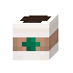Cà phê Americano</a> | <a class="hl-icon-link" href="../../reference/items/#item-espresso">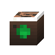</a> |  |
| [`Hồng trà - BREW_BLACK_TEA`](../recipes/default-recipes.md#recipe-brew-black-tea) | <a class="hl-output-item" href="../default-recipes/#recipe-brew-black-tea">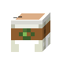Trà đen</a> | 0-1 |  |
| [`Trà sữa trân châu - BREW_BOBA_TEA`](../recipes/default-recipes.md#recipe-brew-boba-tea) | <a class="hl-output-item" href="../default-recipes/#recipe-brew-boba-tea">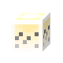Trà trân châu</a>Trà trân châu mặc định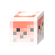Trà trân châu dâu | hoặchoặchoặc0-1 |  |
| [`Cà phê ca-pu-chi-nô - BREW_CAPPUCCINO`](../recipes/default-recipes.md#recipe-brew-cappuccino) | <a class="hl-output-item" href="../default-recipes/#recipe-brew-cappuccino">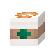Cappuccino</a> | hoặc2 |  |
| [`Cà phê Espresso - BREW_ESPRESSO`](../recipes/default-recipes.md#recipe-brew-espresso) | <a class="hl-output-item" href="../default-recipes/#recipe-brew-espresso">Espresso</a> | hoặc |  |
| [`phê sữa Flat White - BREW_FLAT_WHITE`](../recipes/default-recipes.md#recipe-brew-flat-white) | <a class="hl-output-item" href="../default-recipes/#recipe-brew-flat-white">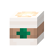Flat White</a> | 2hoặc |  |
| [`Trà xanh - BREW_GREEN_TEA`](../recipes/default-recipes.md#recipe-brew-green-tea) | <a class="hl-output-item" href="../default-recipes/#recipe-brew-green-tea">Trà xanh</a> | 0-1 |  |
| [`Ca cao nóng - BREW_HOT_COCOA`](../recipes/default-recipes.md#recipe-brew-hot-cocoa) | <a class="hl-output-item" href="../default-recipes/#recipe-brew-hot-cocoa">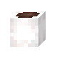Ca cao nóng</a> | hoặc1-2hoặchoặc0-1 |  |
| [`Cà phê đá - BREW_ICED_COFFEE`](../recipes/default-recipes.md#recipe-brew-iced-coffee) | <a class="hl-output-item" href="../default-recipes/#recipe-brew-iced-coffee">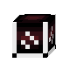Cà phê đá</a> |  |  |
| [`Cà phê Latte - BREW_LATTE`](../recipes/default-recipes.md#recipe-brew-latte) | <a class="hl-output-item" href="../default-recipes/#recipe-brew-latte">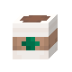Latte</a> | hoặc |  |
| [`Trà xanh Matcha Latte - BREW_MATCHA_LATTE`](../recipes/default-recipes.md#recipe-brew-matcha-latte) | <a class="hl-output-item" href="../default-recipes/#recipe-brew-matcha-latte">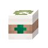Latte trà xanh</a> | <a class="hl-icon-link" href="../../reference/items/#item-matcha-powder">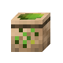</a>hoặc |  |
| [`Cà phê sô cô la - BREW_MOCHA`](../recipes/default-recipes.md#recipe-brew-mocha) | <a class="hl-output-item" href="../default-recipes/#recipe-brew-mocha">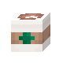Mocha</a> | hoặc |  |
