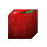
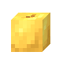
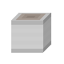
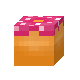
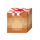
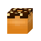
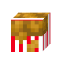
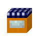
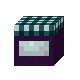
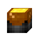

## Công thức nồi luộc

| Công thức | Kết quả | Nguyên liệu | Nguồn |
| --- | --- | --- | --- |
| [`Bánh trôi Nhật Bản - ASIAN_DANGO`](../recipes/default-recipes.md#recipe-asian-dango) | <a class="hl-output-item" href="../default-recipes/#recipe-asian-dango">Bánh dango Á</a> |  |  |
| [`Điểm tâm - ASIAN_DIM_SUM`](../recipes/default-recipes.md#recipe-asian-dim-sum) | <a class="hl-output-item" href="../default-recipes/#recipe-asian-dim-sum">Điểm tâm Á</a> | 1-2 |  |
| [`Sủi cảo - ASIAN_DUMPLINGS`](../recipes/default-recipes.md#recipe-asian-dumplings) | <a class="hl-output-item" href="../default-recipes/#recipe-asian-dumplings">Sủi cảo thịt</a>Sủi cảo thịtSủi cảo rau củSủi cảo hải sản | hoặchoặc |  |
| [`Lẩu kiểu Á - ASIAN_HOT_POT`](../recipes/default-recipes.md#recipe-asian-hot-pot) | <a class="hl-output-item" href="../default-recipes/#recipe-asian-hot-pot">Lẩu Á</a> | hoặchoặchoặc |  |
| [`Canh miso - ASIAN_MISO_SOUP`](../recipes/default-recipes.md#recipe-asian-miso-soup) | <a class="hl-output-item" href="../default-recipes/#recipe-asian-miso-soup">Súp miso Á</a> |  |  |
| [`Bánh bao nhân thịt heo - ASIAN_PORK_BAO`](../recipes/default-recipes.md#recipe-asian-pork-bao) | <a class="hl-output-item" href="../default-recipes/#recipe-asian-pork-bao">Bánh bao thịt heo Á</a> |  |  |
| [`Mì Ramen nước tương - ASIAN_SHOYU_RAMEN`](../recipes/default-recipes.md#recipe-asian-shoyu-ramen) | <a class="hl-output-item" href="../default-recipes/#recipe-asian-shoyu-ramen">Mì ramen shoyu Á</a> | hoặc0-1 |  |
| [`Cơm sushi - ASIAN_SUSHI_RICE`](../recipes/default-recipes.md#recipe-asian-sushi-rice) | <a class="hl-output-item" href="../default-recipes/#recipe-asian-sushi-rice">Cơm sushi Á</a> | 1-20-1 |  |
| [`Mì Ramen Tonkotsu - ASIAN_TONKOTSU_RAMEN`](../recipes/default-recipes.md#recipe-asian-tonkotsu-ramen) | <a class="hl-output-item" href="../default-recipes/#recipe-asian-tonkotsu-ramen">Mì ramen tonkotsu Á</a> | hoặc0-1 |  |
| [`Mì Udon - ASIAN_UDON`](../recipes/default-recipes.md#recipe-asian-udon) | <a class="hl-output-item" href="../default-recipes/#recipe-asian-udon">Mì udon Á</a> | hoặc0-1 |  |
| [`Kẹo táo - CANDY_APPLE`](../recipes/default-recipes.md#recipe-candy-apple) | <a class="hl-output-item" href="../default-recipes/#recipe-candy-apple">Táo kẹo</a>Táo kẹo mặc địnhTáo kẹo vàng | hoặc1-2 |  |
| [`Kẹo ngô - CANDY_CORN`](../recipes/default-recipes.md#recipe-candy-corn) | <a class="hl-output-item" href="../default-recipes/#recipe-candy-corn">Kẹo ngô</a> | 1-2 |  |
| [`Cà chua đóng hộp - CANNED_TOMATOES`](../recipes/default-recipes.md#recipe-canned-tomatoes) | <a class="hl-output-item" href="../default-recipes/#recipe-canned-tomatoes">Cà chua đóng hộp</a> |  |  |
| [`Phô mai - CHEESE`](../recipes/default-recipes.md#recipe-cheese) | <a class="hl-output-item" href="../default-recipes/#recipe-cheese">Phô mai</a> |  |  |
| [`Phô mai 2 - CHEESE 2`](../recipes/default-recipes.md#recipe-cheese-2) | <a class="hl-output-item" href="../default-recipes/#recipe-cheese-2">Phô mai</a> |  |  |
| [`Cà ri gà - CHICKEN_CURRY`](../recipes/default-recipes.md#recipe-chicken-curry) | <a class="hl-output-item" href="../default-recipes/#recipe-chicken-curry">Cà ri gà</a> | hoặchoặchoặchoặc1-3 |  |
| [`Trứng sô cô la - CHOCOLATE_EGG`](../recipes/default-recipes.md#recipe-chocolate-egg) | <a class="hl-output-item" href="../default-recipes/#recipe-chocolate-egg">Trứng sô-cô-la</a> |  |  |
| [`Cơm chín - COOKED_RICE`](../recipes/default-recipes.md#recipe-cooked-rice) | <a class="hl-output-item" href="../default-recipes/#recipe-cooked-rice">Cơm chín</a> | 0-1 |  |
| [`Bánh vòng Doughnut - DOUGHNUT`](../recipes/default-recipes.md#recipe-doughnut) | <a class="hl-output-item" href="../default-recipes/#recipe-doughnut">Bánh rán</a>Bánh rán mặc địnhBánh rán nhân mứtBánh rán sô-cô-la | 0-1hoặchoặc0-1 |  |
| [`Cá và khoai tây chiên - FISH_AND_CHIPS`](../recipes/default-recipes.md#recipe-fish-and-chips) | <a class="hl-output-item" href="../default-recipes/#recipe-fish-and-chips">Cá và khoai tây chiên</a> | hoặchoặc |  |
| [`Gà rán - FRIED_CHICKEN`](../recipes/default-recipes.md#recipe-fried-chicken) | <a class="hl-output-item" href="../default-recipes/#recipe-fried-chicken">Gà rán</a> | hoặc |  |
| [`Khoai tây chiên - FRIES`](../recipes/default-recipes.md#recipe-fries) | <a class="hl-output-item" href="../default-recipes/#recipe-fries">Khoai tây chiên</a> | 1-20-1 |  |
| [`Mứt - JAM`](../recipes/default-recipes.md#recipe-jam) | <a class="hl-output-item" href="../default-recipes/#recipe-jam">Mứt</a>Mứt mặc địnhMứt phát sángMứt vàngMứt Chorus | hoặchoặchoặchoặchoặc1-3 |  |
| [`Mì ống phô mai - MAC_AND_CHEESE`](../recipes/default-recipes.md#recipe-mac-and-cheese) | <a class="hl-output-item" href="../default-recipes/#recipe-mac-and-cheese">Mì ống phô mai</a> | 0-10-1 |  |
| [`Khoai tây nghiền - MASHED_POTATOES`](../recipes/default-recipes.md#recipe-mashed-potatoes) | <a class="hl-output-item" href="../default-recipes/#recipe-mashed-potatoes">Khoai tây nghiền</a> | 20-1 |  |
| [`Mì Ý sốt bò bằm - PASTA_BOLOGNESE`](../recipes/default-recipes.md#recipe-pasta-bolognese) | <a class="hl-output-item" href="../default-recipes/#recipe-pasta-bolognese">Mì ý sốt bolognese</a> | hoặc |  |
| [`Súp cà chua - TOMATO_SOUP`](../recipes/default-recipes.md#recipe-tomato-soup) | <a class="hl-output-item" href="../default-recipes/#recipe-tomato-soup">Súp cà chua</a> | 0-1 |  |
