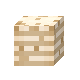
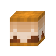
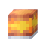
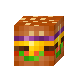
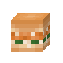
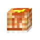
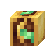

## Công thức Chảo chiên

| Công thức | Kết quả | Nguyên liệu | Nguồn |
| --- | --- | --- | --- |
| [`Há cảo Nhật Bản - ASIAN_GYOZA`](../recipes/default-recipes.md#recipe-asian-gyoza) | <a class="hl-output-item" href="../default-recipes/#recipe-asian-gyoza">Gyoza Á</a> | hoặchoặc |  |
| [`Gỏi cuốn - ASIAN_SPRING_ROLL`](../recipes/default-recipes.md#recipe-asian-spring-roll) | <a class="hl-output-item" href="../default-recipes/#recipe-asian-spring-roll">Chả giò Á</a> | hoặc |  |
| [`Bánh bạch tuộc Takoyaki - ASIAN_TAKOYAKI`](../recipes/default-recipes.md#recipe-asian-takoyaki) | <a class="hl-output-item" href="../default-recipes/#recipe-asian-takoyaki">Takoyaki Á</a> |  |  |
| [`Cơm bò xốt Teriyaki - ASIAN_TERIYAKI_BOWL`](../recipes/default-recipes.md#recipe-asian-teriyaki-bowl) | <a class="hl-output-item" href="../default-recipes/#recipe-asian-teriyaki-bowl">Cơm teriyaki Á</a> |  |  |
| [`Thịt xông khói - BACON`](../recipes/default-recipes.md#recipe-bacon) | <a class="hl-output-item" href="../default-recipes/#recipe-bacon">Thịt xông khói</a> |  |  |
| [`Trứng và thịt xông khói - EGGS_AND_BACON`](../recipes/default-recipes.md#recipe-eggs-and-bacon) | <a class="hl-output-item" href="../default-recipes/#recipe-eggs-and-bacon">Trứng và thịt xông khói</a> | hoặchoặc1-2 |  |
| [`Chả đậu gà - FALAFEL`](../recipes/default-recipes.md#recipe-falafel) | <a class="hl-output-item" href="../default-recipes/#recipe-falafel">Falafel</a> | hoặchoặc1-2 |  |
| [`Cá và khoai tây chiên - FISH_AND_CHIPS`](../recipes/default-recipes.md#recipe-fish-and-chips-2) | <a class="hl-output-item" href="../default-recipes/#recipe-fish-and-chips-2">Cá và khoai tây chiên</a> |  |  |
| [`Bánh mì dẹt - FLATBREAD`](../recipes/default-recipes.md#recipe-flatbread) | <a class="hl-output-item" href="../default-recipes/#recipe-flatbread">Bánh mì dẹt</a> |  |  |
| [`Bánh mì nướng kiểu Pháp - FRENCH_TOAST`](../recipes/default-recipes.md#recipe-french-toast) | <a class="hl-output-item" href="../default-recipes/#recipe-french-toast">Bánh mì nướng kiểu Pháp</a> | hoặchoặchoặc |  |
| [`Trứng ốp la - FRIED_EGG`](../recipes/default-recipes.md#recipe-fried-egg) | <a class="hl-output-item" href="../default-recipes/#recipe-fried-egg">Trứng chiên</a> | hoặchoặc1-3 |  |
| [`Cơm chiên - FRIED_RICE`](../recipes/default-recipes.md#recipe-fried-rice) | <a class="hl-output-item" href="../default-recipes/#recipe-fried-rice">Cơm chiên</a> | hoặchoặc0-10-10-10-1 |  |
| [`Cơm chiên 2 - FRIED_RICE 2`](../recipes/default-recipes.md#recipe-fried-rice-2) | <a class="hl-output-item" href="../default-recipes/#recipe-fried-rice-2">Cơm rang Trung Quốc</a> | hoặchoặc0-10-10-10-1 |  |
| [`Sandwich phô mai nướng - GRILLED_CHEESE`](../recipes/default-recipes.md#recipe-grilled-cheese) | <a class="hl-output-item" href="../default-recipes/#recipe-grilled-cheese">Bánh mì kẹp phô mai nướng</a> | hoặc |  |
| [`HAMBURGER`](../recipes/default-recipes.md#recipe-hamburger) | <a class="hl-output-item" href="../default-recipes/#recipe-hamburger">Hamburger</a>HamburgerGà burger | hoặchoặchoặc0-10-10-1 |  |
| [`Trứng tráng - OMELETTE`](../recipes/default-recipes.md#recipe-omelette) | <a class="hl-output-item" href="../default-recipes/#recipe-omelette">Trứng ốp-la</a> | hoặchoặc1-30-10-10-10-1 |  |
| [`Bánh kếp - PANCAKES`](../recipes/default-recipes.md#recipe-pancakes) | <a class="hl-output-item" href="../default-recipes/#recipe-pancakes">Bánh kếp</a> | hoặchoặchoặchoặchoặc0-3 |  |
| [`Bỏng ngô - POPCORN`](../recipes/default-recipes.md#recipe-popcorn) | <a class="hl-output-item" href="../default-recipes/#recipe-popcorn">Bắp rang bơ</a> |  |  |
| [`Bánh Taco - TACO`](../recipes/default-recipes.md#recipe-taco-2) | <a class="hl-output-item" href="../default-recipes/#recipe-taco-2">Taco</a> | hoặchoặc0-10-10-1 |  |