## Công thức Bát trộn

| Công thức | Đầu ra | Nguyên liệu | Nguồn |
| --- | --- | --- | --- |
| [`Trà sữa trân châu - ASIAN_BOBA_TEA`](../recipes/default-recipes.md#recipe-asian-boba-tea) | <a class="hl-output-item" href="../default-recipes/#recipe-asian-boba-tea">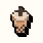ASIAN_BOBA_TEA</a> |  | 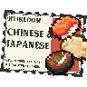 |
| [`Kem matcha - ASIAN_MATCHA_ICE_CREAM`](../recipes/default-recipes.md#recipe-asian-matcha-ice-cream) | <a class="hl-output-item" href="../default-recipes/#recipe-asian-matcha-ice-cream">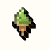ASIAN_MATCHA_ICE_CREAM</a> | <a class="hl-icon-link" href="../../reference/items/#item-ice-cream">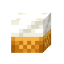</a> |  |
| [`Mochi - ASIAN_MOCHI`](../recipes/default-recipes.md#recipe-asian-mochi) | <a class="hl-output-item" href="../default-recipes/#recipe-asian-mochi">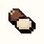ASIAN_MOCHI</a> | hoặc0-1 |  |
| [`Cơm trộn kiểu Hawaii - ASIAN_POKE_BOWL`](../recipes/default-recipes.md#recipe-asian-poke-bowl) | <a class="hl-output-item" href="../default-recipes/#recipe-asian-poke-bowl">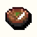ASIAN_POKE_BOWL_SALMON</a>Poke Bowl cá hồi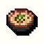Poke Bowl cá tuyết | <a class="hl-icon-link" href="../../reference/items/#item-asian-sushi-rice">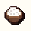</a>hoặc<a class="hl-icon-link" href="../../reference/items/#item-cooked-rice">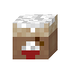</a><a class="hl-icon-link" href="../../reference/vanilla-items/#vanilla-item-salmon">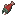</a>hoặc<a class="hl-icon-link" href="../../reference/vanilla-items/#vanilla-item-cod">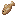</a>hoặc0-10-1 |  |
| [`Hộp cơm bento mang đi - ASIAN_PORTABLE_BENTO`](../recipes/default-recipes.md#recipe-asian-portable-bento) | <a class="hl-output-item" href="../default-recipes/#recipe-asian-portable-bento">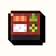ASIAN_PORTABLE_BENTO</a> |  |  |
| [`Bột gạo - ASIAN_RICE_FLOUR`](../recipes/default-recipes.md#recipe-asian-rice-flour) | <a class="hl-output-item" href="../default-recipes/#recipe-asian-rice-flour">ASIAN_RICE_FLOUR</a> | 1-2 |  |
| [`Bơ - BUTTER_RECIPE`](../recipes/default-recipes.md#recipe-butter-recipe) | <a class="hl-output-item" href="../default-recipes/#recipe-butter-recipe">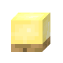BUTTER</a> | <a class="hl-icon-link" href="../../reference/items/#item-heavy-cream">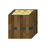</a> |  |
| [`Dầu ăn (ngô) - COOKING_OIL_CORN`](../recipes/default-recipes.md#recipe-cooking-oil-corn) | <a class="hl-output-item" href="../default-recipes/#recipe-cooking-oil-corn">COOKING_OIL</a> | 1-2 |  |
| [`Dầu ăn (hướng dương) - COOKING_OIL_SUNFLOWER`](../recipes/default-recipes.md#recipe-cooking-oil-sunflower) | <a class="hl-output-item" href="../default-recipes/#recipe-cooking-oil-sunflower">COOKING_OIL</a> | 1-4 |  |
| [`Bột nhào - DOUGH`](../recipes/default-recipes.md#recipe-dough) | <a class="hl-output-item" href="../default-recipes/#recipe-dough">DOUGH</a> | <a class="hl-icon-link" href="../../reference/items/#item-bag-of-flour">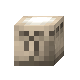</a>hoặc<a class="hl-icon-link" href="../../reference/items/#item-cornmeal">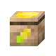</a>hoặchoặc0-10-10-1<a class="hl-icon-link" href="../../reference/vanilla-items/#vanilla-item-brown-mushroom">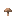</a>0-10-1 |  |
| [`Bột nhào 2 - DOUGH 2`](../recipes/default-recipes.md#recipe-dough-2) | <a class="hl-output-item" href="../default-recipes/#recipe-dough-2">DOUGH</a> | hoặchoặchoặchoặc0-10-10-10-10-1 |  |
| [`Cocktail trứng sữa - EGGNOG`](../recipes/default-recipes.md#recipe-eggnog) | <a class="hl-output-item" href="../default-recipes/#recipe-eggnog">EGGNOG</a> | 1-2 |  |
| [`Nghiền lá trà đen - GRIND_BLACK_TEA_LEAVES`](../recipes/default-recipes.md#recipe-grind-black-tea-leaves) | <a class="hl-output-item" href="../default-recipes/#recipe-grind-black-tea-leaves">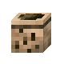BLACK_TEA_LEAVES</a> | <a class="hl-icon-link" href="../../reference/vanilla-items/#vanilla-item-leaf-litter">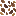</a>1-2 |  |
| [`Nghiền lá trà xanh khô - GRIND_GREEN_TEA_LEAVES`](../recipes/default-recipes.md#recipe-grind-green-tea-leaves) | <a class="hl-output-item" href="../default-recipes/#recipe-grind-green-tea-leaves">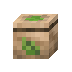DRIED_GREEN_TEA</a> | <a class="hl-icon-link" href="../../reference/vanilla-items/#vanilla-item-oak-leaves">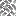</a>hoặc... (tương tự các lá còn lại)1-2 |  |
| [`Bột matcha - GRIND_MATCHA_POWDER`](../recipes/default-recipes.md#recipe-grind-matcha-powder) | <a class="hl-output-item" href="../default-recipes/#recipe-grind-matcha-powder">DRIED_GREEN_TEA</a> |  |  |
| [`Kem tươi - HEAVY_CREAM_RECIPE`](../recipes/default-recipes.md#recipe-heavy-cream-recipe) | <a class="hl-output-item" href="../default-recipes/#recipe-heavy-cream-recipe">HEAVY_CREAM</a> |  |  |
| [`Kem - ICE_CREAM`](../recipes/default-recipes.md#recipe-ice-cream) | <a class="hl-output-item" href="../default-recipes/#recipe-ice-cream">ICE_CREAM</a>Kem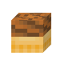Kem sô-cô-la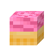Kem dâu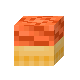Kem phát sáng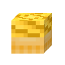Kem mật ong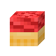Kem dưa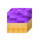Kem Chorus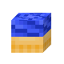Kem nho Meloi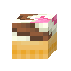Kem sô-cô-la + dâu | hoặchoặchoặchoặchoặc0-1... (nhiều lựa chọn)0-4 |  |
| [`Sữa yến mạch - MAKE_OAT_MILK`](../recipes/default-recipes.md#recipe-make-oat-milk) | <a class="hl-output-item" href="../default-recipes/#recipe-make-oat-milk">OAT_MILK</a> | 1-2 |  |
| [`Protein thực vật - PLANT_PROTEIN`](../recipes/default-recipes.md#recipe-plant-protein) | <a class="hl-output-item" href="../default-recipes/#recipe-plant-protein">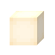PLANT_PROTEIN</a> | hoặchoặchoặc |  |
| [`Sa lát rau củ - SALAD`](../recipes/default-recipes.md#recipe-salad) | <a class="hl-output-item" href="../default-recipes/#recipe-salad">SALAD</a> | <a class="hl-icon-link" href="../../reference/items/#item-lettuce">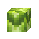</a>1-2... (nhiều lựa chọn)0-4... (nhiều lựa chọn)0-1hoặc0-1 |  |
| [`Giấm - VINEGAR`](../recipes/default-recipes.md#recipe-vinegar) | <a class="hl-output-item" href="../default-recipes/#recipe-vinegar">VINEGAR</a> |  |  |
