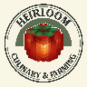
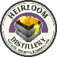

# Tham chiếu ID Cây trồng

Tài liệu tham chiếu dựa trên mã nguồn cho các định nghĩa cây trồng được tích hợp sẵn.

| ID | Nguồn | Vật phẩm | Loại | Thời gian cơ bản (giây) | Quyền |
| --- | --- | --- | --- | --- | --- |
| `COFFEE` |  | Anh đào cà phê - COFFEE_CHERRY | Cây thấp | 900 |  |
| `CORN` |  | Ngô - CORN | Cây cao | 480 | heirloom.crop.corn |
| `LETTUCE` |  | Xà lách - LETTUCE | Cây thấp | 300 | heirloom.crop.lettuce |
| `ONION` |  | Hành tây - ONION | Hành | 360 | heirloom.crop.onion |
| `RICE` |  | Gạo - RICE | Thủy sinh | 360 | heirloom.crop.rice |
| `TOMATO` |  | Cà chua - TOMATO | Dây leo | 420 | heirloom.crop.tomato |
| `CHERIMOLA_BLAN_GRAPE` |  | Nho Cherimola Blan - CHERIMOLA_BLAN_GRAPE | Dây leo | 600 | heirloom.crop.grape |
| `CRANERLET_NUALA_GRAPE` |  | Nho Cranerlet Nuala - CRANERLET_NUALA_GRAPE | Dây leo | 600 | heirloom.crop.grape |
| `GRALLADINA_FRAN_GRAPE` |  | Nho Gralladina Fran - GRALLADINA_FRAN_GRAPE | Dây leo | 600 | heirloom.crop.grape |
| `MELOIRE_GRAPE` |  | Nho Meloire - MELOIRE_GRAPE | Dây leo | 600 | heirloom.crop.grape |
| `RENOIT_GRAPE` |  | Nho Renoit - RENOIT_GRAPE | Dây leo | 600 | heirloom.crop.grape 
