# Tham chiếu Nguyên liệu Vanilla

Danh sách các vật phẩm Minecraft vanilla được xác định từ mã nguồn, được sử dụng trong các công thức Heirloom có sẵn hoặc làm vật liệu cơ sở cho vật phẩm tùy chỉnh.

| Biểu tượng | ID | Tên | Trạng thái biểu tượng |
| --- | --- | --- | --- |
| 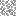 | `ACACIA_LEAVES` | Acacia Leaves | ok |
|  | `ALLIUM` | Allium | ok |
|  | `APPLE` | Apple | ok |
| 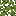 | `AZALEA_LEAVES` | Azalea Leaves | ok |
|  | `AZURE_BLUET` | Azure Bluet | ok |
| 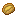 | `BAKED_POTATO` | Baked Potato | ok |
|  | `BEEF` | Beef | ok |
|  | `BEETROOT` | Beetroot | ok |
| 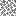 | `BIRCH_LEAVES` | Birch Leaves | ok |
|  | `BLUE_EGG` | Blue Egg | ok |
|  | `BLUE_ORCHID` | Blue Orchid | ok |
|  | `BOWL` | Bowl | ok |
|  | `BROWN_EGG` | Brown Egg | ok |
|  | `BROWN_MUSHROOM` | Brown Mushroom | ok |
|  | `CARROT` | Carrot | ok |
|  | `CHERRY_LEAVES` | Cherry Leaves | ok |
| 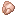 | `CHICKEN` | Chicken | ok |
| 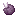 | `CHORUS_FRUIT` | Chorus Fruit | ok |
|  | `COCOA_BEANS` | Cocoa Beans | ok |
|  | `COD` | Cod | ok |
| 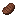 | `COOKED_BEEF` | Cooked Beef | ok |
|  | `COOKED_CHICKEN` | Cooked Chicken | ok |
|  | `COOKED_COD` | Cooked Cod | ok |
| 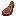 | `COOKED_MUTTON` | Cooked Mutton | ok |
| 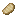 | `COOKED_PORKCHOP` | Cooked Porkchop | ok |
|  | `CORNFLOWER` | Cornflower | ok |
|  | `DANDELION` | Dandelion | ok |
| 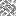 | `DARK_OAK_LEAVES` | Dark Oak Leaves | ok |
|  | `DRIED_KELP` | Dried Kelp | ok |
|  | `EGG` | Egg | ok |
| 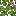 | `FLOWERING_AZALEA_LEAVES` | Flowering Azalea Leaves | ok |
|  | `GLASS_BOTTLE` | Glass Bottle | ok |
|  | `GLOW_BERRIES` | Glow Berries | ok |
|  | `GOLDEN_APPLE` | Golden Apple | ok |
|  | `GREEN_DYE` | Green Dye | ok |
|  | `HONEY_BOTTLE` | Honey Bottle | ok |
|  | `ICE` | Ice | ok |
|  | `IRON_HOE` | Iron Hoe | ok |
| 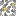 | `JUNGLE_LEAVES` | Jungle Leaves | ok |
|  | `KNOWLEDGE_BOOK` | Knowledge Book | ok |
|  | `LEAF_LITTER` | Leaf Litter | ok |
|  | `LILAC` | Lilac | ok |
|  | `LILY_OF_THE_VALLEY` | Lily Of The Valley | ok |
| 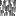 | `MANGROVE_LEAVES` | Mangrove Leaves | ok |
| 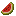 | `MELON_SLICE` | Melon Slice | ok |
|  | `MILK_BUCKET` | Milk Bucket | ok |
|  | `MUTTON` | Mutton | ok |
|  | `OAK_LEAVES` | Oak Leaves | ok |
|  | `ORANGE_TULIP` | Orange Tulip | ok |
|  | `OXEYE_DAISY` | Oxeye Daisy | ok |
|  | `PACKED_ICE` | Packed Ice | ok |
|  | `PAPER` | Paper | ok |
|  | `PEONY` | Peony | ok |
|  | `PINK_TULIP` | Pink Tulip | ok |
|  | `POPPY` | Poppy | ok |
|  | `PORKCHOP` | Porkchop | ok |
| 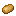 | `POTATO` | Potato | ok |
|  | `POTION` | Potion | ok |
|  | `PUFFERFISH` | Pufferfish | ok |
|  | `PUMPKIN` | Pumpkin | ok |
|  | `RED_MUSHROOM` | Red Mushroom | ok |
|  | `RED_TULIP` | Red Tulip | ok |
|  | `ROSE_BUSH` | Rose Bush | ok |
|  | `SALMON` | Salmon | ok |
|  | `SLIME_BALL` | Slime Ball | ok |
| 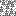 | `SPRUCE_LEAVES` | Spruce Leaves | ok |
|  | `STICK` | Stick | ok |
|  | `SUGAR` | Sugar | ok |
|  | `SUNFLOWER` | Sunflower | ok |
|  | `SWEET_BERRIES` | Sweet Berries | ok |
|  | `TROPICAL_FISH` | Tropical Fish | ok |
|  | `WATER_BOTTLE` | Water Bottle | ok |
|  | `WATER_BUCKET` | Water Bucket | ok |
|  | `WHEAT` | Wheat | ok |
|  | `WHITE_TULIP` | White Tulip | ok |
|  | `WITHER_ROSE` | Wither Rose | ok |
