# Thớt

## Công thức chế tạo

Xây dựng Thớt bằng cách đặt bất kỳ tấm áp lực gỗ nào lên trên bất kỳ khối `STRIPPED_` nào.

<figure class="hl-figure">
  
  <figcaption>Trạm Thớt được xây bằng tấm áp lực gỗ trên khối gỗ đã bóc vỏ.</figcaption>
</figure>

<figure class="hl-figure">
  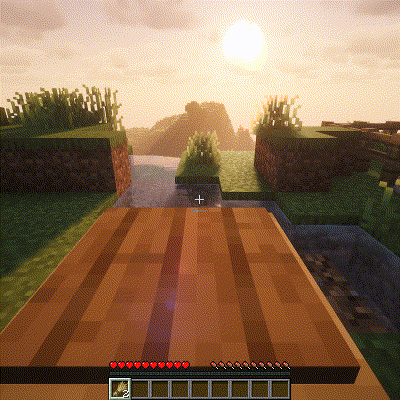
  <figcaption>Quy trình cắt bằng Thớt với tương tác chuẩn bị hiển thị.</figcaption>
</figure>

## Vòng lặp lối chơi

Thớt xử lý các công việc chuẩn bị như bột mì, mì, nguyên liệu băm nhỏ và các bước cắt lát trong công thức.

## Cách thức hoạt động

Thớt là công việc chuẩn bị: chặt, thái, băm và biến nguyên liệu thô thành các thành phần công thức chính xác. Nó có chủ đích không phải là một cái bàn thông thường; nhiều công thức cần dạng đã chuẩn bị trước khi một trạm khác chấp nhận chúng.

## Chuỗi kết hợp phổ biến

- `WHEAT` có thể trở thành nguyên liệu dạng bột mì dùng cho chuỗi bột nhào và bột làm bánh.
- Thịt và các lựa chọn thay thế từ thực vật có thể trở thành thành phần băm nhỏ hoặc thái lát cho các bữa ăn sau.
- Mì và các vật phẩm chuẩn bị tương tự được làm ở đây trước khi luộc hoặc nấu.

## Công thức tốt để bắt đầu

Bắt đầu với bột mì hoặc mì, những công thức này thể hiện rõ sự khác biệt giữa nguyên liệu Vanilla mặc định và vật phẩm của Heirloom.

## Sai lầm thường gặp

Sử dụng sai trạm vật lý: tấm áp lực gỗ trên khối gỗ đã bóc vỏ. Nếu hệ thống nấu bị chặn, tạo lại chuẩn chỉnh công thức chế tạo cái thớt giùm mình.

## Công thức

| Công thức | Đầu ra | Nguyên liệu | Nguồn |
| --- | --- | --- | --- |
| [`ASIAN_FEAST_BENTO`](../recipes/default-recipes.md#recipe-asian-feast-bento) | <a class="hl-output-item" href="../../recipes/default-recipes/#recipe-asian-feast-bento">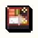ASIAN_FEAST_BENTO</a> | 20-1 |  |
| [`ASIAN_MAKI`](../recipes/default-recipes.md#recipe-asian-maki) | <a class="hl-output-item" href="../../recipes/default-recipes/#recipe-asian-maki">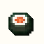ASIAN_MAKI_SALMON</a>Default Salmon Maki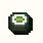Vegetable Maki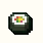Tropical Maki | orororororor |  |
| [`ASIAN_PUFFERFISH_SASHIMI`](../recipes/default-recipes.md#recipe-asian-pufferfish-sashimi) | <a class="hl-output-item" href="../../recipes/default-recipes/#recipe-asian-pufferfish-sashimi">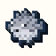ASIAN_SASHIMI_PUFFERFISH</a> |  |  |
| [`ASIAN_SASHIMI`](../recipes/default-recipes.md#recipe-asian-sashimi) | <a class="hl-output-item" href="../../recipes/default-recipes/#recipe-asian-sashimi">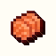ASIAN_SASHIMI_SALMON</a>Default Salmon Sashimi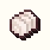Cod Sashimi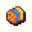Tropical Fish Sashimi | oror |  |
| [`BLT`](../recipes/default-recipes.md#recipe-blt) | <a class="hl-output-item" href="../../recipes/default-recipes/#recipe-blt">BLT</a> | or<a class="hl-icon-link" href="../../reference/items/#item-bacon">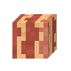</a>or<a class="hl-icon-link" href="../../reference/items/#item-tomato">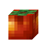</a> |  |
| [`CORNMEAL`](../recipes/default-recipes.md#recipe-cornmeal) | <a class="hl-output-item" href="../../recipes/default-recipes/#recipe-cornmeal">CORNMEAL</a> |  |  |
| [`DRY_PASTA`](../recipes/default-recipes.md#recipe-dry-pasta) | <a class="hl-output-item" href="../../recipes/default-recipes/#recipe-dry-pasta">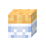DRY_PASTA</a> | <a class="hl-icon-link" href="../../reference/items/#item-dough">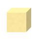</a> |  |
| [`DRY_PASTA`](../recipes/default-recipes.md#recipe-dry-pasta-2) | <a class="hl-output-item" href="../../recipes/default-recipes/#recipe-dry-pasta-2">DRY_PASTA</a>Default Dry Pasta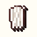Rice Noodles |  |  |
| [`FLOUR`](../recipes/default-recipes.md#recipe-flour) | <a class="hl-output-item" href="../../recipes/default-recipes/#recipe-flour">BAG_OF_FLOUR</a> |  |  |
| [`GINGERBREAD_HOUSE`](../recipes/default-recipes.md#recipe-gingerbread-house) | <a class="hl-output-item" href="../../recipes/default-recipes/#recipe-gingerbread-house">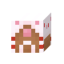GINGERBREAD_HOUSE</a> | 1-3or<a class="hl-icon-link" href="../../reference/vanilla-items/#vanilla-item-glow-berries">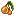</a>0-2 |  |
| [`MINCED_MEAT_BEEF`](../recipes/default-recipes.md#recipe-minced-meat-beef) | <a class="hl-output-item" href="../../recipes/default-recipes/#recipe-minced-meat-beef">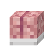MINCED_MEAT</a> | oror |  |
| [`SUSHI`](../recipes/default-recipes.md#recipe-sushi) | <a class="hl-output-item" href="../../recipes/default-recipes/#recipe-sushi">SUSHI</a> | orororor |  |
| [`SUSHI`](../recipes/default-recipes.md#recipe-sushi-2) | <a class="hl-output-item" href="../../recipes/default-recipes/#recipe-sushi-2">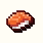SUSHI</a>Default Salmon Nigiri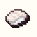Cod Nigiri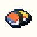Tropical Fish Nigiri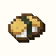Tamago Nigiri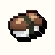Mushroom Nigiri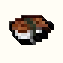Unagi Nigiri | orororororor<a class="hl-icon-link" href="../../reference/vanilla-items/#vanilla-item-cooked-cod">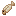</a>or |  |
| [`SUSHI_ROLL`](../recipes/default-recipes.md#recipe-sushi-roll) | <a class="hl-output-item" href="../../recipes/default-recipes/#recipe-sushi-roll">SUSHI_ROLL</a> | ororor |  |
| [`VALENTINES_CHOCOLATE`](../recipes/default-recipes.md#recipe-valentines-chocolate) | <a class="hl-output-item" href="../../recipes/default-recipes/#recipe-valentines-chocolate">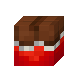VALENTINES_CHOCOLATE</a> | <a class="hl-icon-link" href="../../reference/vanilla-items/#vanilla-item-cocoa-beans">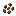</a>ororororor<a class="hl-icon-link" href="../../reference/vanilla-items/#vanilla-item-red-tulip">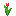</a>ororororororor<a class="hl-icon-link" href="../../reference/vanilla-items/#vanilla-item-wither-rose">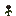</a>orororor |  |

## Khắc phục sự cố

Sử dụng cuốc chim hoặc rìu để thực hiện các thao tác chặt. Các tấm áp lực không làm từ gỗ được dành cho những trạm khác và sẽ không kích hoạt thao tác này.

Xem [chỉ mục công thức đầy đủ](../recipes/default-recipes.md) để biết liên kết nguyên liệu, thời gian chế biến, quy tắc công thức hoặc thành quả đầu ra.