# Lò nướng

## Công thức chế tạo

Xây dựng Lò nướng bằng cách đặt một `STONE_PRESSURE_PLATE` (Tấm áp lực đá) lên trên một `SMOKER` (Lò hun khói).

<figure class="hl-figure">
  
  <figcaption>Trạm Lò nướng được xây từ tấm áp lực đá trên lò hun khói.</figcaption>
</figure>

## Vòng lặp lối chơi

Lò nướng xử lý việc nướng, rang, sấy và một số bước chuỗi như bánh mì, pizza và rang cà phê.

## Cách thức hoạt động

Lò nướng là trạm xử lý nhiệt chuyên dùng cho các công đoạn chế biến kéo dài. Đây là nơi nguyên liệu thô được chuyển thành thực phẩm đã qua chế biến hoặc có thể bảo quản lâu hơn: bột nhào trở thành bánh mì, bột dẹt được làm thành pizza, quả cà phê tươi được chế biến thành hạt cà phê rang, cùng một số chuỗi công thức tiện ích khác sử dụng lò nướng làm bước xử lý quan trọng đầu tiên.

## Chuỗi kết hợp phổ biến

- `BAG_OF_FLOUR` -> `DOUGH` -> bánh mì, pizza, bánh kếp, bánh quế, bánh rán và các công thức bánh ngọt.
- Quả cà phê Cafe rang qua các hạt rang nhạt, vừa, đậm trước khi trở thành đồ uống espresso.
- Công thức với `SET_RETURN_ITEM` có thể trả lại vật chứa sau khi chế biến, vì vậy hãy kiểm tra đầu ra và túi đồ trước khi cho rằng xô hoặc chai biến mất.

## Công thức tốt để bắt đầu

Bắt đầu với bánh mì hoặc công thức kiểu khoai tây nướng trước khi thử pizza và chuỗi tiện ích bổ sung. Chúng chứng minh cấu trúc trạm hoạt động mà không cần nhiều nguyên liệu trung gian.

## Sai lầm phổ biến

Nếu công thức không bắt đầu, trước tiên xác nhận trạm là cặp lò hun khói cộng tấm áp lực đá. Nếu trạm hoạt động nhưng công thức không khớp, hãy tìm kiếm đầu ra hoặc nguyên liệu chính xác bằng `/hl search <truy vấn>`; nhiều món nướng cần một vật phẩm Heirloom trung gian thay vì nguyên liệu vanilla thô.

## Công thức

| Công thức | Đầu ra | Nguyên liệu | Nguồn |
| --- | --- | --- | --- |
| [`ASIAN_PEKING_DUCK`](../recipes/default-recipes.md#recipe-asian-peking-duck) | <a class="hl-output-item" href="../../recipes/default-recipes/#recipe-asian-peking-duck">ASIAN_PEKING_DUCK</a> | 1-2 |  |
| [`BAKE_MUFFIN`](../recipes/default-recipes.md#recipe-bake-muffin) | <a class="hl-output-item" href="../../recipes/default-recipes/#recipe-bake-muffin">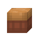MUFFIN</a>Default Muffin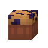Chorus Muffin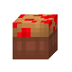Sweetberry Muffin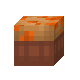Carrot Muffin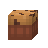Chocolate Chip Muffin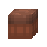Chocolate Muffin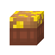Golden Apple Muffin | orororor<a class="hl-icon-link" href="../../reference/items/#item-chocolate">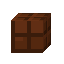</a>or0-1 |  |
| [`BEEF_WELLINGTON`](../recipes/default-recipes.md#recipe-beef-wellington) | <a class="hl-output-item" href="../../recipes/default-recipes/#recipe-beef-wellington">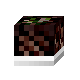BEEF_WELLINGTON</a> |  |  |
| [`BREAD`](../recipes/default-recipes.md#recipe-bread) | <a class="hl-output-item" href="../../recipes/default-recipes/#recipe-bread">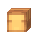BREAD</a>Default Bread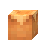Brioche Bread |  |  |
| [`CHOCOLATE`](../recipes/default-recipes.md#recipe-chocolate) | <a class="hl-output-item" href="../../recipes/default-recipes/#recipe-chocolate">CHOCOLATE</a> |  |  |
| [`CHRISTMAS_HAM`](../recipes/default-recipes.md#recipe-christmas-ham) | <a class="hl-output-item" href="../../recipes/default-recipes/#recipe-christmas-ham">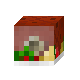CHRISTMAS_HAM</a> | 2 |  |
| [`GINGERBREAD`](../recipes/default-recipes.md#recipe-gingerbread) | <a class="hl-output-item" href="../../recipes/default-recipes/#recipe-gingerbread">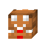GINGERBREAD</a> |  |  |
| [`KEBAB`](../recipes/default-recipes.md#recipe-kebab) | <a class="hl-output-item" href="../../recipes/default-recipes/#recipe-kebab">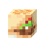KEBAB</a> | or<a class="hl-icon-link" href="../../reference/items/#item-onion">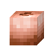</a>or0-2 |  |
| [`LASAGNA`](../recipes/default-recipes.md#recipe-lasagna) | <a class="hl-output-item" href="../../recipes/default-recipes/#recipe-lasagna">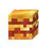LASAGNA</a> | or<a class="hl-icon-link" href="../../reference/items/#item-cheese">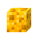</a>0-10-1 |  |
| [`MAKE_LEAF_LITTER`](../recipes/default-recipes.md#recipe-make-leaf-litter) | <a class="hl-output-item" href="../../recipes/default-recipes/#recipe-make-leaf-litter">LEAF_LITTER</a> | ororororororororor1-3 |  |
| [`PIE`](../recipes/default-recipes.md#recipe-pie) | <a class="hl-output-item" href="../../recipes/default-recipes/#recipe-pie">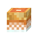PIE</a>Default Pumpkin Pie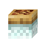Apple Pie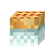Berry Pie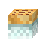Glow Berry Pie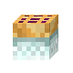Chorus Pie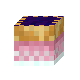Blueberry Pie | ororororor |  |
| [`PIZZA`](../recipes/default-recipes.md#recipe-pizza) | <a class="hl-output-item" href="../../recipes/default-recipes/#recipe-pizza">PIZZA</a> | orororororor0-4 |  |
| [`ROAST_COFFEE_CHERRY`](../recipes/default-recipes.md#recipe-roast-coffee-cherry) | <a class="hl-output-item" href="../../recipes/default-recipes/#recipe-roast-coffee-cherry">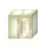COFFEE_BEANS_LIGHT</a> | <a class="hl-icon-link" href="../../reference/items/#item-coffee-cherry">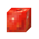</a>1-3 |  |
| [`ROAST_DARK_COFFEE_BEANS_TO_CHARCOAL`](../recipes/default-recipes.md#recipe-roast-dark-coffee-beans-to-charcoal) | <a class="hl-output-item" href="../../recipes/default-recipes/#recipe-roast-dark-coffee-beans-to-charcoal">CHARCOAL</a> | <a class="hl-icon-link" href="../../reference/items/#item-coffee-beans-dark">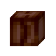</a>1-3 |  |
| [`ROAST_LIGHT_COFFEE_BEANS`](../recipes/default-recipes.md#recipe-roast-light-coffee-beans) | <a class="hl-output-item" href="../../recipes/default-recipes/#recipe-roast-light-coffee-beans">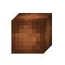COFFEE_BEANS_MEDIUM</a> | 1-3 |  |
| [`ROAST_MEDIUM_COFFEE_BEANS`](../recipes/default-recipes.md#recipe-roast-medium-coffee-beans) | <a class="hl-output-item" href="../../recipes/default-recipes/#recipe-roast-medium-coffee-beans">COFFEE_BEANS_DARK</a> | 1-3 |  |
| [`ROAST_TURKEY`](../recipes/default-recipes.md#recipe-roast-turkey) | <a class="hl-output-item" href="../../recipes/default-recipes/#recipe-roast-turkey">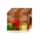ROAST_TURKEY</a>Default Roast Turkey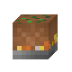Roast Tofu | or |  |
| [`SALT_RECIPE`](../recipes/default-recipes.md#recipe-salt-recipe) | <a class="hl-output-item" href="../../recipes/default-recipes/#recipe-salt-recipe">SALT</a> |  |  |
| [`SHEPHERDS_PIE`](../recipes/default-recipes.md#recipe-shepherds-pie) | <a class="hl-output-item" href="../../recipes/default-recipes/#recipe-shepherds-pie">SHEPHERDS_PIE</a> | <a class="hl-icon-link" href="../../reference/items/#item-mashed-potatoes">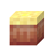</a>0-1 |  |
| [`TACO`](../recipes/default-recipes.md#recipe-taco) | <a class="hl-output-item" href="../../recipes/default-recipes/#recipe-taco">TACO</a> | orororororor0-3 |  |
| [`WAFFLES`](../recipes/default-recipes.md#recipe-waffles) | <a class="hl-output-item" href="../../recipes/default-recipes/#recipe-waffles">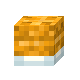WAFFLES</a> | ororororor0-3 |  |

## Khắc phục sự cố

Nếu trạm không kích hoạt, hãy kiểm tra xem tấm áp lực có được đặt ngay phía trên lò hun khói hay không, đồng thời đảm bảo khối bạn đang nhấp vào thực sự là tấm áp lực.

Xem [chỉ mục công thức đầy đủ](../recipes/default-recipes.md) để biết liên kết nguyên liệu, thời gian chế biến, quy tắc công thức và hành động đầu ra.